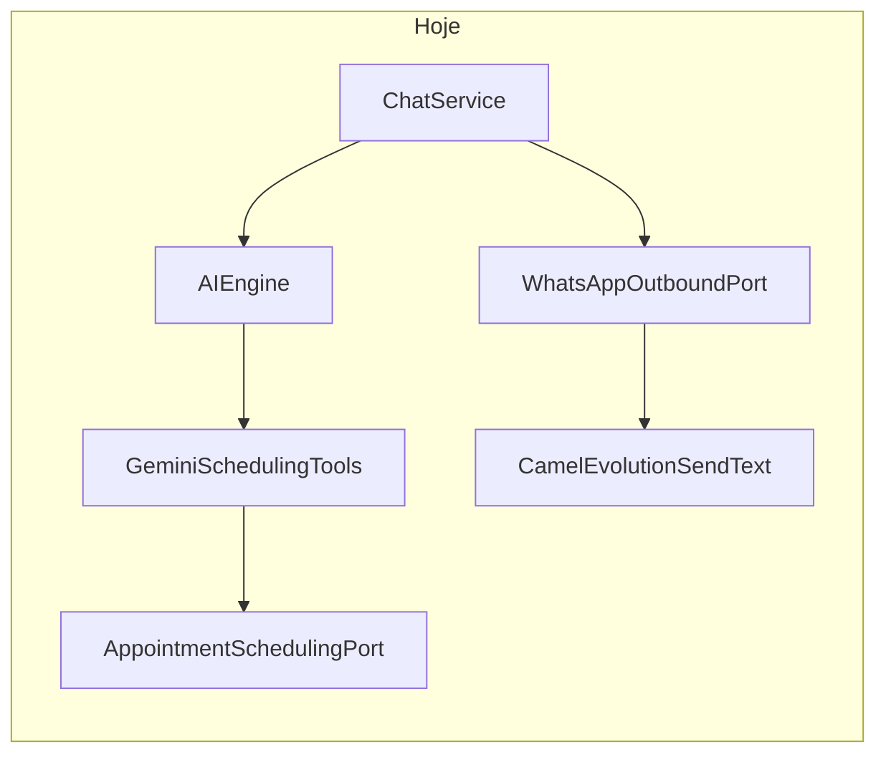

# Plano: precisão de datas, diálogo e horários interativos (Evolution)

## Contexto atual

- A ferramenta `check_availability` está em [`GeminiSchedulingTools`](d:\Documents\agenteAtendimento\infrastructure\src\main\java\com\atendimento\cerebro\infrastructure\adapter\out\ai\GeminiSchedulingTools.java) e delega para [`AppointmentSchedulingPort`](d:\Documents\agenteAtendimento\application\src\main\java\com\atendimento\cerebro\application\port\out\AppointmentSchedulingPort.java) sem validar se a data é anterior a “hoje” no fuso do calendário.
- Implementações concretas: [`MockAppointmentSchedulingService`](d:\Documents\agenteAtendimento\infrastructure\src\main\java\com\atendimento\cerebro\infrastructure\calendar\MockAppointmentSchedulingService.java) e [`GoogleCalendarAppointmentSchedulingService`](d:\Documents\agenteAtendimento\infrastructure\src\main\java\com\atendimento\cerebro\infrastructure\calendar\GoogleCalendarAppointmentSchedulingService.java) — hoje não bloqueiam datas passadas em `checkAvailability` (vale alinhar as três camadas: ferramenta + port, para consistência).
- Política de agendamento e âncora temporal: [`RagSystemPromptComposer`](d:\Documents\agenteAtendimento\infrastructure\src\main\java\com\atendimento\cerebro\infrastructure\adapter\out\ai\RagSystemPromptComposer.java) (`SCHEDULING_POLICY`, `schedulingTemporalAnchor`).
- O texto “Verificando disponibilidade” **não aparece no código**; vem do modelo. A correção é sobretudo **instrução de sistema** (e eventual saneamento pós-modelo se quiserem garantia extra).
- Envio WhatsApp Evolution hoje é só **texto**: [`WhatsAppOutboundRoutes.prepareEvolutionHttp`](d:\Documents\agenteAtendimento\infrastructure\src\main\java\com\atendimento\cerebro\infrastructure\adapter\inbound\rest\camel\WhatsAppOutboundRoutes.java) (`POST .../message/sendText/...` com `{ number, text }`).
- Contrato de saída: [`WhatsAppOutboundPort`](d:\Documents\agenteAtendimento\application\src\main\java\com\atendimento\cerebro\application\port\out\WhatsAppOutboundPort.java) só expõe `sendMessage(tenant, to, text)`.

---

## 1. Validação de data retroativa (antes / dentro de `check_availability`)

- **Onde validar:** Preferência por validar **no início de** `GeminiSchedulingTools.check_availability` com `LocalDate` parseada e comparação a `LocalDate.now(ZoneId)` usando o mesmo fuso que [`CerebroGoogleCalendarProperties#getZone()`](d:\Documents\agenteAtendimento\infrastructure\src\main\java\com\atendimento\cerebro\infrastructure\config\CerebroGoogleCalendarProperties.java) (passar `ZoneId` ou o próprio `CerebroGoogleCalendarProperties` ao construtor de `GeminiSchedulingTools` em [`GeminiChatEngineAdapter`](d:\Documents\agenteAtendimento\infrastructure\src\main\java\com\atendimento\cerebro\infrastructure\adapter\out\ai\GeminiChatEngineAdapter.java)).
- **Se `date` &lt; hoje:** retornar à LLM uma **string orientada ao comportamento**, não um erro técnico exposto ao utilizador final, por exemplo (PT): instrução explícita de que a data já passou, que o assistente deve explicar de forma cordial e pedir uma data a partir de hoje — **sem** prefixos tipo `Erro:` ou stack.
- **Reforço no prompt:** acrescentar em `SCHEDULING_POLICY` (e, se útil, uma linha em `schedulingTemporalAnchor`) regra clara: **nunca** repetir ao cliente mensagens internas de ferramenta, códigos ou linhas que pareçam log (`Erro:`, `AVISO_FERRAMENTA:`, etc.); reformular sempre em linguagem natural.
- **Dupla defesa:** opcional mas recomendado — em `MockAppointmentSchedulingService` e `GoogleCalendarAppointmentSchedulingService.checkAvailability`, se a data for anterior a “hoje” no fuso, devolver mensagem alinhada (ou vazio + já tratado na ferramenta) para chamadas diretas ao port.

---

## 2. Correção do fluxo de diálogo (“serviço” vs “quando está agendado”)

- Ajustar **`SCHEDULING_POLICY`** em `RagSystemPromptComposer`: quando o cliente **só indicou o serviço** e ainda **não** disse a data pretendida para **esta** marcação, a pergunta deve ser no sentido **“Para quando você deseja agendar?”** (ou equivalente natural), e **não** formulários que sugiram “quando o serviço está agendado” / ambiguidade com agendamento já existente.
- Refinar texto gerado em [`ChatService.buildCrmContextForPrompt`](d:\Documents\agenteAtendimento\application\src\main\java\com\atendimento\cerebro\application\service\ChatService.java): a linha sobre **“Último agendamento”** deve ficar explícita como **histórico** (ex.: “último registo no CRM”), para o modelo não confundir com o horário da **nova** intenção do cliente.

---

## 3. Horários interativos (Evolution API: botões / lista)

**Restrição real:** a API Evolution/WhatsApp limita **botões de resposta** (ex.: frequentemente **até 3** por mensagem). Se o mock devolver muitos horários (ex.: 9:00–17:00 em slots de 30 min), **botões individuais para todos** não cabem num único `sendButtons`.

**Estratégia proposta (equilibrada):**

- **Extrair lista de horários** no mesmo sítio onde já existem slots livres: [`WorkingDaySlotPlanner.freeSlotStarts`](d:\Documents\agenteAtendimento\infrastructure\src\main\java\com\atendimento\cerebro\infrastructure\calendar\WorkingDaySlotPlanner.java) / retorno atual em texto via `formatSlotsLine`. Opções:
  - **A)** Fazer `checkAvailability` devolver também uma estrutura (ex.: novo DTO ou método auxiliar) que exponha `List<LocalTime>` ao chamador da ferramenta; ou
  - **B)** Manter `String` no port mas registar os slots num **contexto por pedido** (bean `@RequestScope` ou `ThreadLocal` limpo no início/fim de `GeminiChatEngineAdapter.complete`) preenchido em `GeminiSchedulingTools` após chamada bem-sucedida ao port.

- **Propagar até ao envio WhatsApp:** estender o fluxo para que, quando o provider for **Evolution** e existir lista de horários:
  - Se **≤ 3** horários: `POST /message/sendButtons/{instance}` com `number`, texto introdutório, e `buttons` tipo **reply** com `displayText` = horário (e `id` útil, ex. o mesmo horário ou `slot_09:00`) — conforme [documentação Evolution v2 “Send Button”](https://doc.evolution-api.com/v2/api-reference/message-controller/send-button).
  - Se **> 3**: usar **lista** (endpoint de list message da Evolution, se disponível na versão que utilizam) **ou** enviar **texto** com os horários + primeira mensagem com 3 botões e instrução para pedir outro intervalo (fallback documentado). O plano de implementação deve escolher **um** destes após verificar a versão/endpoints já usados no projeto.

- **Alterações de código prováveis:**
  - Estender [`WhatsAppOutboundPort`](d:\Documents\agenteAtendimento\application\src\main\java\com\atendimento\cerebro\application\port\out\WhatsAppOutboundPort.java) com overload ou tipo auxiliar (ex.: `sendInteractiveEvolution(...)`) **ou** um único método que aceite `Optional<EvolutionInteractive>` para não quebrar Meta/simulado.
  - [`CamelWhatsAppOutboundAdapter`](d:\Documents\agenteAtendimento\infrastructure\src\main\java\com\atendimento\cerebro\infrastructure\adapter\out\whatsapp\CamelWhatsAppOutboundAdapter.java): novos headers Camel para título/corpo/botões.
  - [`WhatsAppOutboundRoutes`](d:\Documents\agenteAtendimento\infrastructure\src\main\java\com\atendimento\cerebro\infrastructure\adapter\inbound\rest\camel\WhatsAppOutboundRoutes.java): ramo Evolution — `choice()` para `sendText` vs `sendButtons`/`sendList` conforme headers.
  - [`ChatService`](d:\Documents\agenteAtendimento\application\src\main\java\com\atendimento\cerebro\application\service\ChatService.java) / [`ChatResult`](d:\Documents\agenteAtendimento\application\src\main\java\com\atendimento\cerebro\application\dto\ChatResult.java): transportar metadados opcionais do `complete()` até ao [`WhatsAppIntegrationRoute.enviarRespostaWhatsApp`](d:\Documents\agenteAtendimento\infrastructure\src\main\java\com\atendimento\cerebro\infrastructure\adapter\inbound\rest\camel\WhatsAppIntegrationRoute.java) (onde hoje só passa `String`). Alternativa mais local: apenas WhatsApp lê o contexto request-scoped — reduz mudanças em `ChatResult`, mas acopla infra ao pedido HTTP/Camel.

**Testes:** unitários para montagem do JSON Evolution; teste manual ou integração com Evolution desligada validando que Meta continua a receber texto plano.

---

## 4. Resposta imediata (“Verificando disponibilidade” não pode ser a mensagem inteira)

- **Prompt:** em `SCHEDULING_POLICY`, exigir que qualquer frase tipo “a verificar disponibilidade” / “verificando…” seja **apenas prefixo** da **mesma** resposta que já inclui os horários (ou a recusa amigável), nunca uma mensagem isolada sem conteúdo útil.
- **Opcional (garantia):** em [`GeminiChatEngineAdapter`](d:\Documents\agenteAtendimento\infrastructure\src\main\java\com\atendimento\cerebro\infrastructure\adapter\out\ai\GeminiChatEngineAdapter.java), se `tools.schedulingToolInvocationCount() > 0` e o texto final for muito curto / só “verificando”, concatenar resumo amigável do último retorno de ferramenta (última linha arriscada; preferir **só** reforço de prompt salvo produto queira hardening).

---

## Ordem sugerida de implementação

1. Zone + validação de data em `GeminiSchedulingTools` + reforço de `SCHEDULING_POLICY` / `schedulingTemporalAnchor`.
2. Ajuste de `buildCrmContextForPrompt` + política de pergunta “Para quando deseja agendar?”.
3. Contexto de slots + extensão `WhatsAppOutboundPort` / Camel / Evolution `sendButtons` (e fallback list/texto se >3 slots).
4. Refinar prompt para resposta única; opcionalmente saneamento mínimo no adapter.
