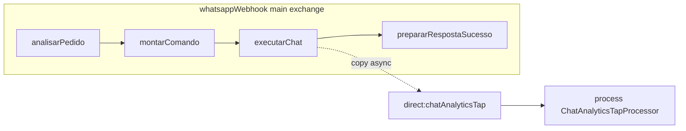

# Categorização automática (Gemini) + `chat_analytics`

## Contexto existente (evitar duplicar sem necessidade)

- **Flyway:** scripts em [`bootstrap/src/main/resources/db/migration`](d:\Documents\agenteAtendimento\bootstrap\src\main\resources\db\migration); próximo ficheiro: **`V10__chat_analytics.sql`**.
- **Classificação Gemini já existente:** [`ConversationPrimaryIntentService`](d:\Documents\agenteAtendimento\application\src\main\java\com\atendimento\cerebro\application\service\ConversationPrimaryIntentService.java) usa `AIEnginePort` + `TRANSCRIPT_SYSTEM_PROMPT` e grava em **`analytics_intents`** com categorias `ORCAMENTO`, `AGENDAMENTO`, etc. — **sem sentimento** e **só em limiar/inatividade**.
- **Async hoje:** [`PrimaryIntentTurnNotifier`](d:\Documents\agenteAtendimento\infrastructure\src\main\java\com\atendimento\cerebro\infrastructure\analytics\PrimaryIntentTurnNotifier.java) usa `@Async`; **não há `wireTap`** no projeto ([`WhatsAppIntegrationRoute`](d:\Documents\agenteAtendimento\infrastructure\src\main\java\com\atendimento\cerebro\infrastructure\adapter\inbound\rest\camel\WhatsAppIntegrationRoute.java)).
- **REST analytics:** [`AnalyticsRestRoute`](d:\Documents\agenteAtendimento\infrastructure\src\main\java\com\atendimento\cerebro\infrastructure\adapter\inbound\rest\camel\AnalyticsRestRoute.java) expõe `/v1/analytics/...` (servlet Camel com context-path `/api/*` → **`/api/v1/...`**).

Este trabalho **não remove** o fluxo `analytics_intents`; cumpre a sua tabela e endpoint novos.

---

## 1. Base de dados: `chat_analytics`

Novo script **`V10__chat_analytics.sql`**:

- Colunas: `id` (BIGSERIAL PK), `tenant_id`, `phone_number`, `main_intent`, `sentiment`, `last_updated` (TIMESTAMPTZ, default `NOW()`).
- **CHECK** em `main_intent` para os valores pedidos: `Venda`, `Suporte`, `Orçamento`, `Agendamento`, `Outros`.
- **CHECK** em `sentiment`: `Positivo`, `Neutro`, `Negativo`.
- **UNIQUE** `(tenant_id, phone_number)` — semântica de **último estado por conversa** (cada classificação faz `INSERT ... ON CONFLICT ... DO UPDATE`).
- Índice `(tenant_id)` para agregações do endpoint.

---

## 2. Camada de aplicação: `AnalyticsService` + portas

- **`AnalyticsService`** (nome pedido; package [`application/.../service`](d:\Documents\agenteAtendimento\application\src\main\java\com\atendimento\cerebro\application\service)): método principal, por exemplo `analyzeAndUpsert(TenantId tenantId, String phoneNumber, List<ChatMessage> recentChronological, String latestAssistantText)`.
  - Monta **transcrição** no estilo de `ConversationPrimaryIntentService.buildTranscript` (reutilizar a função estática existente ou extrair pequeno helper partilhado **só se** evitar duplicação óbvia).
  - **System prompt** curto (PT-BR) alinhado ao texto que indicou; **user content**: bloco `"Últimas mensagens:\n" + transcript` (incluir a linha do assistente do turno actual se ainda não estiver em `chat_message`).
  - Pedido ao modelo via **`AIEnginePort.complete`** + [`AICompletionRequest`](d:\Documents\agenteAtendimento\application\src\main\java\com\atendimento\cerebro\application\dto\AICompletionRequest.java) com `AiChatProvider.GEMINI`, `conversationHistory = List.of()`, `knowledgeHits = List.of()`, `userMessage = ...`, `systemPrompt = ...` — mesmo padrão que [`classifyAndPersist`](d:\Documents\agenteAtendimento\application\src\main\java\com\atendimento\cerebro\application\service\ConversationPrimaryIntentService.java).
  - Exigir resposta **estruturada para parse** (ex.: duas linhas `INTENCAO: ...` / `SENTIMENTO: ...` ou JSON mínimo `{"intencao":"...","sentimento":"..."}`) para parsing robusto; mapear sinónimos para o conjunto fixo e fazer **fallback** (`Outros` / `Neutro`) se o modelo falhar.
- **Porta de persistência:** `ChatAnalyticsRepository` (ou nome equivalente) em `application/port/out`: `upsert(...)`, `countByIntentAndSentiment(TenantId)` ou dois métodos que alimentem o DTO do endpoint.
- **DTO de leitura:** record(s) para contagens (ex.: `ChatAnalyticsStatsResult` com listas ou mapas por intenção e sentimento **com zeros** incluídos, à semelhança de [`handleIntents`](d:\Documents\agenteAtendimento\infrastructure\src\main\java\com\atendimento\cerebro\infrastructure\adapter\inbound\rest\camel\AnalyticsRestRoute.java)).

**Infra:** `JdbcChatAnalyticsRepository` com `JdbcClient` (como [`JdbcChatMessageRepository`](d:\Documents\agenteAtendimento\infrastructure\src\main\java\com\atendimento\cerebro\infrastructure\adapter\out\persistence\JdbcChatMessageRepository.java)).

**Bean:** registar `AnalyticsService` em [`ApplicationConfiguration`](d:\Documents\agenteAtendimento\bootstrap\src\main\java\com\atendimento\cerebro\bootstrap\ApplicationConfiguration.java) (padrão actual do projecto para serviços de aplicação).

---

## 3. Integração Camel: `wireTap` após o chat

Objetivo: **não aumentar** o tempo até `prepararRespostaSucesso` / envio WhatsApp.

Alterações em [`WhatsAppIntegrationRoute`](d:\Documents\agenteAtendimento\infrastructure\src\main\java\com\atendimento\cerebro\infrastructure\adapter\inbound\rest\camel\WhatsAppIntegrationRoute.java):

1. Depois de `.process(this::executarChat)`, guardar em **exchange property** o [`ChatResult`](d:\Documents\agenteAtendimento\application\src\main\java\com\atendimento\cerebro\application\dto\ChatResult.java) (o body pode ser reutilizado pelo tap, mas a propriedade evita ambiguidades se o body mudar).
2. Acrescentar **`.wireTap("direct:chatAnalyticsTap")`** antes de `.process(this::prepararRespostaSucesso)` (ainda dentro do `circuitBreaker` no ramo de sucesso).
3. Novo `RouteBuilder` **pequeno** (ou secção no mesmo ficheiro, conforme convenção do repo) com `from("direct:chatAnalyticsTap").routeId(...).process(chatAnalyticsTapBean)` para manter o `WhatsAppIntegrationRoute` legível.

**`ChatAnalyticsTapProcessor` (componente Spring):**

- Lê `tenantId`, `phone`, `ChatResult` da cópia do exchange.
- Carrega mensagens recentes via `ChatMessageRepository.findRecentForTenantAndPhone` (reutilizar janela/limites semelhantes ao histórico WhatsApp: p.ex. mesmos 2 dias / N mensagens que [`loadWhatsAppHistoryPriorTurns`](d:\Documents\agenteAtendimento\infrastructure\src\main\java\com\atendimento\cerebro\infrastructure\adapter\inbound\rest\camel\WhatsAppIntegrationRoute.java) ou parâmetros configuráveis curtos).
- Chama `AnalyticsService.analyzeAndUpsert(...)`.
- Tratamento de erros: log `WARN`/`DEBUG`, **sem** propagar excepção para o webhook (o `wireTap` já isola; garantir try/catch no processor).

**Nota importante:** no instante do tap, a mensagem **ASSISTANT** pode ainda não estar na BD (persistência ocorre em [`WhatsAppOutboundRoutes`](d:\Documents\agenteAtendimento\infrastructure\src\main\java\com\atendimento\cerebro\infrastructure\adapter\inbound\rest\camel\WhatsAppOutboundRoutes.java)). Por isso o texto da resposta deve vir do **`ChatResult`** incluído no tap, não só do `SELECT`.

---

## 4. Endpoint `GET /api/v1/analytics/stats`

- Em [`AnalyticsRestRoute`](d:\Documents\agenteAtendimento\infrastructure\src\main\java\com\atendimento\cerebro\infrastructure\adapter\inbound\rest\camel\AnalyticsRestRoute.java): `rest(...).get("/stats").to("direct:analyticsChatStats")`.
- Query **`tenantId` obrigatório** (igual a `/summary` e `/intents` via `resolveTenantId`).
- Resposta JSON: contagens totais **por intenção** e **por sentimento** (todas as chaves com zero), mais metadados mínimos (tenantId, timestamps opcionais se fizer sentido “snapshot agora”).
- Implementação: `ChatAnalyticsRepository` com `GROUP BY` sobre `chat_analytics` filtrado por `tenant_id`.

**Testes:** espelhar [`AnalyticsIntentsRestRouteIntegrationTest`](d:\Documents\agenteAtendimento\bootstrap\src\test\java\com\atendimento\cerebro\camel\AnalyticsIntentsRestRouteIntegrationTest.java) para `GET /api/v1/analytics/stats` + teste unitário do parser do output Gemini em `AnalyticsService`.

**Documentação OpenAPI:** atualizar [`bootstrap/src/main/resources/static/openapi.yaml`](d:\Documents\agenteAtendimento\bootstrap\src\main\resources\static\openapi.yaml) com o novo path (opcional mas recomendado para consistência com o resto das rotas `/api/v1/analytics/*`).

---

## 5. Riscos / decisões

- **Duas taxonomias:** `analytics_intents` (maiúsculas EN-style) vs `chat_analytics` (PT pedido). O dashboard pode escolher qual feed usar; não misturar colunas sem migração.
- **Custo/latência:** cada mensagem dispara classificação assíncrona; considerar feature flag em `application.yml` (`cerebro.analytics.chat.enabled`) se quiser desligar em ambientes de teste (opcional, pequena propriedade `@ConfigurationProperties`).
- **`wireTap` vs `@Async`:** cumpre o requisito explícito de Camel; o processamento pesado permanece fora do thread principal do webhook.
