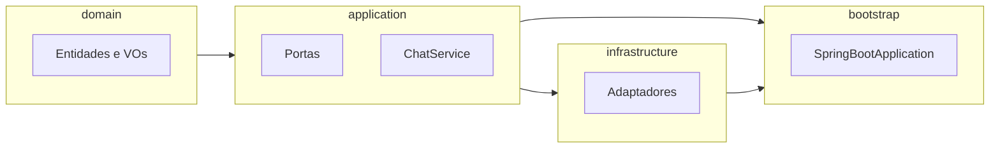

# Plano: Cérebro multi-tenant (Hexagonal + Spring Boot 3 + Java 21)

## Contexto

O workspace [`d:\Documents\agenteAtendimento`](d:\Documents\agenteAtendimento) está vazio; trata-se de um **projeto novo**. A separação hexagonal fica mais **enforçável** com **Maven multi-módulo**: o módulo `domain` não declara Spring; `application` só depende de `domain`; `infrastructure` depende de `application` + Spring/Spring AI; `bootstrap` agrega o executável Spring Boot.

## Visão de módulos e dependências

## Estrutura de pastas (proposta)

Raiz: `pom.xml` (parent BOM: Spring Boot 3.x + Java 21 + **Spring AI BOM** alinhado à versão do Boot).

- **[`domain/src/main/java/.../domain/`](domain)** — núcleo puro
  - `conversation/` — `ConversationContext`, `Message` (papéis: user/assistant/system ou equivalente), identificadores como value objects se desejar (`ConversationId`, `TenantId` como `record` ou classe imutável).
  - `tenant/` (opcional no mesmo pacote) — `TenantId`; referência a configurações pode ser só IDs no domínio na fase inicial.
- **[`application/src/main/java/.../application/`](application)**
  - `port/in/` — `ChatUseCase` (interface da porta de entrada usada por REST/fila depois) **ou** expor diretamente `ChatService` como classe orquestradora (recomendação: **`ChatUseCase` + `ChatService` implementando** para hexágono mais explícito).
  - `port/out/` — portas de saída (driven):
    - `KnowledgeBasePort` — busca semântica (vetores).
    - `AIEnginePort` — processamento LLM.
    - **`ConversationContextStorePort`** (nome sugerido) — carregar/persistir `ConversationContext` por `TenantId` + `ConversationId` (necessário para o fluxo “recuperar → salvar”; sem isso o orquestrador não fecha o ciclo).
  - `service/` — `ChatService` com o fluxo abaixo.
  - `dto/` (opcional) — `ChatCommand` / `ChatResult` imutáveis para a camada de aplicação.
- **[`infrastructure/src/main/java/.../infrastructure/`](infrastructure)** — apenas na fase seguinte ou como esqueleto: `adapter/out/vector`, `adapter/out/ai` (Spring AI), `adapter/out/persistence` (memória/Redis/DB). Na “tarefa inicial” pode haver **`NoOp` ou in-memory** mínimos só para o contexto subir; o foco pedido é **interfaces + orquestração + testes**.
- **[`bootstrap/src/main/java/...`](bootstrap)** — `@SpringBootApplication`, `main`, configuração de beans que **registram implementações** das portas (quando existirem).

Convenção de pacote base sugerida: `com.atendimento.cerebro` (ajuste livre para o seu domínio corporativo).

## Entidade de domínio `ConversationContext`

- Campos conceituais: `TenantId tenantId`, `ConversationId conversationId`, coleção ordenada de `Message` (conteúdo, papel, timestamp opcional), regras mínimas (ex.: imutabilidade com cópia ao adicionar mensagem; validação de não-nulos).
- **Sem** anotações JPA ou Spring no `domain`.
- Lombok: `@Getter`, `@Builder` (ou records onde couber sem conflito com comportamento).

## Multi-tenant

- Propagar **`TenantId` em todos os métodos das portas de saída** e no comando de entrada do `ChatUseCase` (ou no `ChatCommand`).
- “Configurações de IA e base de conhecimento por tenant”: na fase inicial, **não é obrigatório modelar todas as configs no domínio**; basta que as implementações de `AIEnginePort` e `KnowledgeBasePort` recebam `TenantId` e resolvam API keys, índice/collection e hiperparâmetros internamente (arquivos, DB ou config Spring por tenant depois). Se quiser deixar explícito já no core, um VO leve `TenantAIProfile` / `KnowledgeBaseScope` pode ficar em `application.dto` ou `domain.tenant` — escopo mínimo recomendado: **só `TenantId` nas portas** até existir armazenamento de config.

## Portas (interfaces) — contratos essenciais

### `KnowledgeBasePort` (saída)

- Método do tipo: busca por linguagem natural + limite de resultados + `TenantId`.
- Tipo de retorno: lista de **trechos citáveis** (ex.: `KnowledgeHit` com `String id`, `String content`, `double score` opcional) no pacote `application` ou `domain` (preferência: **VO em `domain.knowledge`** se for conceito universal do negócio; senão DTO em `application`).

### `AIEnginePort` (saída)

- Entrada: `TenantId`, histórico relevante (lista de `Message` ou subset), **trechos da base** retornados pela KB, **mensagem atual do usuário**.
- Saída: texto da resposta (e opcionalmente metadados para telemetria).
- O contrato permanece **agnóstico de provedor**; Spring AI fica só no adapter.

### `ConversationContextStorePort` (saída, recomendado)

- `Optional<ConversationContext> load(TenantId, ConversationId)`
- `void save(ConversationContext)`

## `ChatService` (orquestração)

Implementa `ChatUseCase`; fluxo exatamente como pedido:

1. **Receber** comando (tenant, conversationId, texto do usuário).
2. **Recuperar** contexto via `ConversationContextStorePort` (ou criar vazio se ausente).
3. **Buscar** na base com `KnowledgeBasePort` (query = mensagem atual ou query enriquecida simples na v1).
4. **Chamar** `AIEnginePort` com histórico + hits da KB + mensagem.
5. **Atualizar** `ConversationContext` (append user + assistant).
6. **Salvar** via `ConversationContextStorePort`.
7. **Retornar** `ChatResult` com a resposta.

Injeção de dependência: no `bootstrap`, construtor do `ChatService` com as portas; em testes, Mockito nas interfaces.

## Stack Maven (referência)

- Parent POM: `spring-boot-starter-parent` 3.x, `java.version` **21**, import **Spring AI BOM** (versão compatível com o Boot escolhido — fixar após primeira resolução de dependências).
- Módulos:
  - `domain`: só Lombok + (opcional) `jakarta.validation-api` sem implementação, ou validação manual.
  - `application`: `domain` + Lombok.
  - `infrastructure`: `application` + `spring-boot-starter` + **Spring AI** starters pertinentes (ex.: OpenAI quando for implementar).
  - `bootstrap`: `spring-boot-starter-web` (se REST na v1), `infrastructure`, `spring-boot-starter-test`.
- Testes: `spring-boot-starter-test` (JUnit 5), Mockito; testes unitários de `ChatService` no módulo `application` com **mocks das 3 portas**, cobrindo: contexto novo, contexto existente, ordem das interações (`InOrder` opcional), persistência após resposta.

## O que não entra na primeira entrega (a menos que você peça)

- Adaptadores reais de vetor (pgvector, Pinecone, etc.) e persistência distribuída do contexto.
- API REST completa + segurança multi-tenant (JWT com claim de tenant); pode ser passo imediato depois do core.

## Arquivos principais a criar (checklist)

| Área | Arquivos |
|------|----------|
| Build | Parent [`pom.xml`](pom.xml), [`domain/pom.xml`](domain/pom.xml), [`application/pom.xml`](application/pom.xml), [`infrastructure/pom.xml`](infrastructure/pom.xml), [`bootstrap/pom.xml`](bootstrap/pom.xml) |
| Domain | `ConversationContext`, `Message`, IDs |
| Application | `ChatUseCase`, `ChatService`, `KnowledgeBasePort`, `AIEnginePort`, `ConversationContextStorePort`, DTOs |
| Testes | `ChatServiceTest` com Mockito |
