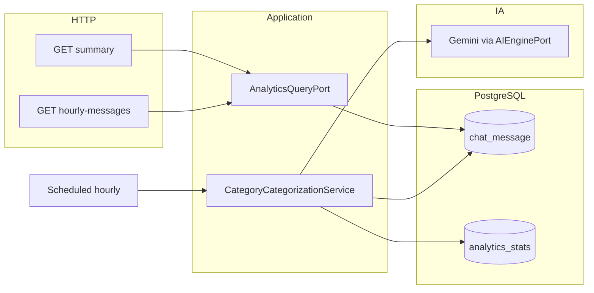

# Plano: Serviço de Analytics para o Dashboard

## Contexto atual

- Rotas públicas combinam [`camel.servlet.mapping.context-path: /api/*`](d:\Documents\agenteAtendimento\bootstrap\src\main\resources\application.yml) com `rest("/v1/...")` nos `RouteBuilder`, resultando em URLs como **`/api/v1/...`** (ex.: [`MessagesRestRoute`](d:\Documents\agenteAtendimento\infrastructure\src\main\java\com\atendimento\cerebro\infrastructure\adapter\inbound\rest\camel\MessagesRestRoute.java) com `tenantId` em query).
- Dados operacionais relevantes estão em **`chat_message`** ([`JdbcChatMessageRepository`](d:\Documents\agenteAtendimento\infrastructure\src\main\java\com\atendimento\cerebro\infrastructure\adapter\out\persistence\JdbcChatMessageRepository.java)), com `occurred_at`, `phone_number`, `role` (`USER` / `ASSISTANT`), `status` (`RECEIVED`, `SENT`, `ERROR`). Já existe migração [`V7__chat_message_intent_and_avatar.sql`](d:\Documents\agenteAtendimento\bootstrap\src\main\resources\db\migration\V7__chat_message_intent_and_avatar.sql) com `detected_intent` na mensagem; o pedido de **`analytics_stats`** mantém agregação/analytics separada da linha de mensagem.
- Geração com IA usa **[`AIEnginePort`](d:\Documents\agenteAtendimento\application\src\main\java\com\atendimento\cerebro\application\port\out\AIEnginePort.java)** + [`AICompletionRequest`](d:\Documents\agenteAtendimento\application\src\main\java\com\atendimento\cerebro\application\dto\AICompletionRequest.java) (histórico, knowledge, `userMessage`, persona); [`GeminiChatEngineAdapter`](d:\Documents\agenteAtendimento\infrastructure\src\main\java\com\atendimento\cerebro\infrastructure\adapter\out\ai\GeminiChatEngineAdapter.java) chama `ChatModel.call` — adequado para um prompt de classificação curto.
- **Não há** `@EnableScheduling` nem rotas Camel `timer` hoje; o job horário será introduzido com **Spring Scheduling** (mais simples para batch JDBC + IA) a menos que queiram explicitamente métricas Camel no job.

## Definições de negócio (contrato dos endpoints)

| Métrica | Definição proposta |
|--------|---------------------|
| **Total de mensagens (24h)** | `COUNT(*)` em `chat_message` com `tenant_id = ?` e `occurred_at >= now() - 24h`. |
| **Utilizadores únicos (24h)** | `COUNT(DISTINCT phone_number)` no mesmo filtro. |
| **Taxa de sucesso (24h)** | Sobre mensagens **`role = ASSISTANT`** apenas: `100 * COUNT(*) FILTER (WHERE status = 'SENT') / NULLIF(COUNT(*) FILTER (WHERE status IN ('SENT','ERROR')), 0)`. **`RECEIVED`** fica de fora (ainda não terminal). Se denominador 0 → `successRate` `null` no JSON. |
| **Volume por hora** | Para o tenant, agregar `date_trunc('hour', occurred_at AT TIME ZONE 'UTC')` (ou equivalente) com `COUNT(*)`, **janela configurável** (default **24 horas**), ordenado cronologicamente. **Fuso documentado como UTC** na API/resposta (`bucket` como instante ISO início da hora) para evitar ambiguidade; opcional futuro: query `timeZone`. |

## 1. Schema `analytics_stats`

Nova migração **Flyway [`V8__analytics_stats.sql`](d:\Documents\agenteAtendimento\bootstrap\src\main\resources\db\migration)** (V7 já está usada):

- Tabela `analytics_stats` com, no mínimo:
  - `tenant_id`, `bucket_hour` (início da hora UTC da classificação), `phone_number`, `category` (`VENDAS`, `SUPORTE`, `FINANCEIRO`, `OUTRO`), `classified_at`, opcional `model_label` (texto cru) para auditoria.
  - **`UNIQUE (tenant_id, bucket_hour, phone_number)`** para idempotência do job.
- Índice `(tenant_id, bucket_hour)` para leituras do dashboard futuras.

## 2. Camada de aplicação

- **Port de leitura** (ex.: `AnalyticsQueryPort`) com métodos:
  - `Summary24h` para o sumário;
  - `List<HourlyCount>` para o gráfico.
- **Port de escrita** (ex.: `AnalyticsStatsRepository`): `insertIfAbsent(...)` ou `upsert` para gravar classificação.
- **Port auxiliar** em [`ChatMessageRepository`](d:\Documents\agenteAtendimento\application\src\main\java\com\atendimento\cerebro\application\port\out\ChatMessageRepository.java): consultas para o job, por exemplo:
  - pares distintos `(tenant_id, phone_number)` com pelo menos uma mensagem `USER` no intervalo `[start, end)`;
  - concatenação ordenada do texto `USER` nesse intervalo (pode ser feita na app com `find...` limitado ou uma query SQL dedicada com `string_agg` — preferir uma query agregada para menos round-trips).
- **Serviço de classificação** (ex.: `ConversationCategoryAnalyticsService`):
  - Para cada par no intervalo **hora anterior completa** (job a correr no minuto 0: intervalo `[nowTruncHour-1h, nowTruncHour)`), se não existir linha em `analytics_stats`, montar `AICompletionRequest` com:
    - `conversationHistory`: vazio ou mínimo;
    - `knowledgeHits`: vazio;
    - `userMessage`: texto resumo das mensagens USER (truncar se necessário, ex. 2–4k chars);
    - `systemPrompt`: instruções rígidas — responder **apenas** uma palavra/chave entre `VENDAS`, `SUPORTE`, `FINANCEIRO`, ou `OUTRO`;
    - `chatProvider`: [`AiChatProvider.GEMINI`](d:\Documents\agenteAtendimento\application\src\main\java\com\atendimento\cerebro\application\ai\AiChatProvider.java).
  - Normalizar resposta (trim, map case-insensitive); se inválido → `OUTRO`.
  - Inserir em `analytics_stats` dentro de transação por lote ou por conversa com tratamento de concorrência na unique key.

## 3. Job horário

- Adicionar **`@EnableScheduling`** (ex. na [`ApplicationConfiguration`](d:\Documents\agenteAtendimento\bootstrap\src\main\java\com\atendimento\cerebro\bootstrap\ApplicationConfiguration.java) ou classe dedicada em `bootstrap`).
- Componente `@Component` com `@Scheduled(cron = "0 0 * * * *")` (início de cada hora) que delega ao serviço de classificação.
- Propriedade opcional `cerebro.analytics.categorization.enabled` (default `true`) para ambientes sem Gemini/chave.
- Logging: contagem processada, falhas por conversa (não falhar o job inteiro por um telefone).

**Alternativa Camel:** novo `RouteBuilder` com `from("timer:analyticsHourly?period=3600000&fixedRate=true")` chamando o mesmo serviço — só vale a pena se quiserem uniformizar observabilidade com outras rotas Camel.

## 4. Endpoints REST (Camel)

Novo [`AnalyticsRestRoute`](d:\Documents\agenteAtendimento\infrastructure\src\main\java\com\atendimento\cerebro\infrastructure\adapter\inbound\rest\camel) (padrão igual ao `MessagesRestRoute`):

| Método | Caminho no código | URL pública |
|--------|-------------------|-------------|
| GET | `rest("/v1/analytics").get("/summary")` | **`GET /api/v1/analytics/summary?tenantId=`** |
| GET | `get("/hourly-messages")` (ou nome equivalente) | **`GET /api/v1/analytics/hourly-messages?tenantId=&hours=24`** |

DTOs JSON pequenos (ex.: `totalMessages`, `uniqueUsers`, `successRate`, `periodStart`, `periodEnd`; hourly: `points: [{ bucket, count }]`).

Validação: `tenantId` obrigatório (400 se ausente), `hours` limitado (ex. 1–168).

## 5. Contrato e front-end

- Atualizar [`openapi.yaml`](d:\Documents\agenteAtendimento\bootstrap\src\main\resources\static\openapi.yaml) com os dois endpoints.
- O dashboard hoje usa placeholders em [`metric-cards.tsx`](d:\Documents\agenteAtendimento\atendimento-frontEnd\atendimento-frontend\src\components\dashboard\metric-cards.tsx); após o backend, conectar via [`apiService.ts`](d:\Documents\agenteAtendimento\atendimento-frontEnd\atendimento-frontend\src\services\apiService.ts) (escopo opcional se quiserem só API nesta entrega).

## 6. Testes

- **Unidade:** serviço de classificação com `AIEnginePort` mockado (respostas válidas/inválidas).
- **Integração leve:** queries de sumário/horário com `JdbcClient`/Testcontainers se o projeto já tiver padrão semelhante; caso contrário, testes de mapeamento SQL com mocks do `JdbcClient` onde for viável.

## Diagrama de fluxo (visão geral)

## Riscos e mitigação

- **Custo/latência Gemini:** muitos `(tenant, phone)` na hora → muitas chamadas; mitigar com limite configurável por execução ou processamento em lotes e logs de truncagem.
- **Fuso horário:** resposta em UTC explícita; front pode converter.
- **Duplicados:** unique key em `analytics_stats` + tratar `DuplicateKey` como sucesso (idempotência).
