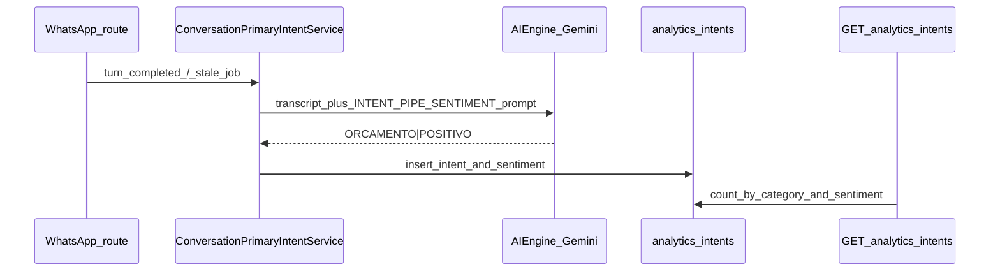

# Dashboard: intenções, sentimento (IA) e destaque

## Estado atual

- Em [`atendimento-frontEnd/atendimento-frontend/src/components/dashboard/dashboard-panel.tsx`](atendimento-frontEnd/atendimento-frontend/src/components/dashboard/dashboard-panel.tsx) já existe um **donut** (`PieChart` + `innerRadius={52}`) alimentado por `getAnalyticsIntents`, com rótulos via `useTranslations("dashboard")` e `primaryIntents.*` (ex.: PT “Orçamento”, EN “Quote / budget”, ES “Presupuesto”).
- **Não há** modelo de dados nem API para **sentimento**; busca por `sentiment` no repositório não retorna nada.
- A janela de intenções no front replica o período do dashboard (`days` 1 / 7 / 30), alinhada ao backend em [`AnalyticsRestRoute.handleIntents`](infrastructure/src/main/java/com/atendimento/cerebro/infrastructure/adapter/inbound/rest/camel/AnalyticsRestRoute.java) (`[now − days, now)`).

## 1. Gráfico de intenções (pizza)

- **Se a expectativa for pizza “cheia”**: alterar `innerRadius` de `52` para `0` (ou valor muito baixo) no mesmo `Pie`; legenda/tooltip permanecem.
- **Se a expectativa for só reposicionamento**: colocar **área** e, na linha seguinte, um **grid responsivo** (ex.: uma coluna no mobile) para alinhar intenções + sentimento lado a lado em `md+`, conforme item 3.
- Ajustar títulos nas mensagens se quiser o texto exato “Intenções dos Clientes” em [`src/messages/{pt-BR,en,es,zh-CN}.json`](atendimento-frontEnd/atendimento-frontend/src/messages/pt-BR.json) (`dashboard.primaryIntents.pieTitle` / `pieSubtitle`).

## 2. Backend: sentimento com dados reais de IA

Fluxo atual: [`ConversationPrimaryIntentService`](application/src/main/java/com/atendimento/cerebro/application/service/ConversationPrimaryIntentService.java) envia a transcrição ao Gemini com `TRANSCRIPT_SYSTEM_PROMPT` e persiste **uma** categoria em [`analytics_intents`](bootstrap/src/main/resources/db/migration/V9__analytics_intents.sql) via [`JdbcAnalyticsIntentsRepository.insert`](infrastructure/src/main/java/com/atendimento/cerebro/infrastructure/adapter/out/persistence/JdbcAnalyticsIntentsRepository.java).

**Abordagem (uma única chamada ao modelo):**

- Adicionar enum em application, ex. `ConversationSentiment`: `POSITIVO`, `NEUTRO`, `NEGATIVO` (valores estáveis no prompt e no DB).
- Alterar o prompt para exigir **uma única linha** no formato `INTENCAO|SENTIMENTO` (intenção igual às categorias já existentes; sentimento com as três opções em português ou tokens fixos mapeados no parse).
- Implementar parse robusto (split por `|`, trim, fallback: intenção via lógica atual; sentimento `NEUTRO` se inválido — ou `null` no DB se preferir não inventar; recomenda-se **NEUTRO** para não deixar o gráfico vazio em classificações antigas após deploy).
- **Flyway**: nova migration `V10__analytics_intents_sentiment.sql` — coluna `conversation_sentiment VARCHAR(16) NULL` + `CHECK` alinhado ao enum (ou sem CHECK e validação só na aplicação).
- Estender `AnalyticsIntentsRepository.insert(...)` com parâmetro de sentimento; atualizar `JdbcAnalyticsIntentsRepository` (INSERT + novo método `countBySentimentInRange` com `classified_at` na mesma janela que as intenções).
- Estender resposta HTTP em [`AnalyticsIntentsHttpResponse`](infrastructure/src/main/java/com/atendimento/cerebro/infrastructure/adapter/inbound/rest/camel/AnalyticsIntentsHttpResponse.java), por exemplo:
  - `List<SentimentCountHttp> sentimentCounts` — sempre três entradas (zeros permitidos), espelhando o padrão de `counts` para intenções.
- Em `handleIntents`, além do agregado atual, preencher `sentimentCounts` e **período anterior** (ver §4).
- Atualizar [`AnalyticsIntentsRestRouteIntegrationTest`](bootstrap/src/test/java/com/atendimento/cerebro/camel/AnalyticsIntentsRestRouteIntegrationTest.java) (assinatura `insert` + asserções dos novos campos).

## 3. Front: gráfico de sentimento

- Estender tipo [`AnalyticsIntentsResponse`](atendimento-frontEnd/atendimento-frontend/src/services/apiService.ts) + `isAnalyticsIntentsResponse` para `sentimentCounts` (e campos de comparação do §4).
- Implementar com **Recharts** [`BarChart`](https://recharts.org/en-US/api/BarChart) **horizontal** (`layout="vertical"`, `XAxis type="number"`, `YAxis dataKey="label"`) ou um segundo **donut** — o pedido aceita ambos; barras horizontais costumam ler bem para 3 categorias.
- Cores discretas coerentes com o tema (ex.: verde / cinza / vermelho suaves usando variáveis CSS ou tokens existentes).
- Novas chaves i18n: `dashboard.sentiment.title`, `subtitle`, rótulos `POSITIVO` / `NEUTRO` / `NEGATIVO` em PT, EN, ES, **e** [`zh-CN.json`](atendimento-frontEnd/atendimento-frontend/src/messages/zh-CN.json) para não quebrar paridade.

## 4. Card “Destaque da IA” e comparação de volume

- No mesmo `handleIntents`, calcular janela **immediately anterior** de igual duração: `[now − 2×days, now − days)`.
- Reutilizar `countByCategoryInRange` para o período anterior e incluir na resposta, por exemplo `previousCounts` (mesma forma que `counts`) **ou** só expor `previousPeriodStart` / `previousPeriodEnd` + lista; o front precisa dos números por categoria.
- No React: identificar a categoria com **maior aumento percentual** em relação ao período anterior (tratar `previous === 0` e `current > 0` como “subida forte” ou 100% conforme regra única documentada no código).
- Mensagens next-intl com interpolação, ex.: `dashboard.aiInsight.spike` com `{percent}`, `{category}` (onde `category` já vem de `t(\`primaryIntents.${key}\`)`), e variantes `stable`, `empty` quando não houver dados ou mudança relevante (limiar mínimo opcional, ex. só mostrar “atenção” se `percent >= 5`).

## 5. Resumo de ficheiros principais

| Camada | Ficheiros |
|--------|-----------|
| DB | Nova migration sob [`bootstrap/src/main/resources/db/migration/`](bootstrap/src/main/resources/db/migration/) |
| Domínio / app | Novo enum sentimento; `ConversationPrimaryIntentService`; [`AnalyticsIntentsRepository`](application/src/main/java/com/atendimento/cerebro/application/port/out/AnalyticsIntentsRepository.java) |
| Infra | [`JdbcAnalyticsIntentsRepository`](infrastructure/src/main/java/com/atendimento/cerebro/infrastructure/adapter/out/persistence/JdbcAnalyticsIntentsRepository.java); [`AnalyticsRestRoute`](infrastructure/src/main/java/com/atendimento/cerebro/infrastructure/adapter/inbound/rest/camel/AnalyticsRestRoute.java); DTOs HTTP do pacote `camel` |
| Front | [`dashboard-panel.tsx`](atendimento-frontEnd/atendimento-frontend/src/components/dashboard/dashboard-panel.tsx); [`apiService.ts`](atendimento-frontEnd/atendimento-frontend/src/services/apiService.ts); `src/messages/*.json` |

Nenhuma alteração obrigatória em `next.config.ts` (mesmo endpoint `/api/v1/analytics/intents`).
