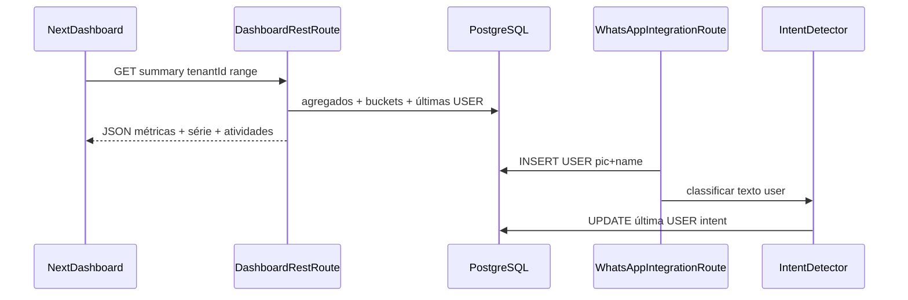

# Painel do Dashboard com dados reais

## Contexto do código hoje

- A Home está em [`atendimento-frontEnd/atendimento-frontend/src/app/[locale]/(app)/page.tsx`](atendimento-frontEnd/atendimento-frontend/src/app/[locale]/(app)/page.tsx) com [`MetricCards`](atendimento-frontEnd/atendimento-frontend/src/components/dashboard/metric-cards.tsx) (3 cards placeholder, `getTranslations("dashboard.metrics")`).
- Dados de conversa existem só via [`GET /api/v1/messages`](bootstrap/src/main/resources/static/openapi.yaml); o tipo [`ChatMessage`](domain/src/main/java/com/atendimento/cerebro/domain/monitoring/ChatMessage.java) tem `contactDisplayName` mas **não** foto nem intenção; o limite da listagem é pensado para monitorização, não para agregados de 24h/semana/mês.
- **`recharts` não está em** [`package.json`](atendimento-frontEnd/atendimento-frontend/package.json) — será dependência nova (componentes de gráfico em client component).

## Arquitetura proposta

## Backend (Spring + Camel)

1. **Migração Flyway** (ex.: `V7__chat_message_intent_and_avatar.sql`): colunas opcionais em `chat_message`:
   - `contact_profile_pic_url TEXT NULL`
   - `detected_intent VARCHAR(128) NULL`  
   Atualizar [`ChatMessage`](domain/src/main/java/com/atendimento/cerebro/domain/monitoring/ChatMessage.java), [`JdbcChatMessageRepository`](infrastructure/src/main/java/com/atendimento/cerebro/infrastructure/adapter/out/persistence/JdbcChatMessageRepository.java) (INSERT/SELECT/UPDATE), [`ChatMessageItemResponse`](infrastructure/src/main/java/com/atendimento/cerebro/infrastructure/adapter/inbound/rest/camel/ChatMessageItemResponse.java) e [`MessagesRestRoute`](infrastructure/src/main/java/com/atendimento/cerebro/infrastructure/adapter/inbound/rest/camel/MessagesRestRoute.java) para serializar os novos campos (monitorização passa a mostrar intenção/foto quando existir).

2. **Webhook Evolution / Meta**: alargar [`WhatsAppWebhookParser.Incoming.TextMessage`](infrastructure/src/main/java/com/atendimento/cerebro/infrastructure/adapter/inbound/rest/camel/WhatsAppWebhookParser.java) com `contactProfilePicUrl` opcional; extrair de nós comuns (`profilePicUrl`, `profilePictureUrl`, `imgUrl` sob `data` / `sender` — validar contra payloads reais e manter `null` se ausente). Passar esse valor a [`persistInboundUserMessage`](infrastructure/src/main/java/com/atendimento/cerebro/infrastructure/adapter/inbound/rest/camel/WhatsAppIntegrationRoute.java).

3. **Deteção de intenção (IA)**  
   - Novo port de aplicação (ex. `IntentDetectionPort`) com implementação que chama o motor já existente (`AIEnginePort` / Gemini) com prompt **curto** (uma frase + lista fechada de etiquetas, resposta só a etiqueta).  
   - Invocar **após** `chatUseCase.chat` no fluxo de sucesso do webhook (e opcionalmente ignorar em fallback/timeout para não bloquear resposta), depois **`UPDATE` na última linha USER** do tenant+telefone com `detected_intent` (novo método no repositório, ex. `updateIntentForLatestUserMessage`).  
   - Tratar custo/latência: timeout curto e falha silenciosa (intenção `null`).

4. **Novo endpoint REST** `GET /api/v1/dashboard/summary?tenantId=&range=day|week|month` (Camel `RouteBuilder` alinhado a [`MessagesRestRoute`](infrastructure/src/main/java/com/atendimento/cerebro/infrastructure/adapter/inbound/rest/camel/MessagesRestRoute.java)):
   - **`totalClients`**: `COUNT(DISTINCT phone_number)` no tenant (opcionalmente filtrado pelo mesmo intervalo do `range` para coerência com o gráfico).
   - **`messagesToday`**: contagem de mensagens `USER` no dia civil atual (timezone: UTC no SQL ou documentar; idealmente alinhar com `Instant` já usado).
   - **`aiRatePercent`**: definir de forma clara no contrato, ex.: `ROUND(100.0 * COUNT(ASSISTANT com status SENT) / NULLIF(COUNT(USER),0))` no mesmo intervalo que o `range` (com teto 100%).
   - **`instanceStatus`**: valor derivado só de [`TenantConfiguration`](application) / settings já persistidos — ex. enum lógico `SIMULATED | CONFIGURED | INCOMPLETE` com base em `whatsappProviderType` e campos preenchidos (Meta: phone id + token; Evolution: base URL + instance + API key). Sem chamada HTTP à Evolution nesta fase (evita credenciais e timeouts); o cartão traduz o estado no frontend.
   - **`series`**: array de pontos para Recharts — para `day`: 24 buckets horários (últimas 24h); `week`: 7 dias; `month`: ~30 dias; agregação `COUNT(*)` ou só `USER`, conforme o que fizer sentido para “volume de mensagens” (recomendação: **todas as linhas** ou só **USER**; documentar no OpenAPI).
   - **`recentInteractions`**: últimas **5** mensagens `USER` ordenadas por `occurred_at`, com `phoneNumber`, `contactDisplayName`, `contactProfilePicUrl`, `detectedIntent`, `timestamp`, `content` (ou preview).

5. **OpenAPI**: atualizar [`openapi.yaml`](bootstrap/src/main/resources/static/openapi.yaml) com o schema do summary e respetivos testes de integração mínimos (padrão [`MessagesRestRouteIntegrationTest`](bootstrap/src/test/java/com/atendimento/cerebro/camel/MessagesRestRouteIntegrationTest.java)).

## Frontend (Next.js + tema dark)

1. **Dependência**: adicionar `recharts`.

2. **`apiService.ts`**: `getDashboardSummary(tenantId, range)` com tipos TS alinhados ao JSON do backend; reutilizar padrão de URL (`NEXT_PUBLIC_API_BASE` vs rewrite) como em [`getChatMessages`](atendimento-frontEnd/atendimento-frontend/src/services/apiService.ts).

3. **Refator da Home**:
   - Tornar o painel principal **client** (ou servidor com ilha client) para ler `cerebro-tenant-id` do `localStorage` como em [`monitoramento/page.tsx`](atendimento-frontEnd/atendimento-frontend/src/app/[locale]/(app)/dashboard/monitoramento/page.tsx).
   - **4 cards** (grid `md:grid-cols-2 lg:grid-cols-4`): Total de clientes, Mensagens hoje, Taxa de IA (%), Status da instância (badge com cores do tema / `Card` existente).
   - **Gráfico de área** (`AreaChart` + `Area` + `defs` `linearGradient`): cores **verde/azul neon** (ex. `#22d3ee` → `#34d399`) sobre fundo escuro; eixos/tooltip com [`hsl(var(--muted-foreground))`](atendimento-frontEnd/atendimento-frontend/src/app/globals.css) para legibilidade no dark.
   - **Controlo de período**: tabs ou `ToggleGroup` com labels **`Total` / `Semana` / `Mês`** mapeados para `range=day|week|month` (sem texto hardcoded).

4. **Tabela “Atividades recentes”**: colunas avatar (`Image` com `fallback` iniciais), nome (`contactDisplayName` ou telefone formatado), intenção (`detectedIntent` traduzida se existir chave em `dashboard.intents.*`, senão texto cru), hora relativa (reutilizar lógica/i18n semelhante a `monitor` se fizer sentido ou chaves novas em `dashboard`).

5. **Internacionalização**: estender `dashboard` (e subnamespaces se necessário) em **os quatro ficheiros**: [`pt-BR.json`](atendimento-frontEnd/atendimento-frontend/src/messages/pt-BR.json), [`en.json`](atendimento-frontEnd/atendimento-frontend/src/messages/en.json), [`es.json`](atendimento-frontEnd/atendimento-frontend/src/messages/es.json), [`zh-CN.json`](atendimento-frontEnd/atendimento-frontend/src/messages/zh-CN.json) — título/subtítulo atualizados, labels dos 4 cards, gráfico, períodos (**Total**, **Semana**, **Mês**), cabeçalhos da tabela, estados vazios/erro, valores do `instanceStatus`, e etiquetas de intenção frequentes.

6. **Limpeza**: substituir ou remover o antigo [`metric-cards.tsx`](atendimento-frontEnd/atendimento-frontend/src/components/dashboard/metric-cards.tsx) de 3 cards placeholder para evitar duplicação de namespaces; migrar chaves `dashboard.metrics.*` para a nova estrutura ou manter compatibilidade mínima.

## Riscos e decisões documentadas

- **Histórico antigo**: mensagens gravadas antes da migração terão `detected_intent` e foto nulos — UI deve mostrar placeholder e copy traduzido (“Sem intenção” / “—”).
- **“Total” vs 24h**: o utilizador pediu gráfico 24h mas também i18n “Total, Semana, Mês”; o plano usa **Total = vista `day` (24h agregadas por hora)** e Semana/Mês com buckets diários; ajustar copy em PT se preferirem “Hoje” em vez de “Total” no primeiro tab.
- **Taxa de IA**: depende da definição SQL acima; manter a mesma janela que o `range` para os cartões não ficarem desalinhados com o gráfico.
