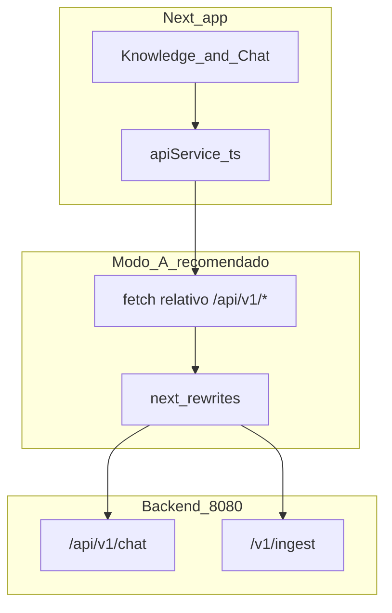

# Plano: Dashboard de gestão (UX dark + chat + upload)

## Estado atual (referência)

- Shell com sidebar em [src/components/layout/app-sidebar.tsx](atendimento-frontEnd/atendimento-frontend/src/components/layout/app-sidebar.tsx): ordem hoje é Dashboard → Base de Conhecimento → Configurações → Chat de Teste; fonte **Geist** em [src/app/layout.tsx](atendimento-frontEnd/atendimento-frontend/src/app/layout.tsx).
- Chamadas em [src/services/cerebro-api.ts](atendimento-frontEnd/atendimento-frontend/src/services/cerebro-api.ts) com paths **relativos** `/api/v1/chat` e `/api/v1/ingest`, e [next.config.ts](atendimento-frontEnd/atendimento-frontend/next.config.ts) faz rewrite do ingest para `${BACKEND_URL}/v1/ingest` (porque o Spring expõe ingest em **`POST /v1/ingest`**, não em `/api/v1/ingest` — ver [IngestMultipartController](infrastructure/src/main/java/com/atendimento/cerebro/infrastructure/adapter/inbound/rest/IngestMultipartController.java)).

## 1. Alinhamento de URL do ingest (crítico)

O pedido cita `POST http://localhost:8080/api/v1/ingest`, mas o backend **não** tem esse path hoje. Três opções (escolher uma na implementação):

| Abordagem | Browser → | Notas |
|-----------|-----------|--------|
| **A — Manter proxy Next (recomendado)** | `fetch('/api/v1/ingest', …)` na mesma origem do Next | Sem CORS; rewrite já mapeia para `/v1/ingest` no Java. |
| **B — URL absoluta literal** | `http://localhost:8080/v1/ingest` | Funciona no browser **só com CORS** no Spring (não existe hoje). |
| **C — Alias no backend** | Novo mapping `POST /api/v1/ingest` → mesmo handler que `/v1/ingest` | Satisfaz o path `/api/v1/ingest` no porto 8080; ainda precisa CORS para origem `localhost:3000` se o front chamar 8080 direto. |

O plano recomenda **A** para desenvolvimento estável; se quiserem URL absoluta explícita no `apiService`, usar **B + CORS** ou **C + CORS**.

## 2. `apiService.ts` centralizado

- Criar [src/services/apiService.ts](atendimento-frontEnd/atendimento-frontend/src/services/apiService.ts) (ou renomear/migrar desde `cerebro-api.ts` para um único módulo).
- Constantes derivadas de `process.env.NEXT_PUBLIC_API_BASE` (ex.: vazio ou `http://localhost:8080`):
  - Se base **vazia**: usar paths relativos `/api/v1/...` (compatível com rewrites).
  - Se base **definida**: `POST ${base}/api/v1/chat` e para ingest **`${base}/v1/ingest`** (path real) **ou** `${base}/api/v1/ingest` apenas após alias no backend (opção C).
- Manter parsing de erro (`error` / `assistantMessage` / `chunksIngested`) como hoje.
- Atualizar imports nas páginas; remover duplicação em `cerebro-api.ts` (ficheiro único).

## 3. Layout e navegação

- Reordenar itens da sidebar para: **Logo** → **Dashboard** → **Base de Conhecimento** (rótulo pode incluir “Upload”) → **Chat de Teste** → **Configurações**.
- Refinar bloco do logo (ícone lucide + nome da plataforma), bordas e sombra suave no aside.
- Garantir sidebar **fixa** visualmente (`sticky`/`h-screen` + scroll só na área principal) em [src/components/layout/app-shell.tsx](atendimento-frontEnd/atendimento-frontend/src/components/layout/app-shell.tsx).

## 4. Tema visual: dark “grafite + azul” e tipografia

- Ajustar tokens em [src/app/globals.css](atendimento-frontEnd/atendimento-frontend/src/app/globals.css): fundos oklch grafite, acentos azul escuro/saturação moderada, bordas e sombras suaves; manter `:root` light opcional ou simplificar para **default dark** alinhado ao pedido.
- Trocar fonte para **Inter** via `next/font/google` em `layout.tsx` (substituir ou complementar Geist conforme preferência de pesos).
- Em [src/components/providers.tsx](atendimento-frontEnd/atendimento-frontend/src/components/providers.tsx): `defaultTheme="dark"` para entrar já no modo pedido.

## 5. Página Base de Conhecimento (upload)

- Manter DnD (Tailwind) para PDF/TXT; estado **ficheiro selecionado** + botão **Enviar** que dispara o `POST` (evita enviar só ao largar o ficheiro, se esse for o comportamento desejado).
- `tenantId` em input; persistência em `localStorage` pode manter-se.
- Toasts Sonner: loading → sucesso (`chunksIngested`) / erro.

## 6. Página Chat de Teste (estilo WhatsApp / ChatGPT)

- Layout em coluna: cabeçalho fixo, área de mensagens com scroll, input fixo em baixo.
- Bolhas: utilizador à direita (cor primária/azul), assistente à esquerda (cartão grafite); timestamps opcionais.
- Ao enviar: mostrar mensagem do user de imediato; **skeleton** (Tailwind `animate-pulse`, blocos arredondados) no lugar da resposta até `postChat` resolver; depois substituir por texto.
- Manter `sessionId` (ex. `crypto.randomUUID()` por sessão) e `tenantId`; Sonner em falhas.

## 7. Dashboard

- Refinar cards existentes [src/components/dashboard/metric-cards.tsx](atendimento-frontEnd/atendimento-frontend/src/components/dashboard/metric-cards.tsx) com o novo sistema de cores, sombras e cantos mais arredondados para consistência com o resto.

## 8. Documentação env

- Atualizar [.env.example](atendimento-frontEnd/atendimento-frontend/.env.example) com `NEXT_PUBLIC_API_BASE` e nota sobre rewrites vs chamada direta a 8080.

## Ficheiros principais a tocar

- [src/app/globals.css](atendimento-frontEnd/atendimento-frontend/src/app/globals.css), [src/app/layout.tsx](atendimento-frontEnd/atendimento-frontend/src/app/layout.tsx), [src/components/providers.tsx](atendimento-frontEnd/atendimento-frontend/src/components/providers.tsx)
- [src/components/layout/app-sidebar.tsx](atendimento-frontEnd/atendimento-frontend/src/components/layout/app-sidebar.tsx), [src/components/layout/app-shell.tsx](atendimento-frontEnd/atendimento-frontend/src/components/layout/app-shell.tsx)
- [src/app/(app)/knowledge/page.tsx](atendimento-frontEnd/atendimento-frontend/src/app/(app)/knowledge/page.tsx), [src/app/(app)/test-chat/page.tsx](atendimento-frontEnd/atendimento-frontend/src/app/(app)/test-chat/page.tsx), componentes novos em `src/components/chat/` (ex. `ChatThread.tsx`, `MessageBubble.tsx`, `ChatSkeleton.tsx`)
- Novo [src/services/apiService.ts](atendimento-frontEnd/atendimento-frontend/src/services/apiService.ts); remover ou delegar [src/services/cerebro-api.ts](atendimento-frontEnd/atendimento-frontend/src/services/cerebro-api.ts)
- Opcional backend: CORS + alias `/api/v1/ingest` se a equipa quiser `fetch` direto a `8080` com o path pedido literalmente.
