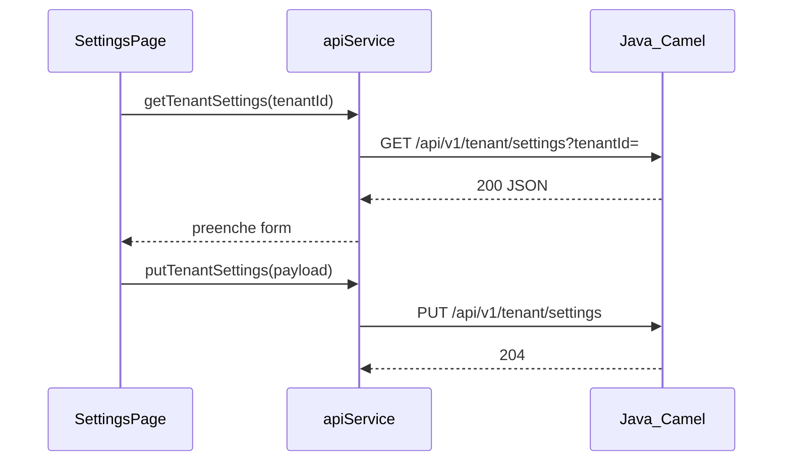

# Plano: Configurações — provedores WhatsApp (frontend + GET backend)

## Pré-requisito

Executar em **Agent mode** (ou aplicar os passos manualmente): edições em `.java`, `.ts`, `.tsx` estão bloqueadas no modo atual.

## 1. Backend: GET `/api/v1/tenant/settings`

O contrato atual só tem **PUT** em [`TenantSettingsRestRoute`](infrastructure/src/main/java/com/atendimento/cerebro/infrastructure/adapter/inbound/rest/camel/TenantSettingsRestRoute.java). É necessário **GET** com query `tenantId` para preencher o formulário.

- Criar record de resposta JSON (ex.: `TenantSettingsResponse`) em `infrastructure/.../camel/` com: `tenantId`, `systemPrompt`, `whatsappProviderType` (String enum name), `whatsappApiKey`, `whatsappInstanceId`, `whatsappBaseUrl` (usar `@JsonInclude(NON_NULL)` se desejado).
- Injetar [`TenantConfigurationStorePort`](application/src/main/java/com/atendimento/cerebro/application/port/out/TenantConfigurationStorePort.java) no `TenantSettingsRestRoute`.
- Registar `rest("/v1/tenant/settings").get().produces(APPLICATION_JSON).outType(...).to("direct:tenantSettingsGet")` e `from("direct:tenantSettingsGet").process(...)`.
- No handler: ler `tenantId` da query (`Exchange.HTTP_QUERY` + parse URL-encoded; reutilizar padrão seguro de split/decode). Se ausento → 400 + `IngestErrorResponse`.
- Resolver config: `findByTenantId` ou, se vazio, [`TenantConfiguration.defaults(tenantId)`](domain/src/main/java/com/atendimento/cerebro/domain/tenant/TenantConfiguration.java). Mapear para `TenantSettingsResponse`. **Não** logar `whatsappApiKey`.
- Resposta **200** com JSON.

## 2. Next.js: proxy

Em [`next.config.ts`](atendimento-frontEnd/atendimento-frontend/next.config.ts), adicionar rewrite:

- `source: "/api/v1/tenant/settings"` → `destination: \`${backend}/api/v1/tenant/settings\`` (mesmo padrão de `/api/v1/chat`: servlet Camel em `/api/*`).

## 3. [`apiService.ts`](atendimento-frontEnd/atendimento-frontend/src/services/apiService.ts)

- Tipos TS: `WhatsAppProviderType`, `TenantSettings` (resposta GET) e payload do PUT (alinhado ao [`TenantSettingsHttpRequest`](infrastructure/src/main/java/com/atendimento/cerebro/infrastructure/adapter/inbound/rest/camel/TenantSettingsHttpRequest.java): `tenantId`, `systemPrompt`, campos WhatsApp opcionais).
- `tenantSettingsUrl(tenantId)` para GET com query (espelhar [`botSettingsUrl`](atendimento-frontEnd/atendimento-frontend/src/services/apiService.ts): com `NEXT_PUBLIC_API_BASE` usar `${base}/api/v1/tenant/settings?...`; sem base usar `/api/v1/tenant/settings?...`).
- `getTenantSettings(tenantId: string): Promise<TenantSettings>` — GET, `parseErrorMessage` em erro.
- `putTenantSettings(payload: TenantSettingsPayload): Promise<void>` — PUT JSON completo para o mesmo path **sem** query (o `tenantId` vai no corpo, como no Java).
- Manter `putBotSettings` apenas se ainda for referenciado noutros sítios; a página de settings passará a usar só `putTenantSettings`.

## 4. Página [`settings/page.tsx`](atendimento-frontEnd/atendimento-frontend/src/app/(app)/settings/page.tsx)

- Estado: `personality` (systemPrompt), `whatsappProviderType`, `whatsappApiKey`, `whatsappInstanceId`, `whatsappBaseUrl`, `loadingInitial` (fetch), `saving`.
- `useEffect`: quando `tenantId` (trim) não vazio, chamar `getTenantSettings`, preencher estado; tratar erro com `toast.error`.
- **Select** nativo estilizado com as mesmas classes base do [`Input`](atendimento-frontEnd/atendimento-frontend/src/components/ui/input.tsx) (`rounded-xl`, `border border-input`, `bg-transparent`, etc.) — não há `select.tsx` em `components/ui`; evitar nova dependência.
- Condicional:
  - **META**: mostrar Phone Number ID (`whatsappInstanceId`), Access Token (`whatsappApiKey`, `type="password"` opcional com toggle olho se quiseres manter simples só password).
  - **EVOLUTION**: URL da instância (`whatsappBaseUrl`), Nome da instância (`whatsappInstanceId`), API Key (`whatsappApiKey`).
  - **SIMULATED**: não mostrar credenciais (ou mensagem curta: respostas só em log).
- Botão salvar: `putTenantSettings` com JSON completo; `disabled={saving || loadingInitial}`; texto "A salvar…" / loading.
- **Sonner**: sucesso com a mensagem exata: `Configurações de canal atualizadas com sucesso!` (já usam [`toast` from `sonner`](atendimento-frontEnd/atendimento-frontend/src/app/(app)/settings/page.tsx)).
- Dicas curtas abaixo dos campos (Meta: painel de desenvolvedores / credenciais do app; Evolution: URL base da API Evolution; etc.).

## 5. Verificação

- `mvnw test` nos módulos `infrastructure` (e raiz se possível).
- No frontend: `npm run build` ou `npm run lint` na pasta `atendimento-frontend`.

