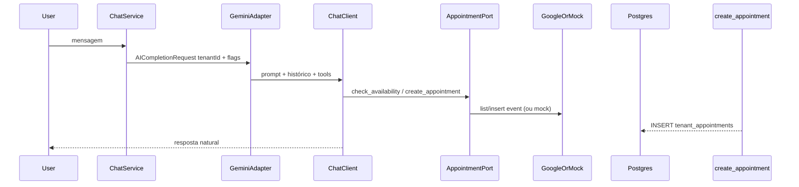

# Plano: Agendamento Google Calendar + Gemini (MVP com Mock)

## Decisões fixas (iteração)

- **Credenciais**: Opção A — **uma Service Account global** (ficheiro JSON referenciado por **variável de ambiente**, alinhado a [docker-compose.yml](d:\Documents\agenteAtendimento\docker-compose.yml) / [.env.example](d:\Documents\agenteAtendimento\.env.example)).
- **Por tenant**: coluna **`google_calendar_id`** em [`tenant_configuration`](d:\Documents\agenteAtendimento\bootstrap\src\main\resources\db\migration\V3__create_tenant_configuration.sql) (nullable). O calendário do cliente deve estar **partilhado** com o e-mail da SA global.
- **Mock**: [`MockAppointmentService`](d:\Documents\agenteAtendimento) (nome a definir no pacote application/infrastructure) **simula** disponibilidade e criação de eventos (sem HTTP Google), apenas respeitando `calendar_id` como identificador lógico e gravando em `tenant_appointments` como o fluxo real.

## Estado atual relevante

- Chat usa [`GeminiChatEngineAdapter`](d:\Documents\agenteAtendimento\infrastructure\src\main\java\com\atendimento\cerebro\infrastructure\adapter\out\ai\GeminiChatEngineAdapter.java) com `GoogleGenAiChatModel.call(Prompt)` — **sem tools**. A documentação Spring AI 1.1 prevê **tool calling** via [`ChatClient.create(chatModel).tools(...)`](https://docs.spring.io/spring-ai/reference/1.1/api/chat/google-genai-chat.html).
- Tenant e persona vêm de [`ChatService`](d:\Documents\agenteAtendimento\application\src\main\java\com\atendimento\cerebro\application\service\ChatService.java) + [`RagSystemPromptComposer`](d:\Documents\agenteAtendimento\infrastructure\src\main\java\com\atendimento\cerebro\infrastructure\adapter\out\ai\RagSystemPromptComposer.java). Persistência é **JDBC**, não JPA.

## Arquitetura (visão)

## 1. Base de dados

- **Flyway** `V18__tenant_google_calendar_id.sql`: `ALTER TABLE tenant_configuration ADD COLUMN google_calendar_id VARCHAR(1024) NULL;`
- **Flyway** `V19__tenant_appointments.sql`: tabela `tenant_appointments` com, no mínimo:
  - `id` BIGSERIAL PK
  - `tenant_id` VARCHAR(512) NOT NULL (FK lógica a `tenant_configuration`, como nas outras tabelas)
  - `conversation_id` VARCHAR(512) NULL (rastreio WhatsApp/chat)
  - `client_name`, `service_name` TEXT/VARCHAR
  - `starts_at`, `ends_at` TIMESTAMPTZ NOT NULL
  - `google_event_id` VARCHAR(512) NOT NULL (no mock: id sintético estável, ex. `mock-uuid`)
  - `created_at` TIMESTAMPTZ NOT NULL DEFAULT now()
  - índice `(tenant_id, starts_at)`

## 2. Domínio e portas (application)

- Estender [`TenantConfiguration`](d:\Documents\agenteAtendimento\domain\src\main\java\com\atendimento\cerebro\domain\tenant\TenantConfiguration.java) com `String googleCalendarId` (nullable).
- Porta **`AppointmentSchedulingPort`** (nome sugerido) com métodos alinhados às tools:
  - `checkAvailability(TenantId tenantId, LocalDate date)` → slots livres (regra de negócio: janela horária e duração definidas em constantes ou `application.yml` para o MVP).
  - `createAppointment(TenantId tenantId, ..., Instant start, Instant end, String clientName, String service, Optional<ConversationId> conversationId)` → retorno com `googleEventId` e persistência interna.
- Porta **`TenantAppointmentStorePort`** (ou método na mesma porta) para INSERT em `tenant_appointments` após sucesso (mock e real compartilham).

## 3. Infraestrutura Google (real)

- Dependências Maven (módulo **infrastructure** ou **bootstrap** conforme onde ficar o bean): `com.google.apis:google-api-services-calendar` + `com.google.api-client:google-api-client` + `com.google.auth:google-auth-library-oauth2-http` (versões compatíveis; usar BOM Google se já existir no parent ou alinhar manualmente no [pom.xml](d:\Documents\agenteAtendimento\pom.xml)).
- Configuração: propriedades tipo `cerebro.google.calendar.service-account-json-path` + **env** espelhada no Docker (ex. `GOOGLE_CALENDAR_SERVICE_ACCOUNT_JSON_PATH`). Carregar credenciais uma vez (bean `@ConfigurationProperties` ou `@PostConstruct` cache).
- Implementação **`GoogleCalendarAppointmentService`** (nome sugerido): usa `Calendar` API com escopo `https://www.googleapis.com/auth/calendar` (ou escopos mínimos para eventos), `calendarId` = `tenant_configuration.google_calendar_id`. Se `google_calendar_id` for null, as tools devem devolver erro claro (“calendário não configurado”).
- **Regra de partilha**: documentar no código/README que o ID do calendário deve permitir escrita pela SA (partilha com o e-mail da SA).

## 4. Mock (`MockAppointmentService`)

- Ativado por propriedade **`cerebro.google.calendar.mock=true`** (default `true` no perfil dev se quiserem validar sem credenciais; ou `false` em prod).
- Comportamento (validação do fluxo **sem** Google Calendar API):
  - **Simula** o mesmo contrato que o serviço real: usa o `google_calendar_id` do tenant só como **identificador lógico** (como se eventos fossem desse calendário), **sem** HTTP nem escrita real no Google.
  - `check_availability`: gera slots “livres” determinísticos ou simples (ex. 9h–18h, slot 30 min) **sem** chamar Google.
  - `create_appointment`: gera `google_event_id` fictício, **insere na mesma tabela** `tenant_appointments` que o fluxo real (rastreio interno idêntico).
- Bean `@ConditionalOnProperty` ou `@Primary` conforme convenção do projeto para escolher mock vs Google.

## 5. Gemini: function calling

- Refatorar [`GeminiChatEngineAdapter`](d:\Documents\agenteAtendimento\infrastructure\src\main\java\com\atendimento\cerebro\infrastructure\adapter\out\ai\GeminiChatEngineAdapter.java) para usar **`ChatClient.create(googleGenAiChatModel)`** quando houver agendamento ativo para o tenant:
  - Definir classe **por request** (ou wrapper) com métodos anotados `@Tool` / `@ToolParam`: `check_availability` e `create_appointment`, delegando a `AppointmentSchedulingPort` com **`TenantId` fechado no construtor** (o `AICompletionRequest` já traz [`tenantId`](d:\Documents\agenteAtendimento\application\src\main\java\com\atendimento\cerebro\application\dto\AICompletionRequest.java)).
- Estender [`AICompletionRequest`](d:\Documents\agenteAtendimento\application\src\main\java\com\atendimento\cerebro\application\dto\AICompletionRequest.java) com um booleano (ex. `schedulingToolsEnabled`) derivado em `ChatService`: `true` quando existir `google_calendar_id` não vazio (e, se aplicável, mock habilitado ou credenciais presentes — definir regra única: **se coluna preenchida**, expor tools; mock não exige credenciais reais).
- **Histórico**: mapear mensagens existentes para o `ChatClient` (equivalente ao fluxo atual com `UserMessage`/`AssistantMessage`) para não regredir comportamento.
- Modelos **Gemini 3 Pro**: Spring AI trata *thought signatures* no loop interno; se no futuro mudarem o modelo, seguir a doc; para MVP manter modelo atual configurado em [`application.yml`](d:\Documents\agenteAtendimento\bootstrap\src\main\resources\application.yml).

## 6. Lógica de negócio e prompt

- **Instrução fixa** (em [`RagSystemPromptComposer`](d:\Documents\agenteAtendimento\infrastructure\src\main\java\com\atendimento\cerebro\infrastructure\adapter\out\ai\RagSystemPromptComposer.java) ou anexo condicional quando `schedulingToolsEnabled`):  
  *"Você tem permissão para agendar serviços. Sempre confirme os detalhes (serviço e horário) com o usuário antes de finalizar o agendamento."*  
  Mais texto curto: **chamar `check_availability` antes de propor horário definitivo** e só então `create_appointment`.
- Descrições das `@Tool` devem reforçar essa ordem (disponibilidade → confirmação → criação).

## 7. API de settings e OpenAPI

- Atualizar [`PostgresTenantConfigurationStore`](d:\Documents\agenteAtendimento\infrastructure\src\main\java\com\atendimento\cerebro\infrastructure\adapter\out\persistence\PostgresTenantConfigurationStore.java), [`TenantSettingsService`](d:\Documents\agenteAtendimento\application\src\main\java\com\atendimento\cerebro\application\service\TenantSettingsService.java), DTOs de [`TenantSettingsRestRoute`](d:\Documents\agenteAtendimento\infrastructure\src\main\java\com\atendimento\cerebro\infrastructure\adapter\inbound\rest\camel\TenantSettingsRestRoute.java) e [`openapi.yaml`](d:\Documents\agenteAtendimento\bootstrap\src\main\resources\static\openapi.yaml) para **ler/gravar `googleCalendarId`** (opcional no PUT).

## 8. Testes e validação

- Teste unitário do **mock** (slots + persistência JDBC com Testcontainers ou H2 se existir perfil de teste).
- Ajustar [`ChatServiceTest`](d:\Documents\agenteAtendimento\application\src\test\java\com\atendimento\cerebro\application\service\ChatServiceTest.java) se o construtor de `AICompletionRequest` mudar.

## Ficheiros principais a tocar

| Área | Ficheiros |
|------|-----------|
| DB | Novos `V18`, `V19` em [db/migration](d:\Documents\agenteAtendimento\bootstrap\src\main\resources\db\migration) |
| Domínio | `TenantConfiguration`, possivelmente `TenantSettingsUpdateCommand` |
| App | `ChatService`, novas portas, DTO `AICompletionRequest` |
| Infra | `GeminiChatEngineAdapter`, novo pacote `calendar` (Google + Mock), JDBC para `tenant_appointments` |
| Config | `application.yml`, `.env.example`, `docker-compose.yml` (env SA + mock) |

## Riscos / notas

- **Fuso horário**: fixar `ZoneId` (ex. `America/Sao_Paulo`) no MVP nas tools e nos eventos; documentar; opcional coluna futura `calendar_timezone`.
- **Segurança**: ficheiro SA só no servidor; não commitar JSON; variável de env aponta para caminho montado no Docker.
