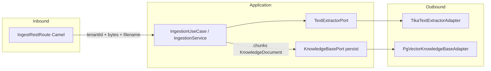

# Plano: módulo de ingestão (hexagonal)

## Contexto atual

- A busca RAG já filtra por metadado [`TENANT_ID_METADATA_KEY = "tenant_id"`](infrastructure/src/main/java/com/atendimento/cerebro/infrastructure/adapter/out/knowledge/PgVectorKnowledgeBaseAdapter.java) (`PgVectorFilterExpressionConverter` + `similaritySearch` / SQL nativo).
- [`KnowledgeBasePort`](application/src/main/java/com/atendimento/cerebro/application/port/out/KnowledgeBasePort.java) só define leitura (`semanticSearch` / `findTopThreeRelevantFragments`). Não há escrita ainda.
- Entrada HTTP segue o padrão Camel REST em [`ChatRestRoute`](infrastructure/src/main/java/com/atendimento/cerebro/infrastructure/adapter/inbound/rest/camel/ChatRestRoute.java) com `camel.servlet.mapping.context-path=/api/*` → paths `rest(...)` viram `/api/v1/...`.
- O módulo [`application`](application/pom.xml) **não** depende de `spring-web`; por isso **`MultipartFile` no serviço de aplicação** obrigaria nova dependência ou violaria camadas.

## 1. Domínio

**Ficheiro novo:** [`domain/.../domain/knowledge/KnowledgeDocument.java`](domain/src/main/java/com/atendimento/cerebro/domain/knowledge/KnowledgeDocument.java)

- Record ou classe imutável com, no mínimo:
  - **Identificador** estável por chunk (ex.: `String id` — UUID ou derivado de `tenantId + filename + chunkIndex`).
  - **`String content`** (texto do chunk).
  - **`TenantId tenantId`** (já existe [`TenantId`](domain/src/main/java/com/atendimento/cerebro/domain/tenant/TenantId.java)).
  - **Metadados** adicionais: `Map<String, Object>` ou `Map<String, String>` para `source`/`filename`, `chunk_index`, `chunk_count` (útil para debug e filtros futuros).
  - **Vetor:** `float[] embedding` **opcional** (`Optional` ou nullable). Motivo: na persistência via Spring AI, o embedding costuma ser calculado no `VectorStore.add` a partir do texto; manter o campo no domínio permite (a) documentar o agregado “conteúdo + vetor” e (b) evoluir para pré-cálculo explícito sem mudar a forma pública. Se quiseres **sempre** preencher vetor antes de gravar, o adaptador pode chamar `EmbeddingModel` e depois mapear para `Document` conforme a API Spring AI 1.1 (evitando duplo embed se a API permitir documento já com embedding).

## 2. Aplicação (ports + serviço)

**Porta de entrada (opcional mas recomendado):** [`application/.../port/in/IngestionUseCase.java`](application/src/main/java/com/atendimento/cerebro/application/port/in/IngestionUseCase.java)

- Método alinhado a **hexágono sem Spring Web**, por exemplo:
  - `void ingest(TenantId tenantId, byte[] fileContent, String originalFilename)`
  - ou `InputStream` + tamanho conhecido (menos cómodo).

**Porta de saída para texto:** [`application/.../port/out/TextExtractorPort.java`](application/src/main/java/com/atendimento/cerebro/application/port/out/TextExtractorPort.java)

- `String extract(byte[] data, String filename)` — o `filename` guia o detetor Tika (PDF vs TXT).

**Estender** [`KnowledgeBasePort`](application/src/main/java/com/atendimento/cerebro/application/port/out/KnowledgeBasePort.java):

- Novo método, por exemplo: `void persistKnowledgeDocuments(TenantId tenantId, List<KnowledgeDocument> documents)` (nome final à escolha consistente com o vocabulário do projeto).

**Serviço:** [`application/.../service/IngestionService.java`](application/src/main/java/com/atendimento/cerebro/application/service/IngestionService.java)

- Implementa `IngestionUseCase`.
- Fluxo:
  1. `TextExtractorPort.extract(bytes, filename)` → texto completo.
  2. **Chunking** (puro Java no `application`, classe auxiliar dedicada, ex.: `TextChunker` no mesmo módulo):
     - tamanho alvo **1000** caracteres;
     - **overlap 200** (ex.: avanço de **800** caracteres entre inícios de janela, ou equivalente explícito com sobreposição);
     - documentar se usas `String` por code units UTF-16 (simples) ou iterador por **code points** (melhor para texto com emojis).
  3. Para cada chunk, construir `KnowledgeDocument` com metadados (ficheiro, índice, total) + `tenantId`.
  4. Chamar `KnowledgeBasePort.persistKnowledgeDocuments`.

**Nota sobre `MultipartFile`:** o pedido menciona `MultipartFile`; a implementação **REST** (infra) pode receber multipart e converter para `byte[]` + nome, chamando o caso de uso — o contrato da camada de aplicação fica **independente** do Spring MVC.

**Configuração Spring:** estender [`ApplicationConfiguration`](bootstrap/src/main/java/com/atendimento/cerebro/bootstrap/ApplicationConfiguration.java) com `@Bean` para `IngestionUseCase` (dependências: `TextExtractorPort`, `KnowledgeBasePort`).

## 3. Infraestrutura

**Tika:** nova classe [`TikaTextExtractorAdapter`](infrastructure/src/main/java/com/atendimento/cerebro/infrastructure/adapter/out/ingestion/TikaTextExtractorAdapter.java) (ou pacote `adapter.out.text`) implementando `TextExtractorPort` com `AutoDetectParser`, `BodyContentHandler`, `ParseContext`, `Metadata` — dependência **`org.apache.tika:tika-core`** em [`infrastructure/pom.xml`](infrastructure/pom.xml) (conforme pedido).

**PgVector:** em [`PgVectorKnowledgeBaseAdapter`](infrastructure/src/main/java/com/atendimento/cerebro/infrastructure/adapter/out/knowledge/PgVectorKnowledgeBaseAdapter.java), implementar `persistKnowledgeDocuments`:

- Para cada `KnowledgeDocument`, construir `org.springframework.ai.document.Document` com:
  - texto = `content`;
  - **metadata** obrigatório: `TENANT_ID_METADATA_KEY` → `tenantId.value()` (mesma chave que a busca);
  - metadata extra: copiar entradas úteis do domínio (filename, chunk index, etc.).
- Chamar `vectorStore.add(List<Document>)` (padrão já usado em testes em [`ChatServiceIntegrationBase`](bootstrap/src/test/java/com/atendimento/cerebro/ChatServiceIntegrationBase.java)).
- Tratar lista vazia / texto vazio após Tika (400 ou no-op documentado).

**REST:** novo `RouteBuilder` (ex.: [`IngestRestRoute`](infrastructure/src/main/java/com/atendimento/cerebro/infrastructure/adapter/inbound/rest/camel/IngestRestRoute.java)):

- `rest("/v1/ingest").post().consumes(multipart).produces(JSON)` alinhado ao chat (`/api/v1/ingest` com context path atual).
- Parâmetros: **ficheiro** + **`tenantId`** (query ou form field — escolher uma e documentar; típico: `tenantId` como campo form + `file`).
- Processador que lê `Exchange` multipart, extrai bytes e nome, chama `IngestionUseCase.ingest`.
- Resposta mínima: JSON com contagem de chunks gravados ou 204, e códigos de erro claros (ficheiro vazio, tipo não suportado).

## 4. Dependências Maven

- [`infrastructure/pom.xml`](infrastructure/pom.xml): `org.apache.tika:tika-core` (versão gerida no BOM parent se existir; senão propriedade explícita no `dependencyManagement` do [`pom.xml`](pom.xml) pai para evitar drift).

## 5. Testes (recomendado)

- **Unitário:** `TextChunker` — texto > 1000 chars, verificar tamanhos, overlap e número de chunks.
- **Unitário:** `IngestionService` com mocks de `TextExtractorPort` e `KnowledgeBasePort`.
- **Integração (opcional):** teste Camel ou `@SpringBootTest` que faz POST multipart e verifica linhas em `vector_store` com `metadata->>'tenant_id'` (similar ao cleanup em `ChatServiceIntegrationBase`).

## Decisões a fixar na implementação

| Tópico | Recomendação |
|--------|----------------|
| `MultipartFile` no serviço | Apenas na camada REST (infra); `IngestionService` com `byte[]` + `filename`. |
| Vetor no domínio | Campo opcional; preenchimento explícito no adaptador só se a API Spring AI evitar embedding duplicado. |
| Nome exato do método na porta | `persistKnowledgeDocuments` ou `ingest` — manter um verbo claro na interface pública. |
