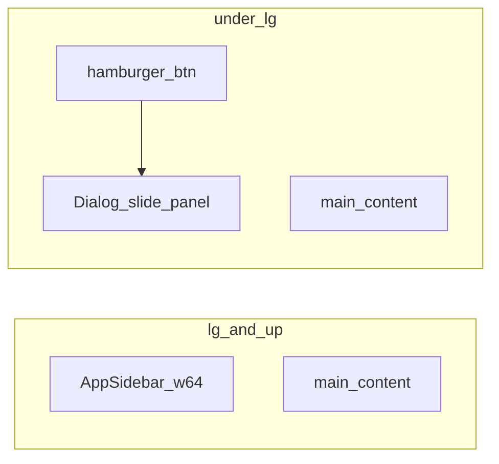

# Plano: InteliZap 100% responsivo (mobile-first)

## Contexto atual

- Shell: [`app-shell.tsx`](d:/Documents/agenteAtendimento/atendimento-frontEnd/atendimento-frontend/src/components/layout/app-sidebar.tsx) + [`app-shell.tsx`](d:/Documents/agenteAtendimento/atendimento-frontEnd/atendimento-frontend/src/components/layout/app-shell.tsx) — sidebar fixa `w-64` sem variante mobile.
- KPIs no dashboard: [`dashboard-panel.tsx`](d:/Documents/agenteAtendimento/atendimento-frontEnd/atendimento-frontend/src/components/dashboard/dashboard-panel.tsx) já empilha em viewports estreitas (`md:grid-cols-2 lg:grid-cols-4` ⇒ 1 coluna no base); será deixado **explícito** `grid-cols-1` e ajuste `sm` se necessário para bater com o requisito “4 desktop → 1 smartphone”.
- Recharts já usa `ResponsiveContainer width="100%"`; faltam **fontes menores em mobile** nos eixos/legendas e, se útil, `outerRadius` da pizza proporcional.
- Não há `@radix-ui/react-dialog` ainda — necessário para **drawer do menu** e **modal do período** ([`package.json`](d:/Documents/agenteAtendimento/atendimento-frontEnd/atendimento-frontend/package.json)).

## 1. Layout adaptável (grid / flex)

- **Dashboard KPI:** classe base `grid grid-cols-1 gap-4 sm:gap-5 lg:grid-cols-4` (e remover dependência de 2 colunas em `md` se quiser estritamente 1 coluna até `lg`; alternativa: `md:grid-cols-2 xl:grid-cols-4` — alinhar ao requisito “1 coluna em smartphones”; tablets podem ficar 2 colunas se desejado).
- **Bloco dos gráficos:** `grid grid-cols-1 gap-4 lg:grid-cols-2` para sempre 1 coluna no mobile.
- **Shell:** reduzir padding do `main` no mobile, ex.: `p-4 md:p-6` em [`app-shell.tsx`](d:/Documents/agenteAtendimento/atendimento-frontEnd/atendimento-frontend/src/components/layout/app-shell.tsx).

## 2. Gráficos Recharts responsivos

- Manter `ResponsiveContainer`; garantir wrapper com largura total (`w-full min-w-0` no pai para evitar overflow em flex).
- Introduzir hook leve **`useMediaQuery("(max-width: 767px)")`** (ou `(max-width: 640px)`) em [`lib/use-media-query.ts`](d:/Documents/agenteAtendimento/atendimento-frontEnd/atendimento-frontend/src/lib/use-media-query.ts) e usar em `dashboard-panel.tsx` para:
  - `XAxis` / `YAxis`: `tick={{ fontSize: isMobile ? 10 : 12 }}` (valores ajustáveis).
  - `Legend`: `wrapperStyle={{ fontSize: ... }}` ou fonte no `formatter`.
  - `PieChart`: `outerRadius` menor no mobile (ex. percentual do container ou valor fixo menor).
- Opcional: altura do bloco do gráfico `h-[280px] sm:h-[320px]` para dar respiro em telas baixas.

## 3. Navegação mobile: hambúrguer + painel lateral (sua escolha)

- Adicionar dependência **`@radix-ui/react-dialog`** e componente UI **`components/ui/dialog.tsx`** (padrão acessível: overlay, foco, `aria`, fechar com ESC).
- **Extrair itens de navegação** para um módulo compartilhado (ex. [`nav-config.tsx`](d:/Documents/agenteAtendimento/atendimento-frontEnd/atendimento-frontend/src/components/layout/nav-config.tsx)) exportando array de `{ href, labelKey, subKey?, icon }` — [`app-sidebar.tsx`](d:/Documents/agenteAtendimento/atendimento-frontEnd/atendimento-frontend/src/components/layout/app-sidebar.tsx) passa a consumir esse config.
- **Novo componente** `MobileNavDrawer` (ou inline): `Dialog` com `DialogContent` posicionado à esquerda (`fixed inset-y-0 left-0 h-full w-[min(100%,20rem)] rounded-none`), mesma lista de links que a sidebar, links com **`min-h-11` / `py-3`** para toque; ao navegar (`Link` click), fechar o dialog (`onOpenChange(false)`).
- **AppShell:**
  - Sidebar desktop: `hidden lg:flex` no `AppSidebar` wrapper.
  - Header: em `lg:hidden` mostrar botão **Menu** (`lucide-react` `Menu`) com `aria-expanded`/`aria-controls`.
  - Desktop header pode manter título; mobile mostra logo compacto + menu.

## 4. Tabelas: Atividades recentes e Monitoramento

**Dashboard — Atividades recentes**

- Em `dashboard-panel.tsx`: para `max-lg` (ou `md`), renderizar **lista de cards** (uma linha da tabela vira card com labels i18n) em vez da `<table>`.
- Em `lg+`, manter `<table>` atual.
- Campos: tempo, contato/canal, intenção, resumo da mensagem — mesmos dados da linha.

**Monitoramento** — [`monitoramento/page.tsx`](d:/Documents/agenteAtendimento/atendimento-frontEnd/atendimento-frontend/src/app/[locale]/(app)/dashboard/monitoramento/page.tsx)

- Layout atual `flex` lado a lado: em mobile usar **`flex-col`**:
  - Lista de conversas: altura limitada (`max-h-[40vh]` ou `min-h-[200px]`) com scroll; ou botão “Conversas” que abre o mesmo padrão `Dialog` com lista (se a lista for longa demais empilhada).
  - Área de chat abaixo com `flex-1 min-h-0`.
- Tabela de mensagens (se existir): espelhar estratégia **cards no mobile** ou `overflow-x-auto` + `min-w` onde cards forem pesados.

## 5. UX de toque e período em modal

- **Botões globais:** em [`button.tsx`](d:/Documents/agenteAtendimento/atendimento-frontEnd/atendimento-frontend/src/components/ui/button.tsx), opcional variant `touch` ou classes utilitárias nos botões críticos: `min-h-11 px-4 active:scale-[0.98]` + `touch-manipulation` no container de ações.
- **Dashboard:** botões Exportar, presets de período, Atualizar — aplicar `min-h-11` e espaçamento vertical entre grupos no mobile.
- **Seletor de período custom:** em `max-md` (ou `max-lg`), esconder os dois `<input type="datetime-local">` inline e mostrar um botão **“Período personalizado”** que abre **`Dialog`** com os dois campos empilhados, botões Aplicar/Cancelar (fechar e disparar `load()` como hoje).
- **Test chat — Enviar:** [`test-chat/page.tsx`](d:/Documents/agenteAtendimento/atendimento-frontEnd/atendimento-frontend/src/app/[locale]/(app)/test-chat/page.tsx) — `Button` com `className` incluindo `min-h-11 w-full sm:w-auto` no mobile para polegar.

## 6. Verificação

- Testar manualmente em DevTools: 320px, 375px, 768px, 1024px — sidebar some &lt; `lg`, drawer funciona, gráficos sem overlap, export e período usáveis.
- `npm run lint` no projeto frontend.

## Arquivos principais a alterar/criar

| Área | Arquivos |
|------|----------|
| Deps + UI | `package.json`, `components/ui/dialog.tsx` |
| Nav | `nav-config.tsx` (novo), `app-sidebar.tsx`, `app-shell.tsx`, `MobileNavDrawer` (novo) |
| Dashboard | `dashboard-panel.tsx`, `lib/use-media-query.ts` (novo) |
| Monitoramento | `monitoramento/page.tsx` |
| Chat | `test-chat/page.tsx` |

Não é obrigatório alterar páginas que não usam tabelas/sidebar pesada, mas o shell e botões de toque beneficiam **toda** a app logada sob `(app)`.
