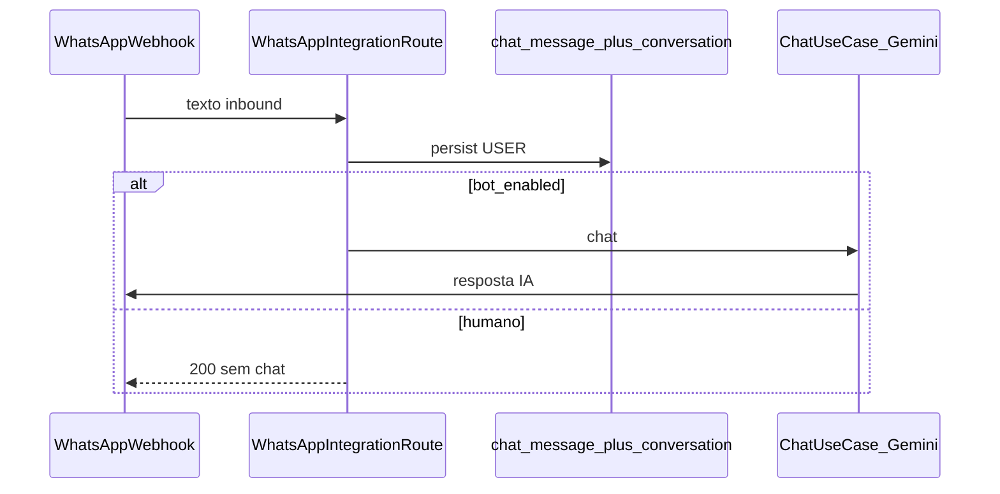

# Intervenção humana no monitoramento

## Contexto do código

- **Histórico WhatsApp / monitoramento:** tabela [`chat_message`](d:\Documents\agenteAtendimento\bootstrap\src\main\resources\db\migration\V5__create_chat_message.sql), chave lógica `tenant_id` + `phone_number` (string como veio do webhook). Não existe entidade JPA “Conversation”; o domínio usa [`ChatMessage`](d:\Documents\agenteAtendimento\domain\src\main\java\com\atendimento\cerebro\domain\monitoring\ChatMessage.java) e [`JdbcChatMessageRepository`](d:\Documents\agenteAtendimento\infrastructure\src\main\java\com\atendimento\cerebro\infrastructure\adapter\out\persistence\JdbcChatMessageRepository.java).
- **Entrada do bot:** [`WhatsAppIntegrationRoute`](d:\Documents\agenteAtendimento\infrastructure\src\main\java\com\atendimento\cerebro\infrastructure\adapter\inbound\rest\camel\WhatsAppIntegrationRoute.java) — após dedupe, define `DECISION_CHAT`, persiste USER em [`persistInboundUserMessage`](d:\Documents\agenteAtendimento\infrastructure\src\main\java\com\atendimento\cerebro\infrastructure\adapter\inbound\rest\camel\WhatsAppIntegrationRoute.java), depois só o ramo `CHAT` chama `montarComando` → circuit → `executarChatDepoisPrepararSucesso` (Gemini).
- **API do dashboard:** [`MessagesRestRoute`](d:\Documents\agenteAtendimento\infrastructure\src\main\java\com\atendimento\cerebro\infrastructure\adapter\inbound\rest\camel\MessagesRestRoute.java) — `GET /api/v1/messages?tenantId=` devolve hoje um **array** JSON; o front em [`apiService.ts`](d:\Documents\agenteAtendimento\atendimento-frontEnd\atendimento-frontend\src\services\apiService.ts) e [`monitoramento/page.tsx`](d:\Documents\agenteAtendimento\atendimento-frontEnd\atendimento-frontend\src\app\[locale]\(app)\dashboard\monitoramento\page.tsx) esperam esse formato.
- **Envio WhatsApp:** [`WhatsAppOutboundPort.sendMessage`](d:\Documents\agenteAtendimento\application\src\main\java\com\atendimento\cerebro\application\port\out\WhatsAppOutboundPort.java) — já usado em retry e respostas do bot.

## 1. Base de dados

- Nova migração Flyway, por exemplo [`V14__conversation_bot_enabled.sql`](d:\Documents\agenteAtendimento\bootstrap\src\main\resources\db\migration\) criando tabela **`conversation`** (nome alinhado ao pedido) com:
  - `tenant_id` `VARCHAR` (alinhado a `chat_message.tenant_id`)
  - `phone_number` `VARCHAR` (mesmo valor que em `chat_message` para esse contacto)
  - `bot_enabled` `BOOLEAN NOT NULL DEFAULT TRUE`
  - `updated_at` `TIMESTAMPTZ NOT NULL DEFAULT now()`
  - `PRIMARY KEY (tenant_id, phone_number)`
- Semântica: **ausência de linha** = bot ativo (equivalente a `true`), para não precisar backfill em todos os contactos.

## 2. Porta de aplicação e persistência

- Novo port em `application`, por exemplo `ConversationBotStatePort`, com:
  - `boolean isBotEnabled(TenantId tenantId, String phoneNumber)` — `true` se não existir linha ou `bot_enabled = true`
  - `void setBotEnabled(TenantId tenantId, String phoneNumber, boolean enabled)` — upsert (`INSERT ... ON CONFLICT DO UPDATE`)
- Implementação JDBC em `infrastructure` (novo repositório, padrão de [`JdbcChatMessageRepository`](d:\Documents\agenteAtendimento\infrastructure\src\main\java\com\atendimento\cerebro\infrastructure\adapter\out\persistence\JdbcChatMessageRepository.java)), bean registado na configuração Spring existente.

## 3. Webhook WhatsApp: ignorar Gemini quando `bot_enabled = false`

- Em `analisarPedido`, **depois** de `persistInboundUserMessage` (para o operador continuar a ver mensagens no monitoramento) e **antes** de definir `DECISION_CHAT` / corpo para o circuito:
  - Se `!conversationBotStatePort.isBotEnabled(tenant, tm.fromRaw())`, definir resposta HTTP 200 com corpo JSON existente no estilo `WhatsAppWebhookResponse` (ex.: status `"human_handoff"` ou `"bot_disabled"`) e **não** definir `DECISION_CHAT` — o `.choice()` atual não entra no ramo do chat (igual ao comportamento implícito para `IGNORE`).
- **Não** chamar `ChatUseCase`, `enviarRespostaWhatsApp`, nem analytics pós-turno desse ramo.

## 4. API REST para o dashboard

- **Assumir conversa + notificação:** novo endpoint Camel `POST`, por exemplo `/v1/conversations/human-handoff?tenantId=...` com JSON `{ "phoneNumber": "<mesmo valor que em chat_message>" }`:
  - `setBotEnabled(..., false)`
  - `whatsAppOutboundPort.sendMessage(tenant, phone, "Um atendente humano assumiu esta conversa para melhor ajudá-lo.")`
  - Opcional e recomendado: enviar a notificação **só** na transição `true → false` (evita spam ao repetir clique).
- **Reativar IA:** `POST /v1/conversations/enable-bot?tenantId=...` com o mesmo body `{ "phoneNumber": "..." }` apenas com `setBotEnabled(..., true)` (sem mensagem WhatsApp).
- **Estado para a UI:** estender `GET /api/v1/messages` para devolver um objeto JSON, por exemplo:
  - `{ "messages": [ ... ChatMessageItemResponse ... ], "botEnabledByPhone": { "<phoneNumber>": true/false } }`
  - Preencher `botEnabledByPhone` para os `phone_number` distintos presentes no lote devolvido (ou para todos os telefones do tenant consultados no repositório — o mais simples é derivar dos últimos N `chat_message` já carregados e consultar estado só para esses).
- Atualizar [`MessagesRestRouteIntegrationTest`](d:\Documents\agenteAtendimento\bootstrap\src\test\java\com\atendimento\cerebro\camel\MessagesRestRouteIntegrationTest.java) e adicionar testes de integração mínimos para handoff/enable-bot e para o webhook quando `bot_enabled = false` (padrão dos testes Camel existentes em [`bootstrap/src/test/...`](d:\Documents\agenteAtendimento\bootstrap\src\test\java\com\atendimento\cerebro\camel\)).

## 5. Frontend (Next.js)

- [`apiService.ts`](d:\Documents\agenteAtendimento\atendimento-frontEnd\atendimento-frontend\src\services\apiService.ts): adaptar `getChatMessages` para aceitar o novo envelope `{ messages, botEnabledByPhone }` (mantendo validação estrita); expor `takeOverConversation(tenantId, phoneNumber)` e `enableBotForConversation(...)`.
- [`next.config.ts`](d:\Documents\agenteAtendimento\atendimento-frontEnd\atendimento-frontend\next.config.ts): adicionar rewrites para `/api/v1/conversations` → backend (espelhando o padrão de `/api/v1/messages`).
- [`monitoramento/page.tsx`](d:\Documents\agenteAtendimento\atendimento-frontEnd\atendimento-frontend\src\app\[locale]\(app)\dashboard\monitoramento\page.tsx): estender `MonitorContact` com `botEnabled`; na lista lateral, por contacto:
  - Botão **Assumir conversa** quando `botEnabled !== false` (e.g. desativado durante loading).
  - Botão **Reativar IA** quando `botEnabled === false`.
  - Feedback com `toast` em sucesso/erro.
- Mensagens em [`pt-BR.json`](d:\Documents\agenteAtendimento\atendimento-frontEnd\atendimento-frontend\src\messages\pt-BR.json) / `en` / `es` / `zh-CN` (chave namespace `monitor` ou `api` conforme o padrão já usado na página).

## 6. Segurança (nota)

- O padrão actual (`tenantId` na query) é o mesmo do GET de mensagens; este plano não altera o modelo de auth. Se no futuro o JWT/RBAC fixar o tenant no servidor, estes endpoints devem alinhar-se a isso (fora do escopo mínimo desta feature).
