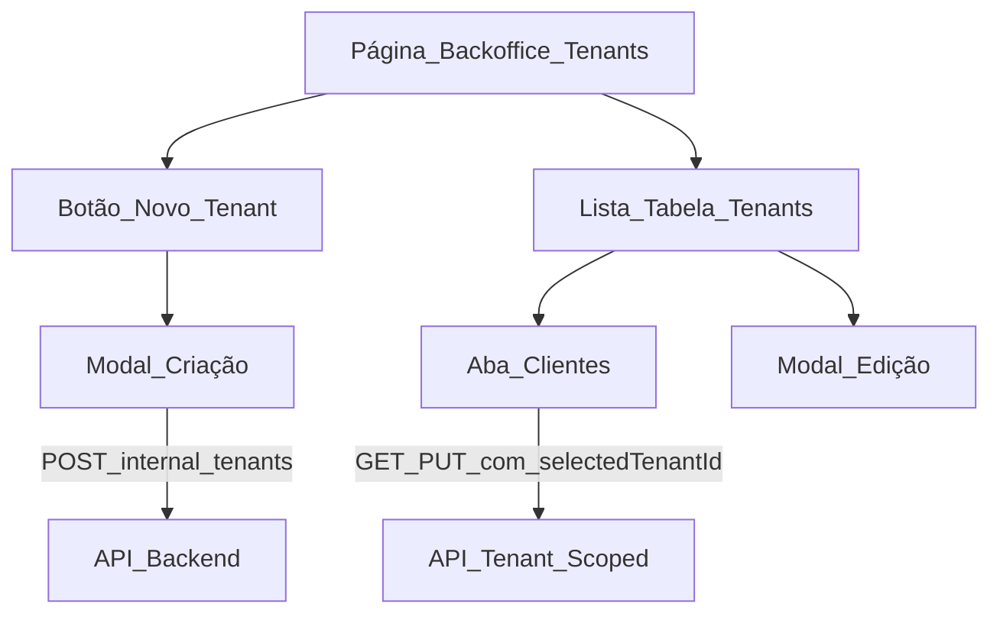

# Plano de implantação — melhorias de testes

## Contexto técnico rápido

- **Frontend**: Next.js em [`atendimento-frontEnd/atendimento-frontend`](atendimento-frontEnd/atendimento-frontend); backoffice COMERCIAL em [`src/app/[locale]/(app)/internal/tenants/page.tsx`](atendimento-frontEnd/atendimento-frontend/src/app/[locale]/(app)/internal/tenants/page.tsx).
- **Auth**: Firebase + token em `localStorage` (`CEREBRO_AUTH_TOKEN_KEY`); perfil/plano via [`SessionProfileSync`](atendimento-frontEnd/atendimento-frontend/src/components/auth/session-profile-sync.tsx) chamando `getPortalSession()` ([`apiService.ts`](atendimento-frontEnd/atendimento-frontend/src/services/apiService.ts)).
- **Evolution**: já existe provisionamento quando `provisionEvolution: true` no POST interno ([`InternalTenantAdminRestRoute.handleCreate`](infrastructure/src/main/java/com/atendimento/cerebro/infrastructure/adapter/inbound/rest/camel/InternalTenantAdminRestRoute.java) → [`EvolutionTenantProvisioningService`](application/src/main/java/com/atendimento/cerebro/application/service/EvolutionTenantProvisioningService.java)).
- **Ingestão KB**: [`IngestMultipartController`](infrastructure/src/main/java/com/atendimento/cerebro/infrastructure/adapter/inbound/rest/IngestMultipartController.java) + [`IngestionService`](application/src/main/java/com/atendimento/cerebro/application/service/IngestionService.java) + Tika ([`TikaTextExtractorAdapter`](infrastructure/src/main/java/com/atendimento/cerebro/infrastructure/adapter/out/ingestion/TikaTextExtractorAdapter.java)); o **bloqueio atual de tipos é só no cliente** ([`file-upload-zone.tsx`](atendimento-frontEnd/atendimento-frontend/src/components/knowledge/file-upload-zone.tsx)).

---

## 1. Settings — secção “Plano de subscrição” e plano atual dinâmico

**Situação**: Em [`settings/page.tsx`](atendimento-frontEnd/atendimento-frontend/src/app/[locale]/(app)/settings/page.tsx), `COMERCIAL` e `ULTRA` caem no mesmo texto (`planUltra`), o que não reflete o plano real; copy da secção pode confundir com “subscrição” vs perfil técnico.

**Ações**:

- Ajustar o mapeamento visual para **mostrar um rótulo por `profileLevel`** vindo da API (`BASIC`, `PRO`, `ULTRA`, `COMERCIAL`), com traduções dedicadas em [`pt-BR.json`](atendimento-frontEnd/atendimento-frontend/src/messages/pt-BR.json) (e espelhos `en.json`, `es.json`, `zh-CN.json`): por exemplo `planTierBasic`, `planTierPro`, `planTierUltra`, `planTierCommercial`.
- Rever `sectionPlan`, `sectionPlanDesc` e `planLabel` para texto alinhado ao modelo real (**perfil/plano técnico** gerido pelo backend/backoffice, não “subscrição” no sentido de billing self-service, salvo que produto queira esse wording).
- Opcional consistente com “dinâmico”: usar também `usePlan().profileLevel` após hidratação do `/auth/me` para não depender apenas do GET settings — definir uma única fonte de verdade na página (ex.: preferir `/auth/me` para o cartão do plano e settings só para restantes campos).

---

## 2. Backoffice interno — layout, grade de clientes e “Novo tenant” só como modal na página principal

**Situação**: A página mistura **formulário de criação no topo**, resultado do último convite, tabs Tenantes vs Clientes e modais de edição — origem da sensação de confusão.

**Ações**:

- **Remover** o `Card` inline de criação (linhas ~367–442) da vista principal.
- Adicionar na zona do cabeçalho (ao lado do título ou toolbar) um botão **“Novo tenant / Novo cliente”** que abre um **`Dialog`** com o mesmo formulário atual (tenantId, estabelecimento, email, perfil, opção Evolution — ver item 3).
- Manter **lista de tenants** como vista principal da tab “Tenantes”: evoluir de cards densos para **tabela responsiva** (`<table>` ou grid com cabeçalhos) com colunas claras: Tenant ID, Nome, Perfil, Estado, Adimplência, Uso mensal, Ações — reduzindo texto repetido nas células.
- Tab **“Clientes”**: renomear ou subtítulo na UI se o conteúdo for “Configuração do tenant” vs CRM — para evitar ambiguidade com “clientes finais”; se o produto quiser manter o nome “Clientes”, reforçar no cabeçalho que é **gestão do tenant selecionado** (item 5).

Arquivo principal: [`internal/tenants/page.tsx`](atendimento-frontEnd/atendimento-frontend/src/app/[locale]/(app)/internal/tenants/page.tsx); opcional extrair subcomponentes (`TenantCreateModal`, `TenantListTable`) no mesmo PR ou PR seguinte para legibilidade.

---

## 3. Criação de instância Evolution automatizada para o cliente

**Situação**: Já existe `provisionEvolution` opcional no payload; quando não marcado, não há instância.

**Ações** (combinadas, produto-fechar comportamento):

- **Backend**: Em [`handleCreate`](infrastructure/src/main/java/com/atendimento/cerebro/infrastructure/adapter/inbound/rest/camel/InternalTenantAdminRestRoute.java), se **`provisionEvolution` for null ou omitido**, tratar como **`true` quando** `globalEvolutionBaseUrl`, `globalEvolutionApiKey` e `webhookPublicBaseUrl` estiverem configurados no ambiente; caso contrário, não tentar e opcionalmente devolver aviso genérico (“Evolution não configurado no servidor”).
- **Frontend**: Remover checkbox ou deixá-lo **ligado por defeito** e oculto se a política for “sempre automático”; documentar variáveis necessárias em [`application.yml`](bootstrap/src/main/resources/application.yml) / `.env` já usadas pelo bean de provisioning.

Assim o fluxo “automático” não depende do operador lembrar-se da checkbox.

---

## 4. Modal de edição de tenant — `tenantId` apenas leitura

**Situação**: [`Dialog` de edição](atendimento-frontEnd/atendimento-frontend/src/app/[locale]/(app)/internal/tenants/page.tsx) (~872) não mostra o ID.

**Ações**:

- Inserir campo **`tenantId`** com `readOnly` / estilo “muted” + `aria-readonly`, valor `editTenantId`.

---

## 5. Menu lateral — identificar utilizador acima de “Sair”

**Situação**: [`NavAuthFooter`](atendimento-frontEnd/atendimento-frontend/src/components/layout/nav-auth-footer.tsx) só mostra logout.

**Ações**:

- Quando `authed` e Firebase configurado: mostrar **`user.email`** (ou `displayName` + email pequeno) num bloco texto acima do botão Sair; respeitar `variant` sidebar/drawer e truncar email longo (`truncate`, `title` com email completo).
- Se Firebase não configurado mas existir token: mostrar texto genérico (“Sessão ativa”) ou deixar só logout (mínimo aceitável).

Integração: em `AppSidebar` o bloco já envolve [`NavAuthFooter`](atendimento-frontEnd/atendimento-frontend/src/components/layout/app-sidebar.tsx); pode ser um pequeno subcomponente `NavUserBadge` dentro de `nav-auth-footer.tsx` para não duplicar lógica no drawer.

---

## 6. Aba “Clientes” — todos os dados filtrados pelo tenant em contexto

**Situação**: As chamadas já usam `selectedTenantId` (`getTenantSettings`, `getPortalUsers`, `getTenantServices`, saves). O risco é **estado stale** ao mudar de tenant ou falta de feedback visual do contexto.

**Ações**:

- **Barra fixa** no topo da aba: “A editar tenant: **`{selectedTenantId}`**” + botão para voltar à lista / limpar seleção.
- Garantir que, ao mudar `selectedTenantId`, se cancela loading anterior (padrão `cancelled` em `useEffect` como em settings) e **reset** de formulários antes do novo load, para não misturar dados.
- Revisão rápida: nenhuma lista na aba deve usar `tenantId` de outra fonte além de `selectedTenantId` (incl. `putTenantServices(..., tid)` — já correto).

---

## 7. Temas claro / escuro — contraste ilegível

**Situação**: Tokens em [`globals.css`](atendimento-frontEnd/atendimento-frontend/src/app/globals.css). Exemplos problemáticos comuns: `text-muted-foreground` em fundos `muted/card`, badges com cores fixas tipo `bg-emerald-100` na lista de tenants (não adaptam ao dark), bolhas de chat (`--chat-assistant` vs foreground).

**Ações**:

- Passar por **WCAG rápido** (contraste muted/secondary em light e dark) e ajustar `--muted-foreground`, `--secondary`, `--border` onde necessário.
- Substituir classes **fixas** `bg-emerald-100 text-emerald-800` / `amber` na grid de tenants por variantes **`dark:`** ou tokens semânticos (`bg-primary/10`, etc.).
- Rever componentes que usam `opacity-[0.22]` no blur do [`FeatureGuard`](atendimento-frontEnd/atendimento-frontend/src/components/plan/feature-guard.tsx) se for ilegível em light.

---

## 8. Upload de ficheiros `.md`

**Ações**:

- **Frontend**: Em [`file-upload-zone.tsx`](atendimento-frontEnd/atendimento-frontend/src/components/knowledge/file-upload-zone.tsx), incluir `.md` em `accept`, validação por extensão e MIME (`text/markdown` opcional); atualizar strings em `knowledgeUpload` nos JSON de mensagens.
- **Backend**: Garantir extração estável — se Tika não extrair bem `.md` no vosso classpath, acrescentar em [`TikaTextExtractorAdapter`](infrastructure/src/main/java/com/atendimento/cerebro/infrastructure/adapter/out/ingestion/TikaTextExtractorAdapter.java) ramo **para `.md` / `.markdown`**: `new String(data, UTF_8)` com validação de tamanho (reutilizar limite já implícito pelo multipart). Teste unitário rápido no adapter ou em [`IngestionServiceTest`](application/src/test/java/com/atendimento/cerebro/application/service/IngestionServiceTest.java) com ficheiro markdown pequeno.

---

## 9. Perda de sessão — voltar sempre ao login

**Situação**: [`SessionProfileSync`](atendimento-frontEnd/atendimento-frontend/src/components/auth/session-profile-sync.tsx) remove o token quando `/auth/me` falha mas **não navega** para `/login`; o utilizador pode ficar na área autenticada com UI inconsistente.

**Ações**:

- Introduzir helper **`redirectToLogin(router)`** (limpar token + tenant opcional + `router.replace('/login')` respeitando locale via [`useRouter`](atendimento-frontEnd/atendimento-frontend/src/i18n/navigation.ts) do next-intl).
- Chamar esse fluxo quando:
  - Firebase `user` passa a `null` dentro do listener **e** a rota atual não é pública (`/login`, `/register`, `/forgot-password`, etc.);
  - `getPortalSession()` falhar após refresh de token (401 / erro de sessão).
- Opcional robustez: interceptor central para `fetch` autenticado que em **401** dispara o mesmo logout + redirect (evita páginas que só falham em toast).

**Nota**: Não há `middleware.ts` de auth hoje ([`proxy.ts`](atendimento-frontEnd/atendimento-frontend/src/proxy.ts) só locale); o redirect será **client-side**, coerente com token em `localStorage`.

---

## Ordem sugerida de entrega (PRs)

1. **Sessão → login** + **sidebar utilizador** (impacto global, baixo risco visual).
2. **Settings plano** + **temas/contrastes** (copy + CSS).
3. **Upload `.md`** (FE + BE pequeno).
4. **Backoffice**: modal novo tenant + tabela + **tenantId readonly** + barra de contexto na aba Clientes.
5. **Evolution automático** no create interno (backend + alinhamento FE).

---

## Diagrama — fluxo backoffice após refactor

