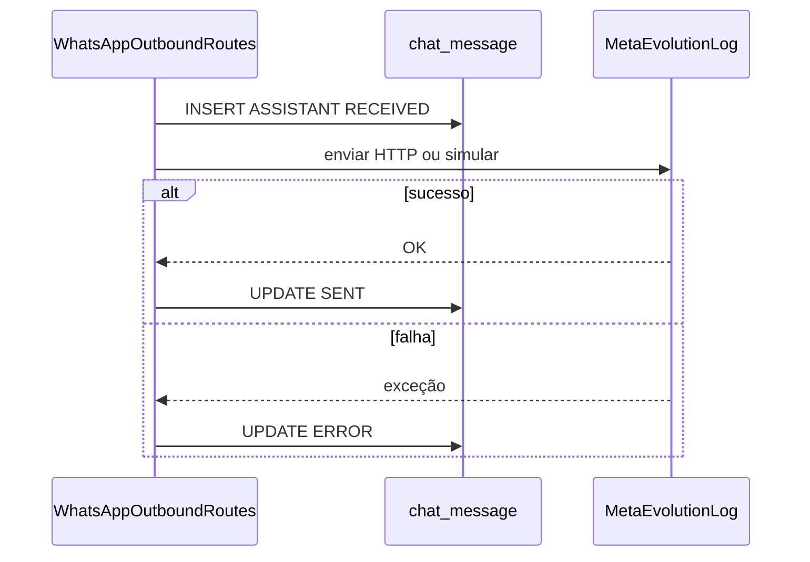

# Monitoramento profissional (status, filtros, retry, dark mode)

## Contexto atual

- UI: [`atendimento-frontEnd/atendimento-frontend/src/app/(app)/dashboard/monitoramento/page.tsx`](atendimento-frontEnd/atendimento-frontend/src/app/(app)/dashboard/monitoramento/page.tsx) faz poll a cada 5s via `getChatMessages` e renderiza [`ChatBubble`](atendimento-frontEnd/atendimento-frontend/src/components/chat/chat-bubble.tsx) só com texto e `timeLabel` (marca “envio com erro” se `ERROR`).
- API: [`MessagesRestRoute`](infrastructure/src/main/java/com/atendimento/cerebro/infrastructure/adapter/inbound/rest/camel/MessagesRestRoute.java) expõe `GET /api/v1/messages?tenantId=`; tipos em [`apiService.ts`](atendimento-frontEnd/atendimento-frontend/src/services/apiService.ts) admitem só `SENT | ERROR`.
- Backend: [`ChatMessageStatus`](domain/src/main/java/com/atendimento/cerebro/domain/monitoring/ChatMessageStatus.java) tem apenas `SENT` e `ERROR`. Em [`WhatsAppOutboundRoutes`](infrastructure/src/main/java/com/atendimento/cerebro/infrastructure/adapter/inbound/rest/camel/WhatsAppOutboundRoutes.java), a mensagem ASSISTANT é **gravada já como `SENT` antes** do HTTP; em falha do provider só há log — **não há `RECEIVED` nem `ERROR` na base**.

Para cumprir o requisito literal (relógio laranja = `RECEIVED` “processando”, check duplo verde = `SENT` “confirmado pelo backend” após envio HTTP, vermelho = `ERROR`), é **necessário** ajustar o fluxo outbound e o repositório; só frontend não basta.

**Semântica “confirmado”**: interpretação alinhada ao código atual — sucesso da chamada outbound (HTTP sem exceção no Camel) ou ramo SIMULATED → `SENT`. Não inclui recibo de entrega WhatsApp (seria outro webhook).

---

## 1. Backend: status `RECEIVED` e transições

| Ficheiro / área | Alteração |
|-----------------|-----------|
| [`ChatMessageStatus`](domain/src/main/java/com/atendimento/cerebro/domain/monitoring/ChatMessageStatus.java) | Adicionar `RECEIVED`. |
| [`ChatMessageRepository`](application/src/main/java/com/atendimento/cerebro/application/port/out/ChatMessageRepository.java) + [`JdbcChatMessageRepository`](infrastructure/src/main/java/com/atendimento/cerebro/infrastructure/adapter/out/persistence/JdbcChatMessageRepository.java) | `long insertReturningId(ChatMessage)` com `INSERT … RETURNING id` (PostgreSQL); `void updateStatus(long id, ChatMessageStatus status)`; `Optional<ChatMessage> findByIdAndTenant(long id, TenantId tenantId)` para retry/validação. |
| [`WhatsAppOutboundRoutes`](infrastructure/src/main/java/com/atendimento/cerebro/infrastructure/adapter/inbound/rest/camel/WhatsAppOutboundRoutes.java) | Substituir persistência pré-envio: inserir ASSISTANT com **`RECEIVED`**, guardar `id` numa property do `Exchange`. Após `sendToMeta` / `sendToEvolution` **com sucesso** (fora do `doCatch`): `updateStatus(id, SENT)`. No `logOutboundFailure`: `updateStatus(id, ERROR)`. No `sendToLog`: após simulação, `updateStatus(id, SENT)`. Tratar falha de persistência inicial (não enviar sem `id`). |
| Constante Camel | Ex.: `PROP_ASSISTANT_MESSAGE_ID` no mesmo estilo de [`WhatsAppOutboundHeaders`](infrastructure/src/main/java/com/atendimento/cerebro/infrastructure/adapter/inbound/rest/camel/WhatsAppOutboundHeaders.java) ou property dedicada. |

**Dados existentes**: linhas antigas ASSISTANT com `SENT` continuam válidas; só mensagens novas passam por `RECEIVED` → `SENT`/`ERROR`.

**Testes**: ajustar [`MessagesRestRouteIntegrationTest`](bootstrap/src/test/java/com/atendimento/cerebro/camel/MessagesRestRouteIntegrationTest.java) se necessário; acrescentar teste de repositório ou rota mínima para `updateStatus` / `insertReturningId` se fizer sentido no projeto.

---

## 2. Backend: `POST` reenvio por ID

- Novo endpoint Camel em [`MessagesRestRoute`](infrastructure/src/main/java/com/atendimento/cerebro/infrastructure/adapter/inbound/rest/camel/MessagesRestRoute.java) (ou classe próxima): **`POST /api/v1/messages/{id}/retry`** com `tenantId` obrigatório (query ou header, igual ao GET).
- Lógica: carregar por `id` + `tenantId`; exigir `role == ASSISTANT` e `status == ERROR`; `updateStatus(id, RECEIVED)`; **reutilizar o mesmo pipeline outbound** com texto/telefone da linha, **sem novo INSERT** (property no exchange, ex. `PROP_ASSISTANT_MESSAGE_ID`, e ramo em `persistAssistantMessageBeforeProviderSend` que, se ID já definido para retry, não chama `insert`—apenas deixa o `id` para os passos de sucesso/falha atualizarem a mesma linha).
- Respostas: 400 (tenant em falta / mensagem inválida), 404 (não existe), 409 (não é ASSISTANT+ERROR), 204 ou 200 JSON simples.

Atualizar [`openapi.yaml`](bootstrap/src/main/resources/static/openview.yaml) — path correto: [`bootstrap/src/main/resources/static/openapi.yaml`](bootstrap/src/main/resources/static/openapi.yaml) (o utilizador viu este ficheiro).

---

## 3. Frontend: tipos e API

- [`ChatMessageItem.status`](atendimento-frontEnd/atendimento-frontend/src/services/apiService.ts): `"RECEIVED" | "SENT" | "ERROR"` e `isChatMessageItem` coerente.
- Função `retryChatMessage(tenantId, messageId)` com `POST` para o novo path (usar o mesmo padrão de URL que `getChatMessages`).
- [`next.config.ts`](atendimento-frontEnd/atendimento-frontend/next.config.ts): rewrite genérico para encaminhar **`/api/v1/messages/:path*`** ao backend (hoje só existe match exato para `/api/v1/messages`, pelo que `/api/v1/messages/123/retry` não seria proxificado).

---

## 4. Frontend: `ChatBubble` (ícone, tooltip, reenviar, dark mode)

- Estender props opcionais (só para `layout="monitor"`): `deliveryStatus?: "RECEIVED" | "SENT" | "ERROR"` (apenas quando `role === "assistant"`), `onRetry?: () => void`, `retryDisabled?: boolean`.
- Rodapé do balão: linha com `timeLabel` + **ícone** à direita (Lucide: `Clock` laranja, `CheckCheck` verde, `CircleAlert` ou `X` vermelho). **Tooltip simples**: atributo HTML `title` em PT (“A processar envio…”, “Enviado com sucesso”, “Falha no envio”).
- Se `ERROR` e `onRetry`: botão texto discretíssimo (“Reenviar”) sob o rodapé ou ao lado do ícone.
- **Dark mode**: reforçar contraste no ramo `monitor` — balão utilizador: fundo mais opaco (`bg-muted` com `dark:bg-muted/95` + texto explícito); assistente: gradiente ou cor sólida com `dark:` que mantenha `text-primary-foreground` legível (evitar `primary-foreground/85` demasiado apagado no tempo).

---

## 5. Frontend: filtros “Todos” / “Pendentes” + badge

- Estado `contactFilter: "all" | "pending"`.
- Função pura `isConversationPending(messagesForPhone): boolean`:
  - Ordenar por `timestamp` / `id`;
  - **Pendente** se a última mensagem for `USER`, **ou** for `ASSISTANT` com `status === "ERROR"` (conforme pedido: sem resposta da IA ou última resposta com erro). Opcional clarificação: se a última for `ASSISTANT` com `RECEIVED`, não contar como pendente (resposta em curso).
- `buildContactsFromMessages` ou lista derivada: filtrar contactos quando `pending`.
- **Badge**: contador = número de telefones pendentes (memo a partir de `rawMessages`); exibir ao lado do rótulo “Pendentes” ( `` — não há componente Badge no projeto).
- UI: dois botões segmentados (“Tabs” visuais) por cima da lista no `aside`, antes da lista de números.

---

## 6. Polling

- O intervalo de 5s já chama `refresh()` → `setRawMessages(list)`. Com os `useMemo` em `contacts` / contagem de pendentes / thread, **status, ícones e badges atualizam automaticamente** após alargar o tipo e o backend. Nenhuma alteração obrigatória no timer; apenas garantir que o GET devolve os novos valores.

---

## Risco / nota

- O GET continua com `DEFAULT_LIMIT = 50` em [`MessagesRestRoute`](infrastructure/src/main/java/com/atendimento/cerebro/infrastructure/adapter/inbound/rest/camel/MessagesRestRoute.java): conversas antigas fora da janela não entram no filtro nem no badge. Se for problema operacional, aumentar o limite ou expor query `limit` — fora do escopo mínimo, mas mencionável na implementação.
