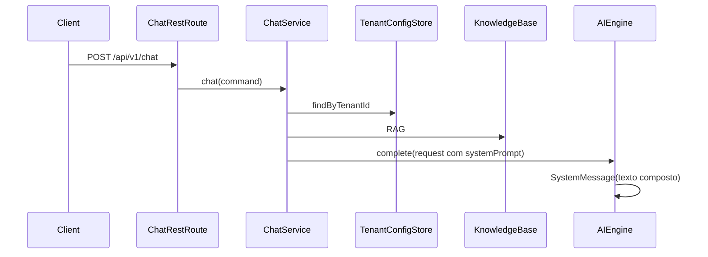

# Persona (System Prompt) por tenant

## Contexto do código atual

- **Tenant** vem do corpo JSON (ex.: [`ChatHttpRequest`](infrastructure/src/main/java/com/atendimento/cerebro/infrastructure/adapter/inbound/rest/camel/ChatHttpRequest.java)); não há Spring Security com principal.
- **Persistência**: [`JdbcClient`](infrastructure/src/main/java/com/atendimento/cerebro/infrastructure/adapter/out/persistence/PostgresConversationContextStore.java) + Flyway em [`bootstrap/src/main/resources/db/migration`](bootstrap/src/main/resources/db/migration).
- **Prompt hoje**: constante `SYSTEM_PROMPT` + bloco de conhecimento em [`GeminiChatEngineAdapter`](infrastructure/src/main/java/com/atendimento/cerebro/infrastructure/adapter/out/ai/GeminiChatEngineAdapter.java) e espelho em [`OpenAiChatEngineAdapter`](infrastructure/src/main/java/com/atendimento/cerebro/infrastructure/adapter/out/ai/OpenAiChatEngineAdapter.java); [`ChatService`](application/src/main/java/com/atendimento/cerebro/application/service/ChatService.java) monta só [`AICompletionRequest`](application/src/main/java/com/atendimento/cerebro/application/dto/AICompletionRequest.java) (sem persona).
- **URL `/api/v1/...`**: servlet Camel `context-path: /api/*` + `rest("/v1/...")` como em [`ChatRestRoute`](infrastructure/src/main/java/com/atendimento/cerebro/infrastructure/adapter/inbound/rest/camel/ChatRestRoute.java) — o PUT deve seguir o mesmo padrão para ficar em **`PUT /api/v1/tenant/settings`**.

## 1. Persistência

- **Flyway** novo script, ex.: [`V3__create_tenant_configuration.sql`](bootstrap/src/main/resources/db/migration/V3__create_tenant_configuration.sql):
  - Tabela `tenant_configuration` com `tenant_id VARCHAR(512) PRIMARY KEY` (alinhado a [`V1`](bootstrap/src/main/resources/db/migration/V1__create_conversation_message.sql)) e `system_prompt TEXT NOT NULL` (default `''` se quiser permitir upsert simples).
- **Domínio**: record `TenantConfiguration` em [`domain/.../tenant/TenantConfiguration.java`](domain/src/main/java/com/atendimento/cerebro/domain/tenant/TenantConfiguration.java) (`TenantId` + `String systemPrompt`).
- **Porta de saída** (application): `TenantConfigurationStorePort` com:
  - `Optional<TenantConfiguration> findByTenantId(TenantId tenantId)`
  - `void upsert(TenantId tenantId, String systemPrompt)` (validação de não-nulo / trim no serviço ou na implementação).
- **Implementação**: `PostgresTenantConfigurationStore` em `infrastructure.adapter.out.persistence`, usando `JdbcClient`: SELECT por `tenant_id`; UPSERT com `INSERT ... ON CONFLICT (tenant_id) DO UPDATE SET system_prompt = EXCLUDED.system_prompt`.

## 2. `ChatService` e `AICompletionRequest`

- Estender [`AICompletionRequest`](application/src/main/java/com/atendimento/cerebro/application/dto/AICompletionRequest.java) com campo **`systemPrompt`** (String; permitir vazio quando não houver linha no banco — normalizar em `ChatService` para `""` após trim).
- Injetar `TenantConfigurationStorePort` em `ChatService`; **antes** do RAG ou logo após carregar contexto, chamar `findByTenantId` e passar o texto para `AICompletionRequest`.
- Atualizar [`ApplicationConfiguration`](bootstrap/src/main/java/com/atendimento/cerebro/bootstrap/ApplicationConfiguration.java) para o novo construtor de `ChatService`.
- Ajustar testes: [`ChatServiceTest`](application/src/test/java/com/atendimento/cerebro/application/service/ChatServiceTest.java) (mock da nova porta), [`RoutingAIEnginePortTest`](bootstrap/src/test/java/com/atendimento/cerebro/infrastructure/adapter/out/ai/RoutingAIEnginePortTest.java) (novo parâmetro no record).

## 3. Prompt engineering (Gemini + OpenAI)

- Extrair a montagem do conteúdo do **único** `SystemMessage` para uma classe utilitária partilhada (ex.: `RagSystemPromptComposer` em `infrastructure.adapter.out.ai`), com método que recebe `String systemPrompt` + `List<KnowledgeHit>` e devolve o texto final no formato:

  - `Instrução de Personalidade: {systemPrompt}.`
  - `Contexto de Conhecimento: {contexto formatado a partir do pgvector/RAG}.`
  - `Instrução Adicional: Use apenas o contexto fornecido para responder. Se não souber, diga que não possui essa informação.`

- Reutilizar a lógica de lista numerada / mensagem quando não há hits (equivalente ao comportamento atual de “nenhum trecho”) dentro do **bloco de contexto**, para o modelo continuar explícito quando o RAG vem vazio.
- Substituir em [`GeminiChatEngineAdapter`](infrastructure/src/main/java/com/atendimento/cerebro/infrastructure/adapter/out/ai/GeminiChatEngineAdapter.java) e [`OpenAiChatEngineAdapter`](infrastructure/src/main/java/com/atendimento/cerebro/infrastructure/adapter/out/ai/OpenAiChatEngineAdapter.java) o `SYSTEM_PROMPT` fixo + `buildSystemContent` duplicado por chamada ao compositor (continua **uma** `SystemMessage` no início da lista, como hoje).

## 4. API `PUT /api/v1/tenant/settings`

- **Porta de entrada**: `UpdateTenantSettingsUseCase` (ou nome equivalente) com um método `void update(TenantId tenantId, String systemPrompt)`.
- **Serviço de aplicação** mínimo que delega ao `TenantConfigurationStorePort#upsert`.
- **Camel**: novo `RouteBuilder` (ex.: `TenantSettingsRestRoute`) com `restConfiguration` coerente com [`ChatRestRoute`](infrastructure/src/main/java/com/atendimento/cerebro/infrastructure/adapter/inbound/rest/camel/ChatRestRoute.java) (servlet + JSON), rota `PUT /v1/tenant/settings` → `direct:...` que valida body, constrói `TenantId`, chama o use case.
- **DTO JSON**: classe tipo `TenantSettingsHttpRequest` (`tenantId`, `systemPrompt`) no pacote `...camel` (espelhando o estilo de `ChatHttpRequest`).
- **Resposta**: `204 No Content` em sucesso; `400` para `tenantId` em branco / validação; reutilizar padrão de erro JSON se já existir para Camel (ou resposta simples alinhada aos outros endpoints).

## 5. Testes recomendados

- Teste unitário do **compositor** (texto exato das três secções e substituição do contexto).
- Opcional: teste de integração leve do repositório ou teste Camel semelhante aos existentes em `bootstrap/src/test`, se o projeto já tiver infra para isso.

## Notas

- **Sem autenticação**: o PUT fica público como o chat/ingest atuais; endurecer depois se necessário.
- **Default de persona**: sem linha na tabela, `systemPrompt` vazio e o template continua com “Instrução de Personalidade: .” ou string vazia na primeira linha — comportamento previsível e alinhado a “buscar no banco”.
