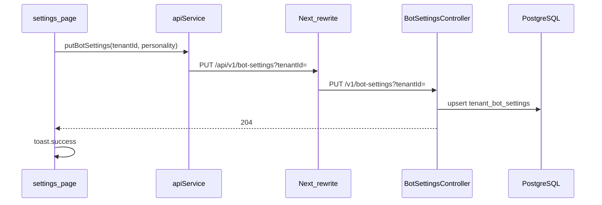

# Página Configurações do Bot (`/settings`)

## Contexto

- Frontend: [`atendimento-frontEnd/atendimento-frontend`](atendimento-frontEnd/atendimento-frontend) — páginas com sidebar em [`src/app/(app)/`](atendimento-frontEnd/atendimento-frontend/src/app/(app)/). Já existe placeholder em [`(app)/bot-settings/page.tsx`](atendimento-frontEnd/atendimento-frontend/src/app/(app)/bot-settings/page.tsx) e o item do menu em [`app-sidebar.tsx`](atendimento-frontEnd/atendimento-frontend/src/components/layout/app-sidebar.tsx) aponta para `/bot-settings`.
- **Tenant atual**: o mesmo padrão de [`knowledge/page.tsx`](atendimento-frontEnd/atendimento-frontend/src/app/(app)/knowledge/page.tsx) — chave `localStorage` `cerebro-tenant-id`, estado inicial carregado no `useEffect`.
- **API e proxy**: [`apiService.ts`](atendimento-frontEnd/atendimento-frontend/src/services/apiService.ts) usa `getApiBaseUrl()` e, sem base, URLs relativas com rewrites em [`next.config.ts`](atendimento-frontEnd/atendimento-frontend/next.config.ts) (ex.: `/api/v1/ingest` → `/v1/ingest` no Java).
- **Backend**: hoje só há ingest via Spring MVC em [`IngestMultipartController`](infrastructure/src/main/java/com/atendimento/cerebro/infrastructure/adapter/inbound/rest/IngestMultipartController.java) (`/v1/ingest`) e chat via Camel. **Não existe** endpoint PUT para personalidade; é obrigatório adicioná-lo para o `PUT` ser real.

## Frontend

1. **Nova página** [`atendimento-frontEnd/atendimento-frontend/src/app/(app)/settings/page.tsx`](atendimento-frontEnd/atendimento-frontend/src/app/(app)/settings/page.tsx)
   - `"use client"`.
   - Título alinhado ao produto (ex.: “Configurações do bot”).
   - **Textarea** com label **“Personalidade do Bot”** (componente [`textarea.tsx`](atendimento-frontEnd/atendimento-frontend/src/components/ui/textarea.tsx) + [`Label`](atendimento-frontEnd/atendimento-frontend/src/components/ui/label.tsx)).
   - Texto de ajuda com o exemplo fixo: `Ex: Você é o atendente virtual da Clínica Saúde+, seja cordial e use emojis de saúde.`
   - Campo **tenant**: reutilizar o mesmo fluxo que Knowledge (input + persistência `cerebro-tenant-id`) para cumprir “tenantId atual”; sem tenant, `toast.error` antes do save.
   - Botão **Salvar** → chama nova função em `apiService` (abaixo); em sucesso `toast.success("Configurações salvas com sucesso!")` via [`sonner`](atendimento-frontEnd/atendimento-frontend/src/components/providers.tsx) (já com `<Toaster />`); em erro mensagem via `toast.error`.

2. **Serviço HTTP** — estender [`apiService.ts`](atendimento-frontEnd/atendimento-frontend/src/services/apiService.ts):
   - `putBotSettings(tenantId: string, personality: string)` → `PUT` com `Content-Type: application/json`, corpo JSON (ex.: `{ "botPersonality": "..." }`), URL coerente com o backend (ver abaixo). Reutilizar `parseErrorMessage` para falhas.

3. **Next rewrite** — em [`next.config.ts`](atendimento-frontEnd/atendimento-frontend/next.config.ts), adicionar regra análoga à do ingest, por exemplo:
   - `source: "/api/v1/bot-settings"` → `destination: \`${backend}/v1/bot-settings\`` (com query `tenantId` na URL do fetch).

4. **Navegação**
   - Em [`app-sidebar.tsx`](atendimento-frontEnd/atendimento-frontend/src/components/layout/app-sidebar.tsx), alterar `href` de `/bot-settings` para `/settings`.
   - Em [`(app)/bot-settings/page.tsx`](atendimento-frontEnd/atendimento-frontend/src/app/(app)/bot-settings/page.tsx), redirecionar para `/settings` (`redirect` do `next/navigation`) para não quebrar bookmarks, ou remover a rota após confirmar — redirecionamento é o mais seguro.

## Backend (Spring)

Contrato proposto (consistente com `tenantId` em query no ingest):

- **`PUT /v1/bot-settings?tenantId={id}`**
- Body JSON: `{ "botPersonality": "..." }` (validar não vazio ou aceitar string vazia conforme regra de negócio; recomenda-se trim e rejeitar se `tenantId` em branco).
- Resposta: `204 No Content` ou `200` com corpo mínimo; o frontend só precisa de `res.ok`.

Implementação sugerida (hexagonal leve, alinhada ao resto do módulo):

- **Flyway** — novo script em [`bootstrap/src/main/resources/db/migration/`](bootstrap/src/main/resources/db/migration/), ex.: `V3__tenant_bot_settings.sql`: tabela `tenant_bot_settings` com `tenant_id VARCHAR(...) PRIMARY KEY`, `personality TEXT NOT NULL`, `updated_at TIMESTAMPTZ` opcional.
- **Porta de saída** (application): `BotPersonalityStorePort` com `void upsert(TenantId tenantId, String personality)`.
- **Caso de uso** (application): `BotSettingsUseCase` (ou nome equivalente) que delega à porta.
- **Adapter** (infrastructure): implementação com `JdbcTemplate` (upsert `INSERT ... ON CONFLICT DO UPDATE` em PostgreSQL).
- **Controller** (infrastructure): `@RestController` sob `@RequestMapping("/v1")`, método `@PutMapping("/bot-settings")`, `@RequestParam String tenantId`, `@RequestBody` DTO com `botPersonality`; retorno `204`.
- **Wiring**: bean do use case + adapter em [`ApplicationConfiguration`](bootstrap/src/main/java/com/atendimento/cerebro/bootstrap/ApplicationConfiguration.java) ou scan de `@Service`/`@Component` conforme o projeto já faz noutros adapters.

**Nota:** [`GeminiChatEngineAdapter`](infrastructure/src/main/java/com/atendimento/cerebro/infrastructure/adapter/out/ai/GeminiChatEngineAdapter.java) usa hoje um `SYSTEM_PROMPT` fixo. **Persistir** a personalidade cumpre o pedido; **aplicar** essa string ao prompt do modelo é melhoria separada (injetar porta no adapter e prefixar/sufixar o system content). Pode ficar fora deste escopo a menos que queiras fechar o ciclo já na mesma entrega.

## Fluxo

## Ficheiros principais a tocar

| Área | Ficheiros |
|------|-----------|
| Frontend | `(app)/settings/page.tsx`, `apiService.ts`, `next.config.ts`, `app-sidebar.tsx`, `bot-settings/page.tsx` (redirect) |
| Backend | Nova migração Flyway, port + use case + JDBC adapter + `BotSettingsController` (ou nome final), `ApplicationConfiguration` se necessário |
