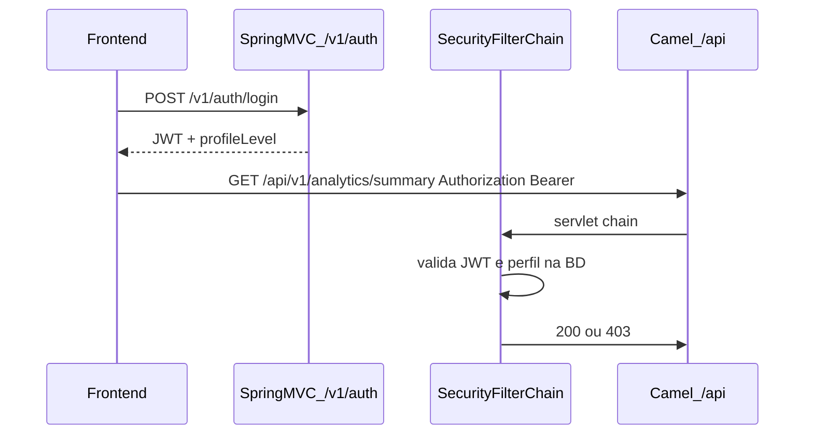

# RBAC por perfil (tenant + JWT)

## Contexto do repositório

- Não existe tabela de utilizadores; a “conta” alinhada com o teu pedido é o **tenant** em [`tenant_configuration`](d:\Documents\agenteAtendimento\bootstrap\src\main\resources\db\migration\V3__create_tenant_configuration.sql), hoje modelado por [`TenantConfiguration`](d:\Documents\agenteAtendimento\domain\src\main\java\com\atendimento\cerebro\domain\tenant\TenantConfiguration.java) e [`PostgresTenantConfigurationStore`](d:\Documents\agenteAtendimento\infrastructure\src\main\java\com\atendimento\cerebro\infrastructure\adapter\out\persistence\PostgresTenantConfigurationStore.java).
- Rotas de **analytics, dashboard e export** são **Apache Camel REST** sob o servlet com [`context-path: /api/*`](d:\Documents\agenteAtendimento\bootstrap\src\main\resources\application.yml) — ficheiros [`AnalyticsRestRoute`](d:\Documents\agenteAtendimento\infrastructure\src\main\java\com\atendimento\cerebro\infrastructure\adapter\inbound\rest\camel\AnalyticsRestRoute.java), [`DashboardRestRoute`](d:\Documents\agenteAtendimento\infrastructure\src\main\java\com\atendimento\cerebro\infrastructure\adapter\inbound\rest\camel\DashboardRestRoute.java), [`AnalyticsExportRestRoute`](d:\Documents\agenteAtendimento\infrastructure\src\main\java\com\atendimento\cerebro\infrastructure\adapter\inbound\rest\camel\AnalyticsExportRestRoute.java).
- **Não há Spring Security** hoje; o MVC que não colide com Camel usa prefixo **`/v1`** (ex.: [`IngestMultipartController`](d:\Documents\agenteAtendimento\infrastructure\src\main\java\com\atendimento\cerebro\infrastructure\adapter\inbound\rest\IngestMultipartController.java)).
- `@PreAuthorize` em `@RestController` **não cobre** as rotas Camel; a proteção deve ser **`SecurityFilterChain` + regras por URL** (e/ou um `AuthorizationManager` custom) para `/api/v1/dashboard/**`, `/api/v1/analytics/**`, com exceções explícitas para **webhook** e restantes APIs se quiseres mantê-las abertas por agora.

## 1. Base de dados (Flyway)

- Novo script (ex.: `V12__tenant_profile_and_portal_auth.sql`) em [`bootstrap/src/main/resources/db/migration`](d:\Documents\agenteAtendimento\bootstrap\src\main\resources\db\migration):
  - `profile_level VARCHAR(16) NOT NULL DEFAULT 'BASIC'` com `CHECK (profile_level IN ('BASIC','PRO','ULTRA'))`.
  - `portal_password_hash VARCHAR(255) NULL` — necessário para **login real** com BCrypt; `NULL` = login desativado para esse tenant.
- Migração compatível com linhas existentes (default `BASIC`).

## 2. Domínio e persistência

- Enum **`ProfileLevel`** (`BASIC`, `PRO`, `ULTRA`) no módulo `domain`, com método utilitário tipo `meets(ProfileLevel required)` por **ordem** (ex.: BASIC &lt; PRO &lt; ULTRA).
- Estender **`TenantConfiguration`** com `ProfileLevel profileLevel` e ajustar `defaults()` para `BASIC`.
- **`TenantSettingsUpdateCommand` / `TenantSettingsService`**: não expor upgrades de plano via PUT público — no `merge`, **preservar sempre** `profileLevel` da base (mudanças só por operação interna/SQL/admin futuro).
- **`PostgresTenantConfigurationStore`**: incluir colunas no `SELECT`, `INSERT ... ON CONFLICT` e `mapRow`.
- Testes de integração que fazem `DELETE FROM tenant_configuration` (ex.: [`ChatServiceIntegrationBase`](d:\Documents\agenteAtendimento\bootstrap\src\test\java\com\atendimento\cerebro\ChatServiceIntegrationBase.java)) podem precisar de ajuste mínimo se passarem a assumir colunas novas ao inserir dados à mão.

## 3. Spring Security + JWT (emitido neste backend)

**Dependências** (provável: [`infrastructure/pom.xml`](d:\Documents\agenteAtendimento\infrastructure\pom.xml) ou [`bootstrap/pom.xml`](d:\Documents\agenteAtendimento\bootstrap\pom.xml)):

- `spring-boot-starter-security`
- JWT assinado (ex.: **JJWT** ou **Nimbus** + HS256 com segredo em `application.yml` / env)

**Componentes principais** (pacote infra, ex. `...security`):

- **`JwtService`**: `createToken(tenantId)`, `parseTenantId(token)`.
- **`SecurityFilterChain`** (Spring Security 6):
  - **CSRF desativado** para API stateless com Bearer.
  - **Sessão stateless.**
  - `permitAll`: `POST /v1/auth/login`, `/v1/whatsapp/webhook/**` (e outros padrões que já precisem públicos, p.ex. webhook Camel), recursos estáticos Swagger se necessário.
  - **Autenticado** (Bearer válido): `GET /api/v1/dashboard/**`, `GET /api/v1/analytics/**` (inclui export).
  - Opcional imediato: `GET /v1/auth/me` autenticado.
- **Autorização por perfil** (duas abordagens equivalentes; escolher uma e aplicar de forma consistente):
  - **A)** `AuthorizationManager<HttpServletRequest>` / filtro após JWT que lê `ProfileLevel` da BD pelo `tenantId` do token e compara com o path (ver matriz abaixo).
  - **B)** `access(ProfileLevelAuthorizationManager)` apenas nos `requestMatchers` de dashboard/analytics.

**Matriz sugerida** (ajustável em código ou `application.yml`):

| Recurso | Mínimo |
|---------|--------|
| `GET /api/v1/dashboard/**` | PRO |
| `GET /api/v1/analytics/**` exceto `/export` | PRO |
| `GET /api/v1/analytics/export` com `format=csv` | PRO |
| `GET /api/v1/analytics/export` com `format=pdf` | ULTRA |
| BASIC | 403 nestes endpoints |

**Tenant no token vs querystring**: nos handlers Camel afetados, o `tenantId` autorizado deve vir do **`SecurityContext`** (subject do JWT) e **validar** que, se ainda existir `tenantId` na query, coincide com o token (evita elevação de privilégio). Helpers partilhados nos três `*RestRoute` reduzem duplicação.

## 4. Login e payload de sessão (MVC `/v1/auth`)

Seguir o padrão do ingest (**fora de `/api/*`**):

- **`AuthController`** (ou similar) em `infrastructure`:
  - `POST /v1/auth/login` — body `{ "tenantId", "password" }`; valida BCrypt contra `portal_password_hash`; resposta `{ "accessToken", "tokenType": "Bearer", "tenantId", "profileLevel" }`.
  - `GET /v1/auth/me` — `Authorization: Bearer`; mesma informação (e opcionalmente campos mínimos) para o frontend ao iniciar.
- **Erros**: 401 credenciais inválidas / tenant sem password; 403 quando o JWT é válido mas o recurso exige perfil superior.

## 5. Configurações e documentação operacional

- Propriedades novas em [`application.yml`](d:\Documents\agenteAtendimento\bootstrap\src\main\resources\application.yml): segredo JWT, tempo de expiração, possivelmente prefixo do issuer.
- Documentar como **definir password** inicial (UPDATE SQL com hash BCrypt ou utilitário CLI) e como subir `profile_level` por tenant.

## 6. API já usada pelo frontend — `TenantSettings`

- Em [`TenantSettingsResponse`](d:\Documents\agenteAtendimento\infrastructure\src\main\java\com\atendimento\cerebro\infrastructure\adapter\inbound\rest\camel\TenantSettingsResponse.java) e [`TenantSettingsRestRoute.handleGet`](d:\Documents\agenteAtendimento\infrastructure\src\main\java\com\atendimento\cerebro\infrastructure\adapter\inbound\rest\camel\TenantSettingsRestRoute.java), adicionar campo `profileLevel` (string ou enum serializado) para o dashboard continuar a funcionar **sem depender só do login**, alinhado com “carregar sessão”.
- **Opcional de segurança**: exigir JWT também em `GET /api/v1/tenant/settings` num passo seguinte; neste plano o foco é analytics/export conforme pedido.

## 7. Frontend (Next.js)

- [`apiService.ts`](d:\Documents\agenteAtendimento\atendimento-frontEnd\atendimento-frontend\src\services\apiService.ts): tipos com `profileLevel`; funções `login`, `getMe`, `authHeader`; anexar `Authorization` em chamadas a dashboard/analytics/export.
- [`next.config.ts`](d:\Documents\agenteAtendimento\atendimento-frontEnd\atendimento-frontend\next.config.ts): rewrites/proxy para **`/v1/auth/*`** além dos já existentes para `/api/v1/...`.
- UI mínima: página ou fluxo de login (ou integrar na settings) que grava token (ex. `localStorage`) e, ao montar a app, chama `/v1/auth/me` ou usa claims guardados; tratar 403 para esconder ou desativar links de analytics/export.

## 8. OpenAPI

- Atualizar [`bootstrap/src/main/resources/static/openapi.yaml`](d:\Documents\agenteAtendimento\bootstrap\src\main\resources\static\openapi.yaml) com `/v1/auth/login`, `/v1/auth/me`, cabeçalho `Authorization` nos endpoints protegidos, e campo `profileLevel` em tenant settings.

## Riscos / notas

- Até o frontend enviar **Bearer**, chamadas diretas a `/api/v1/analytics/...` passam a receber **401** — coordenar release ou flag temporária só se necessário em ambientes internos.
- Webhooks e restantes rotas Camel devem permanecer **fora** das regras de JWT salvo que decidam endurecer o API mais tarde.
