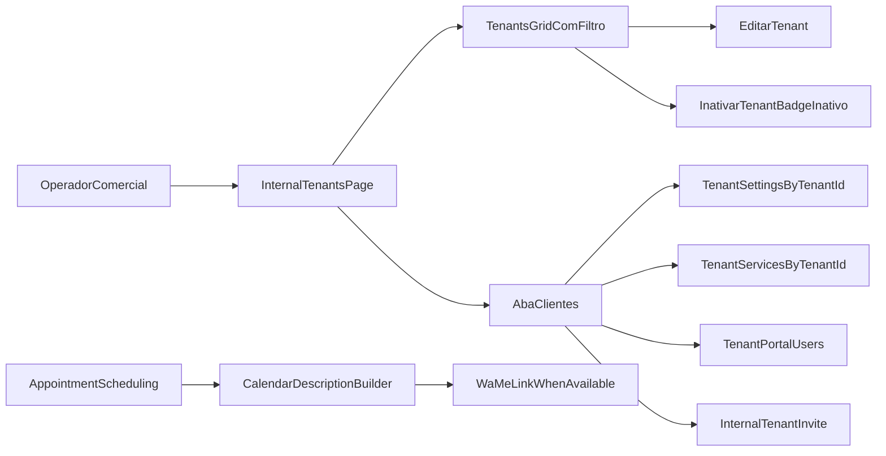

# Plano: Centralizar Gestão de Clientes em Internal > Tenants

## Objetivo
Unificar a operação de clientes (edição, inativação lógica, plano e dados operacionais) na tela interna de tenants, reduzir ruído em `settings`, reforçar UX de bloqueio por plano e enriquecer eventos do Google Calendar com atalho para WhatsApp.

## Escopo Funcional
- Transformar **Tenants Existentes** em grid com filtro, ações de **editar** e **exclusão lógica (inativar com badge Inativo)**.
- Criar aba **Clientes** dentro de `internal/tenants` contendo as seções hoje em `settings`:
  - Dados do Negócio
  - Adimplência e duração padrão
  - Google Calendar e Planilha
  - Serviços oferecidos (catálogo)
  - Outros utilizadores com acesso ao portal
  - Código de convite
  - Número WhatsApp comercial
- Remover essas seções de `settings` (mantendo apenas conteúdos não migrados).
- Garantir cadeado no menu para funcionalidades bloqueadas por plano BASIC/PRO (validar e ajustar UX, já parcialmente implementado).
- Incluir link direto `wa.me` na descrição do evento do Google Calendar quando houver telefone do cliente.

## Fluxo Proposto (alto nível)

## Arquivos-alvo Principais
- Frontend tenants: [d:/Documents/agenteAtendimento/atendimento-frontEnd/atendimento-frontend/src/app/[locale]/(app)/internal/tenants/page.tsx](d:/Documents/agenteAtendimento/atendimento-frontEnd/atendimento-frontend/src/app/[locale]/(app)/internal/tenants/page.tsx)
- Frontend settings: [d:/Documents/agenteAtendimento/atendimento-frontEnd/atendimento-frontend/src/app/[locale]/(app)/settings/page.tsx](d:/Documents/agenteAtendimento/atendimento-frontEnd/atendimento-frontend/src/app/[locale]/(app)/settings/page.tsx)
- Frontend API client: [d:/Documents/agenteAtendimento/atendimento-frontEnd/atendimento-frontend/src/services/apiService.ts](d:/Documents/agenteAtendimento/atendimento-frontEnd/atendimento-frontend/src/services/apiService.ts)
- Menu/nav: [d:/Documents/agenteAtendimento/atendimento-frontEnd/atendimento-frontend/src/components/layout/app-nav-entry.tsx](d:/Documents/agenteAtendimento/atendimento-frontEnd/atendimento-frontend/src/components/layout/app-nav-entry.tsx), [d:/Documents/agenteAtendimento/atendimento-frontEnd/atendimento-frontend/src/components/layout/app-sidebar.tsx](d:/Documents/agenteAtendimento/atendimento-frontEnd/atendimento-frontend/src/components/layout/app-sidebar.tsx), [d:/Documents/agenteAtendimento/atendimento-frontEnd/atendimento-frontend/src/components/layout/mobile-nav-drawer.tsx](d:/Documents/agenteAtendimento/atendimento-frontEnd/atendimento-frontend/src/components/layout/mobile-nav-drawer.tsx)
- Backend internal tenants route: [d:/Documents/agenteAtendimento/infrastructure/src/main/java/com/atendimento/cerebro/infrastructure/adapter/inbound/rest/camel/InternalTenantAdminRestRoute.java](d:/Documents/agenteAtendimento/infrastructure/src/main/java/com/atendimento/cerebro/infrastructure/adapter/inbound/rest/camel/InternalTenantAdminRestRoute.java)
- Backend tenant settings route: [d:/Documents/agenteAtendimento/infrastructure/src/main/java/com/atendimento/cerebro/infrastructure/adapter/inbound/rest/camel/TenantSettingsRestRoute.java](d:/Documents/agenteAtendimento/infrastructure/src/main/java/com/atendimento/cerebro/infrastructure/adapter/inbound/rest/camel/TenantSettingsRestRoute.java)
- Backend onboarding route: [d:/Documents/agenteAtendimento/infrastructure/src/main/java/com/atendimento/cerebro/infrastructure/adapter/inbound/rest/camel/TenantOnboardingRestRoute.java](d:/Documents/agenteAtendimento/infrastructure/src/main/java/com/atendimento/cerebro/infrastructure/adapter/inbound/rest/camel/TenantOnboardingRestRoute.java)
- Calendar scheduling: [d:/Documents/agenteAtendimento/infrastructure/src/main/java/com/atendimento/cerebro/infrastructure/calendar/GoogleCalendarAppointmentSchedulingService.java](d:/Documents/agenteAtendimento/infrastructure/src/main/java/com/atendimento/cerebro/infrastructure/calendar/GoogleCalendarAppointmentSchedulingService.java)
- Calendar tests: [d:/Documents/agenteAtendimento/infrastructure/src/test/java/com/atendimento/cerebro/infrastructure/calendar/GoogleCalendarAppointmentSchedulingServiceTest.java](d:/Documents/agenteAtendimento/infrastructure/src/test/java/com/atendimento/cerebro/infrastructure/calendar/GoogleCalendarAppointmentSchedulingServiceTest.java)
- i18n: [d:/Documents/agenteAtendimento/atendimento-frontEnd/atendimento-frontend/src/messages/pt-BR.json](d:/Documents/agenteAtendimento/atendimento-frontEnd/atendimento-frontend/src/messages/pt-BR.json) (e paridade `en/es/zh-CN`)

## Estratégia Técnica
- Backend primeiro para suportar operações faltantes:
  - adicionar endpoints internos para atualizar tenant selecionado (nome, email/contato, plano) e inativação lógica;
  - padronizar retorno de lista interna com status ativo/inativo para badge e filtro.
- Frontend `apiService` em seguida:
  - incluir funções internas de update/deactivate tenant;
  - garantir operações de settings/services/invite para tenant selecionado na visão interna (reaproveitando `tenantId` explícito quando disponível).
- UI `internal/tenants`:
  - substituir lista atual por grid com busca, filtro por status e ações por linha;
  - adicionar aba `Clientes` com formulário/seções migradas de `settings`, vinculadas ao tenant selecionado.
- UI `settings`:
  - remover seções migradas e manter apenas blocos remanescentes de escopo local.
- Menu bloqueado por plano:
  - validar regras atuais e ajustar apenas UX/consistência visual do cadeado (desktop + mobile).
- Google Calendar:
  - compor descrição com link `https://wa.me/<digits>` quando telefone for derivável (ex.: `conversationId` do canal WhatsApp), mantendo fallback sem link.

## Validação
- Testes manuais:
  - criar, editar e inativar tenant; visualizar badge Inativo e filtro funcional;
  - editar dados migrados na aba Clientes e confirmar persistência por tenant;
  - verificar ausência das seções migradas em `settings`;
  - checar cadeado no menu para BASIC/PRO nas rotas bloqueadas;
  - criar agendamento e confirmar link WhatsApp na descrição do evento no Calendar.
- Testes automatizados:
  - atualizar/adicionar testes de rota interna e serviço de calendar (`GoogleCalendarAppointmentSchedulingServiceTest`).
