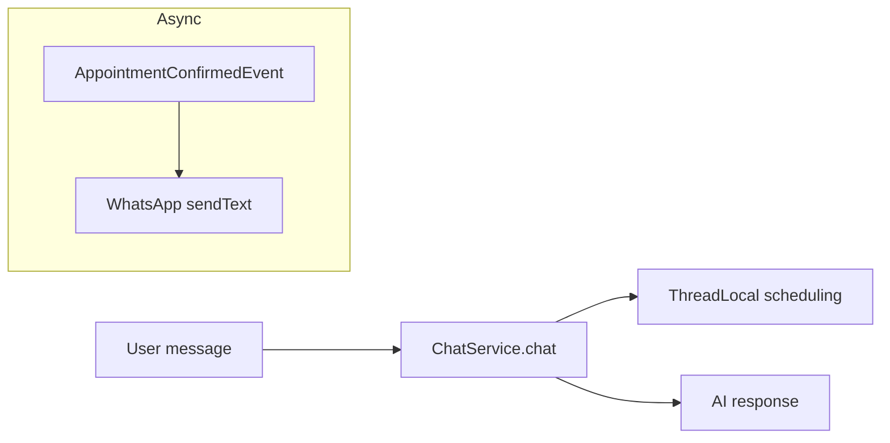

# Plano: Resilience4j, logs PRD, reset por saudação e concorrência

## Contexto do código actual

- **Evolution API**: [`EvolutionOutboundHttp.java`](d:/Documents/agenteAtendimento/infrastructure/src/main/java/com/atendimento/cerebro/infrastructure/adapter/out/whatsapp/EvolutionOutboundHttp.java) usa `HttpClient` com `REQUEST = 45s` (deve alinhar a **10s** e/ou limitar com Resilience4j).
- **Google Calendar API**: [`GoogleCalendarService.java`](d:/Documents/agenteAtendimento/infrastructure/src/main/java/com/atendimento/cerebro/infrastructure/calendar/GoogleCalendarService.java) (`insertRequest.execute()`, listagens, delete).
- **Agendamento Google (fluxo actual)**: [`GoogleCalendarAppointmentSchedulingService.java`](d:/Documents/agenteAtendimento/infrastructure/src/main/java/com/atendimento/cerebro/infrastructure/calendar/GoogleCalendarAppointmentSchedulingService.java) — `findEventsOverlapping` → `createEvent` → `appointmentStore.insert`. O calendário **não** participa de transação JPA; a janela de corrida fica entre o primeiro check e o `createEvent` / INSERT.
- **Mock**: [`MockAppointmentSchedulingService.java`](d:/Documents/agenteAtendimento/infrastructure/src/main/java/com/atendimento/cerebro/infrastructure/calendar/MockAppointmentSchedulingService.java) já usa `tenantAppointmentQuery.existsOverlapping` antes do insert; [`JdbcTenantAppointmentQuery#existsOverlapping`](d:/Documents/agenteAtendimento/infrastructure/src/main/java/com/atendimento/cerebro/infrastructure/adapter/out/persistence/JdbcTenantAppointmentQuery.java) filtra `booking_status = 'AGENDADO'`.
- **Notificação WhatsApp pós-confirmar**: assíncrona em [`AppointmentNotificationListener.java`](d:/Documents/agenteAtendimento/infrastructure/src/main/java/com/atendimento/cerebro/infrastructure/notification/AppointmentNotificationListener.java) — **não bloqueia** a resposta do bot; falhas já vão para `LOG.error`, mas sem formato `[APP-ERROR]` nem ênfase no `appointmentId` para reenvio manual.
- **Reset de contexto**: [`SchedulingToolContext#resetContext`](d:/Documents/agenteAtendimento/application/src/main/java/com/atendimento/cerebro/application/scheduling/SchedulingToolContext.java) limpa `SchedulingSlotCapture` e `SchedulingCancelSessionCapture`. [`ChatService#resetContext`](d:/Documents/agenteAtendimento/application/src/main/java/com/atendimento/cerebro/application/service/ChatService.java) delega nisso. Não existe hoje gatilho por saudação.

---

## 1) Resilience4j (Evolution + Google Calendar)

**Dependências**: o projecto já traz `camel-resilience4j-starter` para rotas Camel, mas as chamadas directas a Evolution e Google vêm de beans Java. O caminho padrão é adicionar **`io.github.resilience4j:resilience4j-spring-boot3`** (e conferir se **`spring-boot-starter-aop`** entra no classpath via starter — se necessário, declarar no [`bootstrap/pom.xml`](d:/Documents/agenteAtendimento/bootstrap/pom.xml) ou [`infrastructure/pom.xml`](d:/Documents/agenteAtendimento/infrastructure/pom.xml) onde vivem os adaptadores).

**Configuração** em [`bootstrap/src/main/resources/application.yml`](d:/Documents/agenteAtendimento/bootstrap/src/main/resources/application.yml) (ou ficheiro de perfil), seguindo a convenção do Resilience4j 2.x:

- Dois *instances*, por exemplo `evolutionApi` e `googleCalendarApi`.
- **TimeLimiter**: `timeoutDuration: 10s` em ambos.
- **Retry**: `maxAttempts: 3` (3 tentativas no total, ou 2 retries conforme a convenção que adoptarem; documentar na propriedade e alinhar com o PRD: “3 tentativas com backoff exponencial”), `exponentialBackoff` (habilitar multiplier/wait base compatível com 2.2.x / docs do BOM).

**Aplicação no código (hexágono)**:

- Opção A (recomendada): anotações em [`EvolutionOutboundHttp`](d:/Documents/agenteAtendimento/infrastructure/src/main/java/com/atendimento/cerebro/infrastructure/adapter/out/whatsapp/EvolutionOutboundHttp.java) `postJson` / `postJsonResponse` (nome `evolutionApi`) e em métodos públicos de [`GoogleCalendarService`](d:/Documents/agenteAtendimento/infrastructure/src/main/java/com/atendimento/cerebro/infrastructure/calendar/GoogleCalendarService.java) que fazem I/O (ex. `createEvent`, `listEvents`/`listEvents` usada em `findEventsOverlapping`, `deleteEvent`) (nome `googleCalendarApi`). Combinar `@Retry` + `@TimeLimiter` com os nomes configurados; garantir `order` de aspecto se a documentação R4j exigir ordem (retry *dentro* ou *fora* do time limiter — o habitual é *time limiter envolve* a operação, com retry a nível de falha, ou o inverso; fixar o que a doc recomenda e testar com um teste de integração leve).
- Ajustar o `HttpClient` em `EvolutionOutboundHttp` para **timeout 10s** (coerente com o TimeLimiter) para não haver 45s a competir com 10s de forma opaca.
- O **cliente** Google (NetHttp) pode ter `connectTimeout`/`readTimeout` ajustados se a API permitir, para reforçar o mesmo tecto; senão, o TimeLimiter na camada de serviço é o limite prático.

**“Fallback” WhatsApp (PRD)**: a falha de **notificação** pós-evento continua a não afectar a resposta do bot (já é `@Async`). O “fallback” pedido = **não repropagar / não estourar** a thread async; **registrar** com `appointmentId` — ver secção 2. Não confundir com `@Recover` do Resilience4j (só se envolver o envio WA com R4j de forma directa; hoje o envio passa por `WhatsAppTextOutboundPort` / Camel). Se quiserem Resilience4j **também** no envio de confirmação, pode aplicar-se no adaptador [`CamelWhatsAppTextOutboundAdapter`](d:/Documents/agenteAtendimento/infrastructure/src/main/java/com/atendimento/cerebro/infrastructure/adapter/out/whatsapp/CamelWhatsAppTextOutboundAdapter.java) com fallback que só regista o erro — **opcional** se o tecto de 10s + retry for só nas integrações “Evolution API + Google” como pedido.

---

## 2) Logs estruturados (auditoria)

Centralizar o formato mínimo (classe util ou logger dedicado, ex. `AppointmentAuditLog` em `application` ou `infrastructure/notification`, à escolha para evitar ciclos) e usar em:

| Evento | Onde / quando |
|--------|------------------|
| `[APP-CONFIRMED] ID: … \| Phone: … \| Slot: …` | Após sucesso de agendamento: [`AppointmentService#createAppointment`](d:/Documents/agenteAtendimento/application/src/main/java/com/atendimento/cerebro/application/service/AppointmentService.java) (ou imediatamente após sucesso de scheduling) e, se fizer sentido, linha alinhada no listener após send bem sucedido. |
| `[APP-CANCELLED] ID: … \| GoogleEvent: deleted \| DB: updated` | Ramo de cancelamento com sucesso em `AppointmentService#cancelAppointment` (mapear delete Google true/false e update DB). |
| `[APP-ERROR] Source: … \| Reason: …` | Falhas Google (quota, IO), Evolution (HTTP), e falha de notificação WhatsApp com `appointmentId` (ex. `Source: WhatsApp` / `Source: GoogleAPI` / `Source: EvolutionAPI`). Incluir `appointmentId` nos erros de confirmação/cancelamento WhatsApp. |

Mascarar telefone se política de privacidade exigir (ex. últimos 4 dígitos + prefixo); o PRD mostrou `5571...` — replicar esse estilo com helper `maskPhone` em [`CrmConversationSupport`](d:/Documents/agenteAtendimento/application/src/main/java/com/atendimento/cerebro/application/crm/CrmConversationSupport.java) ou análogo.

---

## 3) “Interceptor” de saudação no `ChatService`

- No início de [`ChatService#chat`](d:/Documents/agenteAtendimento/application/src/main/java/com/atendimento/cerebro/application/service/ChatService.java) (após ter `userText`), detectar saudação com heurística **segura** (normalizar: `trim` + lower + remover acentos opcional, palavra isolada ou início de frase) para: `oi`, `olá`/`ola`, `bom dia`, `boa tarde`, `boa noite` (e, se desejado, `hi`/`hello`).
- Se coincidir, chamar o equivalente a **`forceResetContext()`** — pode ser `public void forceResetContext()` a delegar para `resetContext()` / `SchedulingToolContext.resetContext()` com **um** `LOG.info` no formato de auditoria, ex. `[ContextReset] reason=greeting`, para não conflitar com os tags `[APP-*]`.
- Evitar falso positivo: não disparar com substrings (ex. “oiss” vs “moi oi”) com regex word-boundary simples.

---

## 4) Concorrência e transaccionalidade no `createAppointment`

**Objectivo PRD:** `@Transactional` + verificação de disponibilidade **o mais imediata possível** antes do INSERT na base.

- **`MockAppointmentSchedulingService`**: anotar `createAppointment` com `@Transactional` (módulo `infrastructure` já tem JDBC / transacções) para alinhar `existsOverlapping` + `insert` + CRM numa unidade. Confirmar se `CrmCustomerStore` / JDBC usam a mesma `DataSource` (típico). Considerar `Isolation.REPEATABLE_READ` ou manter *default* e documentar limites.

- **`GoogleCalendarAppointmentSchedulingService`**: a ordem lógica mais segura perante a base local:
  1. Manter validação e **primeiro** `findEventsOverlapping` na API (como hoje, agora com R4j).
  2. `createEvent` (reserva no Google; sujeita a risco residual entre janela de check e insert — inerente à API).
  3. **Imediatamente antes de `appointmentStore.insert`**: reexecutar `tenantAppointmentQuery.existsOverlapping` no **mesmo slot**; se houver conflito na base, **apagar o evento Google recém-criado** (compensação) e devolver `CreateAppointmentResult.failure(...)`; caso contrário, `insert` (e CRM) dentro de `@Transactional` quando possível.

Isso requer **inject** de `TenantAppointmentQueryPort` em [`GoogleCalendarAppointmentSchedulingService`](d:/Documents/agenteAtendimento/infrastructure/src/main/java/com/atendimento/cerebro/infrastructure/calendar/GoogleCalendarAppointmentSchedulingService.java) (hoje não está presente) e, opcionalmente, extrair a parte “insert+crm” para um método privado `@Transactional` para não manter a transacção aberta durante chamadas longas à API Google.

- **Nível “forte” (opcional mas recomendado)**: *unique* parcial / índice único no Postgres para `AGENDADO` + `(tenant_id, starts_at)` (ou janela exacta) numa [nova migração Flyway](d:/Documents/agenteAtendimento/bootstrap/src/main/resources/db/migration) para tornar a corrida impossível na base; alinhar o handler de `DuplicateKey` com compensação no Google. Incluir só se quiserem garantia além de `REPEATABLE_READ`.

---

## 5) Testes

- `ChatServiceTest` / teste pequeno: saudação dispara `forceResetContext` (mock estático de `SchedulingToolContext` difícil — preferir teste de integração com flag ou testar método package-private `isGreeting` se extraído).
- Resilience4j: teste com WireMock / mock a falhar 2x e passar (se existir base de teste HTTP), ou teste de configuração com contexto mínimo.
- Concorrência: teste de integração com dois threads em mock (se tempo), ou unidade do fluxo `existsOverlapping` + insert com regra documentada.

---

## Ficheiros principais a tocar

- [bootstrap/pom.xml](d:/Documents/agenteAtendimento/bootstrap/pom.xml) — Resilience4j (e AOP se necessário)
- [bootstrap/.../application.yml](d:/Documents/agenteAtendimento/bootstrap/src/main/resources/application.yml) — `resilience4j.*`
- [EvolutionOutboundHttp.java](d:/Documents/agenteAtendimento/infrastructure/src/main/java/com/atendimento/cerebro/infrastructure/adapter/out/whatsapp/EvolutionOutboundHttp.java)
- [GoogleCalendarService.java](d:/Documents/agenteAtendimento/infrastructure/src/main/java/com/atendimento/cerebro/infrastructure/calendar/GoogleCalendarService.java)
- [GoogleCalendarAppointmentSchedulingService.java](d:/Documents/agenteAtendimento/infrastructure/src/main/java/com/atendimento/cerebro/infrastructure/calendar/GoogleCalendarAppointmentSchedulingService.java)
- [MockAppointmentSchedulingService.java](d:/Documents/agenteAtendimento/infrastructure/src/main/java/com/atendimento/cerebro/infrastructure/calendar/MockAppointmentSchedulingService.java)
- [AppointmentService.java](d:/Documents/agenteAtendimento/application/src/main/java/com/atendimento/cerebro/application/service/AppointmentService.java)
- [AppointmentNotificationListener.java](d:/Documents/agenteAtendimento/infrastructure/src/main/java/com/atendimento/cerebro/infrastructure/notification/AppointmentNotificationListener.java)
- [ChatService.java](d:/Documents/agenteAtendimento/application/src/main/java/com/atendimento/cerebro/application/service/ChatService.java)
- (Opcional) [TenantAppointmentQueryPort](d:/Documents/agenteAtendimento/application/src/main/java/com/atendimento/cerebro/application/port/out/TenantAppointmentQueryPort.java) — já tem `existsOverlapping`
- (Opcional) nova migração `V2x__...sql` — unique constraint
