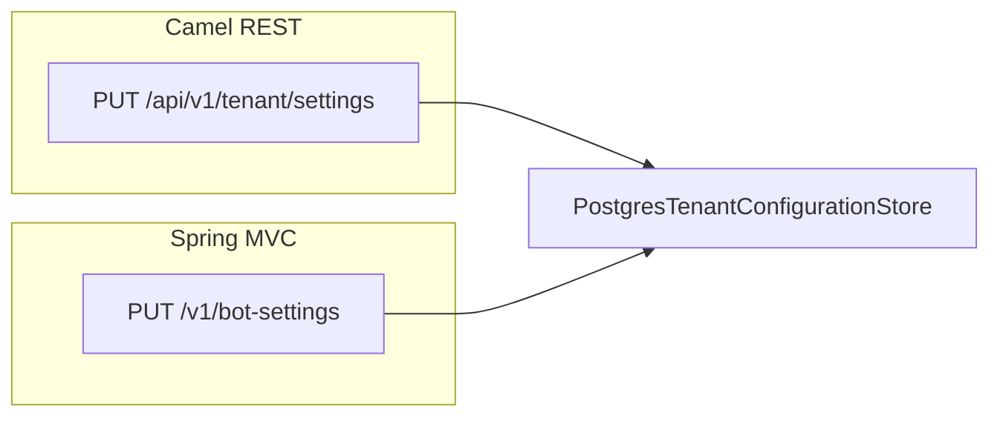

# Plano: Configuração de tenant com múltiplos provedores WhatsApp

## Estado atual (referência)

- Domínio: [`TenantConfiguration`](domain/src/main/java/com/atendimento/cerebro/domain/tenant/TenantConfiguration.java) é um `record` com `(tenantId, systemPrompt)`.
- Migração: [`V3__create_tenant_configuration.sql`](bootstrap/src/main/resources/db/migration/V3__create_tenant_configuration.sql) — apenas `tenant_id` e `system_prompt`.
- Porta: [`TenantConfigurationStorePort`](application/src/main/java/com/atendimento/cerebro/application/port/out/TenantConfigurationStorePort.java) — `findByTenantId` + `upsert(tenantId, systemPrompt)`.
- JDBC: [`PostgresTenantConfigurationStore`](infrastructure/src/main/java/com/atendimento/cerebro/infrastructure/adapter/out/persistence/PostgresTenantConfigurationStore.java) — SELECT só de `system_prompt`; UPSERT só de `system_prompt`.
- API pedida: [`TenantSettingsRestRoute`](infrastructure/src/main/java/com/atendimento/cerebro/infrastructure/adapter/inbound/rest/camel/TenantSettingsRestRoute.java) + [`TenantSettingsHttpRequest`](infrastructure/src/main/java/com/atendimento/cerebro/infrastructure/adapter/inbound/rest/camel/TenantSettingsHttpRequest.java) em `PUT /api/v1/tenant/settings` (prefixo `/api` no servlet Camel).
- Outro caminho: [`BotSettingsController`](infrastructure/src/main/java/com/atendimento/cerebro/infrastructure/adapter/inbound/rest/BotSettingsController.java) `PUT /v1/bot-settings` — usado pelo Next proxy; continua a atualizar só personalidade e **não** deve apagar dados WhatsApp ao gravar.

## 1. Banco de dados (Flyway)

- Novo script **`V4__tenant_configuration_whatsapp.sql`** em [`bootstrap/src/main/resources/db/migration/`](bootstrap/src/main/resources/db/migration/):
  - `whatsapp_provider_type` — `VARCHAR` (ex.: 32) **NOT NULL** com **DEFAULT** `'SIMULATED'` (valores: `META`, `EVOLUTION`, `SIMULATED`).
  - `whatsapp_api_key` — `TEXT` **NULL** (segredo em texto; sem criptografia em repouso nesta etapa — documentar risco e possível evolução futura).
  - `whatsapp_instance_id` — `VARCHAR` **NULL**.
  - `whatsapp_base_url` — `VARCHAR` **NULL** (URL base Evolution).
  - Opcional: `CHECK (whatsapp_provider_type IN ('META','EVOLUTION','SIMULATED'))` para validação no BD.

## 2. Domínio

- Novo enum **`WhatsAppProviderType`** em `com.atendimento.cerebro.domain.tenant` com valores `META`, `EVOLUTION`, `SIMULATED`.
- Estender **`TenantConfiguration`** com os novos campos, mantendo invariantes claros:
  - `systemPrompt` não nulo (como hoje).
  - `whatsappProviderType` não nulo (default `SIMULATED` quando não houver linha na base).
  - Demais campos `String` podem ser `null` (ausente / não aplicável).
- Métodos auxiliares no `record` (ex.: `withSystemPrompt(...)`) para o fluxo de merge sem expor builders desnecessários.

## 3. Porta de aplicação e serviço

- **`TenantConfigurationStorePort`**: substituir `upsert(TenantId, String)` por **`upsert(TenantConfiguration)`** (uma linha = configuração completa).
- **`UpdateTenantSettingsUseCase`**: aceitar um comando/DTO de aplicação (ex.: `TenantSettingsUpdateCommand` no módulo `application`) com `systemPrompt` obrigatório e campos WhatsApp opcionais (`String` / enum), ou um único DTO espelhando o REST — o serviço implementa **merge**:
  - Carregar `findByTenantId`; se vazio, partir de defaults (`SIMULATED`, demais `null`).
  - Aplicar `systemPrompt` sempre.
  - Para cada campo WhatsApp: se o cliente **omitir** (null no DTO após parse), **manter** o valor existente; se enviar string vazia ou valor, persistir conforme regra acordada (recomendação: tratar **null** = “não alterar”; string vazia = “limpar” para campos opcionais — documentar no código e no contrato JSON).
- **`TenantSettingsService`**: implementar merge + `upsert` completo.
- **`BotSettingsController`**: antes de gravar, **`findByTenantId`** + `withSystemPrompt(...)` + `upsert` completo, para **não** zerar colunas WhatsApp.

## 4. Repositório JDBC

- **`findByTenantId`**: `SELECT` de todas as colunas relevantes e mapeamento para `TenantConfiguration` (incluindo parse do enum a partir da string BD; tratar valores inválidos com exceção clara ou fallback documentado).
- **`upsert`**: `INSERT ... ON CONFLICT (tenant_id) DO UPDATE SET` atualizando **`system_prompt` e todos os campos WhatsApp**, com parâmetros bind (nunca interpolar segredos em SQL).

## 5. DTO HTTP e rota Camel

- Estender **`TenantSettingsHttpRequest`** com: `whatsappProviderType`, `whatsappApiKey`, `whatsappInstanceId`, `whatsappBaseUrl` (tipos adequados ao JSON; enum como `String` no record e conversão no handler).
- **`TenantSettingsRestRoute.handlePut`**: validações mínimas (ex.: `tenantId` e `systemPrompt` obrigatórios como hoje); mapear para o comando de aplicação; **não** logar `whatsappApiKey`.
- Resposta: manter **204 No Content** em sucesso, alinhado ao comportamento atual.

## 6. Testes e compilação

- Ajustar/adicar testes em **`TenantSettingsService`** (merge: só persona vs. persona + WhatsApp; primeira linha vs. update).
- Testes de integração que inserem em `tenant_configuration` (ex.: [`ChatServiceIntegrationBase`](bootstrap/src/test/java/com/atendimento/cerebro/ChatServiceIntegrationBase.java) `DELETE` continua válido; se algum teste fizer `INSERT` explícito, incluir novas colunas ou confiar em defaults da migração).
- Executar `mvn test` nos módulos afetados (`domain`, `application`, `infrastructure`, `bootstrap`).

## 7. Frontend (fora do escopo obrigatório deste pedido)

- O app hoje chama **`/api/v1/bot-settings`** ([`apiService.ts`](atendimento-frontEnd/atendimento-frontend/src/services/apiService.ts)). Para usar os novos campos, será necessário passar a chamar **`PUT /api/v1/tenant/settings`** (com proxy no `next.config.ts` se aplicável) ou estender o contrato do bot-settings — **decisão de produto** separada; o backend entregará o contrato no endpoint Camel solicitado.
