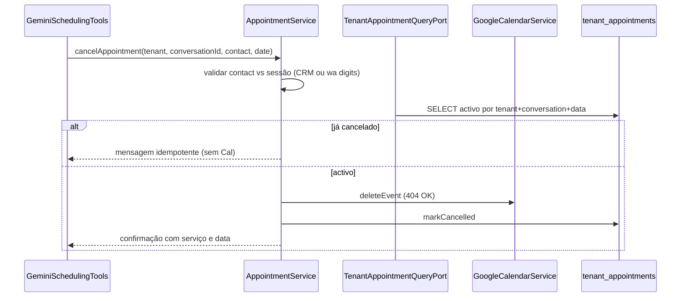

# Plano: `cancel_appointment` com cancelamento seguro e idempotente

## Contexto no código actual

- Ferramentas Gemini: [`GeminiSchedulingTools`](d:\Documents\agenteAtendimento\infrastructure\src\main\java\com\atendimento\cerebro\infrastructure\adapter\out\ai\GeminiSchedulingTools.java) (`check_availability`, `create_appointment`), instanciadas em [`GeminiChatEngineAdapter`](d:\Documents\agenteAtendimento\infrastructure\src\main\java\com\atendimento\cerebro\infrastructure\adapter\out\ai\GeminiChatEngineAdapter.java).
- Persistência: [`V19__tenant_appointments.sql`](d:\Documents\agenteAtendimento\bootstrap\src\main\resources\db\migration\V19__tenant_appointments.sql) — sem `phone`/`email` na linha; o “dono” no fluxo WhatsApp é o [`conversation_id`](d:\Documents\agenteAtendimento\infrastructure\src\main\java\com\atendimento\cerebro\infrastructure\adapter\out\persistence\JdbcTenantAppointmentQuery.java) (padrão `wa-` + dígitos alinhado a [`CrmConversationSupport`](d:\Documents\agenteAtendimento\application\src\main\java\com\atendimento\cerebro\application\crm\CrmConversationSupport.java)).
- [`AppointmentSchedulingPort`](d:\Documents\agenteAtendimento\application\src\main\java\com\atendimento\cerebro\application\port\out\AppointmentSchedulingPort.java) só tem `checkAvailability` / `createAppointment`. [`GoogleCalendarService`](d:\Documents\agenteAtendimento\infrastructure\src\main\java\com\atendimento\cerebro\infrastructure\calendar\GoogleCalendarService.java) não expõe `delete`; eventos cancelados já são ignorados em sobreposição (`status == cancelled`), o que alinha com a política de reuso de slot após apagar o evento.

## 1. Base de dados: cancelamento lógico

- Nova migração Flyway (ex.: `V20__tenant_appointments_cancelled_at.sql`): coluna `cancelled_at TIMESTAMPTZ NULL`.
- **Regra**: “agendamento activo” = `cancelled_at IS NULL`. Idempotência: segundo pedido encontra linha com `cancelled_at` preenchido para o mesmo `tenant_id` + `conversation_id` + dia civil (no fuso do calendário) → não chamar Google; devolver apenas confirmação.
- Ajustar queries em [`JdbcTenantAppointmentQuery`](d:\Documents\agenteAtendimento\infrastructure\src\main\java\com\atendimento\cerebro\infrastructure\adapter\out\persistence\JdbcTenantAppointmentQuery.java): `list`, `listByConversationId`, `findEarliestUpcomingByPhoneDigits`, `existsOverlapping`, contagens — todas com `AND cancelled_at IS NULL` onde listam “válidos”. Novos métodos específicos para cancelamento (activo vs já cancelado no mesmo dia) podem encapsular o SQL.

## 2. Port de persistência

- [`TenantAppointmentStorePort`](d:\Documents\agenteAtendimento\application\src\main\java\com\atendimento\cerebro\application\port\out\TenantAppointmentStorePort.java): adicionar `markCancelled(long appointmentId, Instant cancelledAt)` (implementação em [`JdbcTenantAppointmentStore`](d:\Documents\agenteAtendimento\infrastructure\src\main\java\com\atendimento\cerebro\infrastructure\adapter\out\persistence\JdbcTenantAppointmentStore.java)).
- [`TenantAppointmentQueryPort`](d:\Documents\agenteAtendimento\application\src\main\java\com\atendimento\cerebro\application\port\out\TenantAppointmentQueryPort.java): método para localizar por `tenantId`, `conversationId`, `LocalDate` (dia de `starts_at` no `ZoneId` do calendário):
  - agendamento **activo** (máx. um esperado por conversa+dia; se vários, escolher o mais relevante — ex. `starts_at` DESC LIMIT 1 e documentar);
  - opcionalmente consulta de **já cancelado** no mesmo critério (para ramo idempotente).

## 3. Google Calendar: `deleteEvent` idempotente

- Em [`GoogleCalendarService`](d:\Documents\agenteAtendimento\infrastructure\src\main\java\com\atendimento\cerebro\infrastructure\calendar\GoogleCalendarService.java): método `deleteEvent(String calendarId, String eventId)` usando `calendar.events().delete(calendarId, eventId).execute()` (ou equivalente na versão da API em uso).
- Tratar **HTTP 404 / ResourceNotFoundException** como sucesso (log em DEBUG): evita erro na segunda tentativa e cumpre idempotência com o estado Google vs BD.

## 4. Port de agendamento: cancelamento no calendário

- Estender [`AppointmentSchedulingPort`](d:\Documents\agenteAtendimento\application\src\main\java\com\atendimento\cerebro\application\port\out\AppointmentSchedulingPort.java) com algo como `void deleteCalendarEvent(TenantId tenantId, String googleEventId)` (nome final alinhado ao estilo do projecto).
- **[`GoogleCalendarAppointmentSchedulingService`](d:\Documents\agenteAtendimento\infrastructure\src\main\java\com\atendimento\cerebro\infrastructure\calendar\GoogleCalendarAppointmentSchedulingService.java)**: resolver `calendarId` como em `createAppointment`; chamar `GoogleCalendarService.deleteEvent`; ignorar 404.
- **[`MockAppointmentSchedulingService`](d:\Documents\agenteAtendimento\infrastructure\src\main\java\com\atendimento\cerebro\infrastructure\calendar\MockAppointmentSchedulingService.java)**: corpo vazio (eventos `mock-*` não existem no Google).

## 5. `AppointmentService` (application layer)

- Novo serviço (ex.: [`AppointmentService`](d:\Documents\agenteAtendimento\application\src\main\java\com\atendimento\cerebro\application\service\AppointmentService.java)) com **`String cancelAppointment(TenantId tenantId, String conversationId, String contact, String isoDate, ZoneId calendarZone)`** (retorno texto para o modelo, como as outras ferramentas).

**Segurança (WhatsApp + contacto declarado)**

- **Autorização forte**: só cancelar linhas cujo `conversation_id` na BD seja **igual** ao `conversationId` da sessão (o mesmo passado ao `GeminiSchedulingTools`). Isto amarra o agendamento ao dono da conversa (WhatsApp).
- **Validação do parâmetro `contact` (e-mail ou telefone)** em conjunto com a sessão:
  - Se parecer e-mail: [`CrmCustomerQueryPort.findByTenantAndConversationId`](d:\Documents\agenteAtendimento\application\src\main\java\com\atendimento\cerebro\application\port\out\CrmCustomerQueryPort.java) e comparar `email` (normalizar case/trim); se CRM não tiver e-mail ou não bater, recusar com mensagem clara (sem expor dados internos).
  - Caso contrário, tratar como telefone: normalizar dígitos e exigir igualdade com [`CrmConversationSupport.phoneDigitsOnlyFromConversationId(conversationId)`](d:\Documents\agenteAtendimento\application\src\main\java\com\atendimento\cerebro\application\crm\CrmConversationSupport.java) (fluxo `wa-`). Se não for conversa WhatsApp (`Optional` vazio), exigir caminho e-mail via CRM ou recusar — comportamento documentado no código.

**Fluxo**

1. Validar `isoDate` (`yyyy-MM-DD`) e dia civil no `calendarZone`.
2. Procurar agendamento **activo** para `tenantId` + `conversationId` + data.
3. Se não houver activo: procurar **já cancelado** no mesmo critério → mensagem idempotente (mesmo texto de confirmação ou variação “já estava cancelado”, conforme produto).
4. Se activo: `AppointmentSchedulingPort.deleteCalendarEvent` → `markCancelled` na BD (ordem: apagar Google primeiro; só persistir cancelamento após sucesso; transacção onde fizer sentido).
5. Sucesso: string fixa pedida:  
   `Seu horário para o serviço de {{servico}} no dia {{data}} foi cancelado e a vaga já está disponível para outros clientes`  
   com `servico` = `service_name` da linha e `data` formatada para o utilizador (ex. `dd/MM/yyyy` no fuso do calendário).

## 6. Ferramenta `@Tool cancel_appointment`

- Em [`GeminiSchedulingTools`](d:\Documents\agenteAtendimento\infrastructure\src\main\java\com\atendimento\cerebro\infrastructure\adapter\out\ai\GeminiSchedulingTools.java): novo método com `@Tool(name = "cancel_appointment", ...)` e parâmetros:
  - `contact` — e-mail ou telefone (descrição para o modelo);
  - `date` — `yyyy-MM-DD`.
- Injectar `AppointmentService` no construtor (e actualizar chamadas em [`GeminiChatEngineAdapter`](d:\Documents\agenteAtendimento\infrastructure\src\main\java\com\atendimento\cerebro\infrastructure\adapter\out\ai\GeminiChatEngineAdapter.java) e testes em [`GeminiSchedulingToolsCreateAppointmentTest`](d:\Documents\agenteAtendimento\infrastructure\src\test\java\com\atendimento\cerebro\infrastructure\adapter\out\ai\GeminiSchedulingToolsCreateAppointmentTest.java)).
- Registar bean `AppointmentService` no módulo application/bootstrap (padrão já usado para outros `@Service`).

## 7. Prompts e observabilidade

- [`RagSystemPromptComposer`](d:\Documents\agenteAtendimento\infrastructure\src\main\java\com\atendimento\cerebro\infrastructure\adapter\out\ai\RagSystemPromptComposer.java): uma linha sobre quando chamar `cancel_appointment` (após intenção clara de cancelar; passar contacto e data).
- [`GeminiChatEngineAdapter`](d:\Documents\agenteAtendimento\infrastructure\src\main\java\com\atendimento\cerebro\infrastructure\adapter\out\ai\GeminiChatEngineAdapter.java): opcionalmente alargar `SCHEDULING_TOOL_RETRY_SUFFIX` para mencionar `cancel_appointment` quando o utilizador pede cancelamento.
- Actualizar [`RagSystemPromptComposerTest`](d:\Documents\agenteAtendimento\infrastructure\src\test\java\com\atendimento\cerebro\infrastructure\adapter\out\ai\RagSystemPromptComposerTest.java) se o texto do system prompt mudar.

## 8. Testes

- Unitários: `AppointmentService` — contacto inválido; activo cancelado (mock de port); idempotência com linha já `cancelled_at`; conversa não-`wa-` + telefone.
- Opcional: teste de integração leve em `GoogleCalendarService` com mock HTTP (se já existir padrão); senão, testar só a ramificação 404 com mock do client (se o projecto permitir).
- Teste da ferramenta: `GeminiSchedulingTools.cancel_appointment` com mocks.

## Riscos / notas

- **E-mail na BD do agendamento**: não existe; o e-mail vem só do CRM por `conversation_id`. Se o CRM não tiver e-mail, cancelamento por e-mail declarado falha até haver dado — aceitável e explícito na mensagem de erro.
- **Múltiplos agendamentos no mesmo dia para a mesma conversa**: raro; definir regra única (ex. o mais recente futuro nesse dia).
