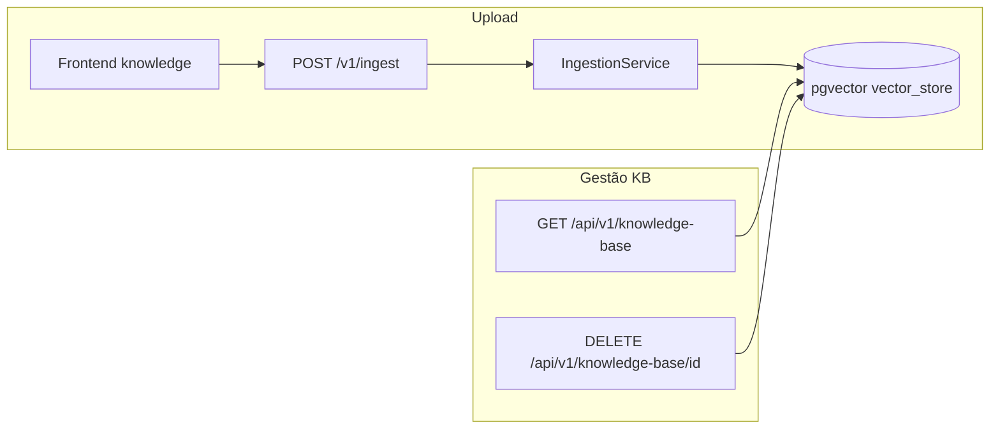

# Plano: dados reais, base de conhecimento e UX

## Contexto do repositório (o que já existe)

- **RAG multi-documento por conta**: [`PgVectorKnowledgeBaseAdapter`](d:\Documents\agenteAtendimento\infrastructure\src\main\java\com\atendimento\cerebro\infrastructure\adapter\out\knowledge\PgVectorKnowledgeBaseAdapter.java) já filtra por `tenant_id` no metadata; [`IngestionService`](d:\Documents\agenteAtendimento\application\src\main\java\com\atendimento\cerebro\application\service\IngestionService.java) gera vários chunks por ficheiro com `source_filename`, `chunk_index`, `chunk_count`. **Não é necessário alterar a lógica de retrieval** para “suportar vários documentos”; o que falta é **gestão no HTTP** (listar/apagar) e **metadados por envio** para a tabela e o `DELETE` serem determinísticos.
- **Credenciais Evolution**: em [`settings/page.tsx`](d:\Documents\agenteAtendimento\atendimento-frontEnd\atendimento-frontend\src\app\(app)\settings\page.tsx) os campos URL, nome da instância e API Key já são editáveis e persistidos com [`putTenantSettings`](d:\Documents\agenteAtendimento\atendimento-frontEnd\atendimento-frontend\src\services\apiService.ts). Ajustar **texto de ajuda** (deixar claro que o valor é guardado na **conta** no servidor, não só via `.env`).
- **Monitorização**: [`monitoramento/page.tsx`](d:\Documents\agenteAtendimento\atendimento-frontEnd\atendimento-frontend\src\app\(app)\dashboard\monitoramento\page.tsx) já consome `GET /api/v1/messages`; estados vazios existem mas ainda citam **tenant** e **endpoint** técnico. **Métricas fictícias** estão no [`dashboard`](d:\Documents\agenteAtendimento\atendimento-frontEnd\atendimento-frontend\src\app\(app)\page.tsx) + [`metric-cards.tsx`](d:\Documents\agenteAtendimento\atendimento-frontEnd\atendimento-frontend\src\components\dashboard\metric-cards.tsx) (`(mock)` / números fixos).

---

## 1) Refatoração de UX e nomenclatura (frontend)

- **Labels “Tenant ID” → “ID da Conta”** (ou “Conta” no título e “ID da Conta” no campo): páginas [`settings/page.tsx`](d:\Documents\agenteAtendimento\atendimento-frontEnd\atendimento-frontend\src\app\(app)\settings\page.tsx), [`knowledge/page.tsx`](d:\Documents\agenteAtendimento\atendimento-frontEnd\atendimento-frontend\src\app\(app)\knowledge\page.tsx), [`test-chat/page.tsx`](d:\Documents\agenteAtendimento\atendimento-frontEnd\atendimento-frontend\src\app\(app)\test-chat\page.tsx), [`dashboard/monitoramento/page.tsx`](d:\Documents\agenteAtendimento\atendimento-frontEnd\atendimento-frontend\src\app\(app)\dashboard\monitoramento\page.tsx).
- Substituir texto que ainda diz **tenantId** ao utilizador (toasts, descrições) por **conta** / **ID da Conta** (manter `tenantId` só no JSON enviado à API).
- **Evolution URL**: renomear “URL da instância” para algo alinhado ao pedido, por exemplo **“Endereço de integração”** (subtítulo explicando que é a URL base da Evolution).
- **Erros amigáveis**: centralizar em [`apiService.ts`](d:\Documents\agenteAtendimento\atendimento-frontEnd\atendimento-frontend\src\services\apiService.ts) uma função `friendlyHttpError(status, fallback)` — para `status >= 500` (e opcionalmente falha de rede) devolver **“Não foi possível conectar ao servidor. Tente novamente.”** em vez de `Chat falhou (500)` / `… (${res.status})`. Manter mensagens do corpo JSON quando forem claras.

---

## 2) Base de conhecimento — backend

**Metadados novos** (constantes em [`KnowledgeDocument`](d:\Documents\agenteAtendimento\domain\src\main\java\com\atendimento\cerebro\domain\knowledge\KnowledgeDocument.java)):

- `ingestion_batch_id` — UUID **um por upload** (todas as chunks do mesmo ficheiro partilham o mesmo valor).
- `uploaded_at` — ISO-8601 (`Instant.now()`).
- `file_size_bytes` — tamanho do ficheiro (bytes) passado do controller.

**Ingestão**: atualizar [`IngestionUseCase` / `IngestionService`](d:\Documents\agenteAtendimento\application\src\main\java\com\atendimento\cerebro\application\service\IngestionService.java) para aceitar `long fileSizeBytes` (e gerar o batch id uma vez por chamada). [`IngestMultipartController`](d:\Documents\agenteAtendimento\infrastructure\src\main\java\com\atendimento\cerebro\infrastructure\adapter\inbound\rest\IngestMultipartController.java) passa `file.getSize()`.

**Porta de aplicação**: estender [`KnowledgeBasePort`](d:\Documents\agenteAtendimento\application\src\main\java\com\atendimento\cerebro\application\port\out\KnowledgeBasePort.java) (ou criar port estreito `KnowledgeBaseAdminPort`) com:

- `List<KnowledgeFileSummary> listUploadedFiles(TenantId tenantId)` — SQL sobre `vector_store` agrupando por `metadata->>'ingestion_batch_id'` (e `tenant_id` no JSON), retornando: `batchId`, `fileName`, `uploadedAt`, `sizeBytes`, `chunkCount`, `status` fixo **`READY`** para linhas existentes (ver frontend).
- `void deleteByBatchId(TenantId tenantId, String batchId)` — `DELETE FROM … WHERE metadata @> jsonb_build_object('tenant_id', ?, 'ingestion_batch_id', ?)` (com nomes de schema/tabela iguais aos de [`PgVectorKnowledgeBaseAdapter`](d:\Documents\agenteAtendimento\infrastructure\src\main\java\com\atendimento\cerebro\infrastructure\adapter\out\knowledge\PgVectorKnowledgeBaseAdapter.java)).

Implementação preferencial: métodos novos na mesma classe do adapter ou repositório JDBC dedicado, **reutilizando** `schema-name` / `table-name` de `application.yml`.

**HTTP (Camel, padrão existente)**: novo `KnowledgeBaseRestRoute` com prefixo `rest("/v1/knowledge-base")` (servido em **`/api/v1/...`** como as outras rotas em [`MessagesRestRoute`](d:\Documents\agenteAtendimento\infrastructure\src\main\java\com\atendimento\cerebro\infrastructure\adapter\inbound\rest\camel\MessagesRestRoute.java)):

- `GET ?tenantId=` — lista de ficheiros.
- `DELETE /{batchId}?tenantId=` — apaga vetores desse envio; `404` se nada removido / batch inválido.

Atualizar [`openapi.yaml`](d:\Documents\agenteAtendimento\bootstrap\src\main\resources\static\openapi.yaml) e testes de integração mínimos (lista vazia, lista após ingest, delete remove linhas).

**Nota sobre ficheiros antigos** (sem `ingestion_batch_id`): não aparecerão na listagem nova até reenvio; opcionalmente documentar ou script SQL manual — evitar over-engineering no primeiro passo.

---

## 3) Base de conhecimento — frontend

- Remover mocks de [`uploaded-files-list.tsx`](d:\Documents\agenteAtendimento\atendimento-frontEnd\atendimento-frontend\src\components\knowledge\uploaded-files-list.tsx); passar **props** com dados da API.
- [`apiService.ts`](d:\Documents\agenteAtendimento\atendimento-frontEnd\atendimento-frontend\src\services\apiService.ts): `getKnowledgeBase(tenantId)`, `deleteKnowledgeFile(tenantId, batchId)` com URLs alinhadas ao backend; adicionar rewrite em [`next.config.ts`](d:\Documents\agenteAtendimento\atendimento-frontEnd\atendimento-frontend\next.config.ts) para `/api/v1/knowledge-base` e subcaminhos.
- [`knowledge/page.tsx`](d:\Documents\agenteAtendimento\atendimento-frontEnd\atendimento-frontend\src\app\(app)\knowledge\page.tsx): `useEffect` + estado **loading** (skeleton [`Skeleton`](d:\Documents\agenteAtendimento\atendimento-frontEnd\atendimento-frontend\src\components\ui\skeleton.tsx) ou spinner) enquanto `GET` corre; **tabela** (shadcn `Table`): Nome do ficheiro, Data de upload, Tamanho, Status (**Processando** só durante o `postIngest` em curso no cliente; **Pronto** quando existe no servidor); botão **Excluir** com confirmação (`AlertDialog`) + `DELETE` + refresh.
- Remover o botão “Atualizar lista (mock)”.

---

## 4) Monitorização — 100% real e contactos

- **Copy**: quando não houver contactos, usar **“Nenhuma conversa ativa no momento.”** (e variantes para filtro pendente); remover referências a `GET /api/v1/messages` e “tenant” na UI pública → **“ID da Conta”** / **“conta”**.
- **Nome do contacto (Evolution)**:
  - Estender [`WhatsAppWebhookParser.Incoming.TextMessage`](d:\Documents\agenteAtendimento\infrastructure\src\main\java\com\atendimento\cerebro\infrastructure\adapter\inbound\rest\camel\WhatsAppWebhookParser.java) com campo opcional `contactDisplayName` extraído de `data.pushName` (e fallback razoável se a Evolution enviar noutro nó — validar com um exemplo real ou doc).
  - Migração Flyway **`contact_display_name` VARCHAR(512) NULL** em [`chat_message`](d:\Documents\agenteAtendimento\bootstrap\src\main\resources\db\migration\V5__create_chat_message.sql).
  - Atualizar [`ChatMessage`](d:\Documents\agenteAtendimento\domain\src\main\java\com\atendimento\cerebro\domain\monitoring\ChatMessage.java), [`JdbcChatMessageRepository`](d:\Documents\agenteAtendimento\infrastructure\src\main\java\com\atendimento\cerebro\infrastructure\adapter\out\persistence\JdbcChatMessageRepository.java), [`persistInboundUserMessage`](d:\Documents\agenteAtendimento\infrastructure\src\main\java\com\atendimento\cerebro\infrastructure\adapter\inbound\rest\camel\WhatsAppIntegrationRoute.java), [`ChatMessageItemResponse`](d:\Documents\agenteAtendimento\infrastructure\src\main\java\com\atendimento\cerebro\infrastructure\adapter\inbound\rest\camel\ChatMessageItemResponse.java) / [`MessagesRestRoute`](d:\Documents\agenteAtendimento\infrastructure\src\main\java\com\atendimento\cerebro\infrastructure\adapter\inbound\rest\camel\MessagesRestRoute.java), e mensagens ASSISTANT em [`WhatsAppOutboundRoutes`](d:\Documents\agenteAtendimento\infrastructure\src\main\java\com\atendimento\cerebro\infrastructure\adapter\inbound\rest\camel\WhatsAppOutboundRoutes.java) com `null` para o nome se não aplicável.
- **Frontend**: estender tipo `ChatMessageItem` com `contactDisplayName?: string | null`; em [`buildContactsFromMessages`](d:\Documents\agenteAtendimento\atendimento-frontEnd\atendimento-frontend\src\app\(app)\dashboard\monitoramento\page.tsx) escolher **nome** se existir; senão [`formatPhoneDisplay`](d:\Documents\agenteAtendimento\atendimento-frontEnd\atendimento-frontend\src\app\(app)\dashboard\monitoramento\page.tsx) ajustado para formato preferido **(71) 99999-9999** (sem prefixo `+55` na vista principal, podendo mostrar número completo como linha secundária se fizer sentido).

---

## 5) Dashboard — remover demonstração

- Substituir [`page.tsx`](d:\Documents\agenteAtendimento\atendimento-frontEnd\atendimento-frontend\src\app\(app)\page.tsx) para **não** passar números inventados; ou remover labels “(mock)” em [`metric-cards.tsx`](d:\Documents\agenteAtendimento\atendimento-frontEnd\atendimento-frontend\src\components\dashboard\metric-cards.tsx) e mostrar estado neutro (**“Métricas em breve”** / traços) até existir um endpoint real — alinhado a “sem dados mockados”.

---

## 6) Estilo: sucesso e loading

- **Toasts**: em [`providers.tsx`](d:\Documents\agenteAtendimento\atendimento-frontEnd\atendimento-frontend\src\components\providers.tsx), configurar `<Toaster theme="dark" />` ou sincronizar com [`AppThemeProvider`](d:\Documents\agenteAtendimento\atendimento-frontEnd\atendimento-frontend\src\components\theme\app-theme-provider.tsx) (`resolvedTheme`) para consistência **dark**.
- **Loading**: skeleton/spinner nas páginas **settings** (já tem `loadingInitial`), **monitoramento** (primeira carga além do ícone de refresh), **knowledge** (lista KB), e opcionalmente **dashboard** se passar a buscar dados.

---

## Ordem de implementação sugerida

1. Metadados de ingestão + portas + rotas Camel `knowledge-base` + testes rápidos.  
2. Frontend KB + `apiService` + rewrites.  
3. Migração `contact_display_name` + parser + API de mensagens + monitoramento (formato telefone + textos).  
4. Pass global de nomenclatura + erros amigáveis + Toaster dark + dashboard sem mock.
