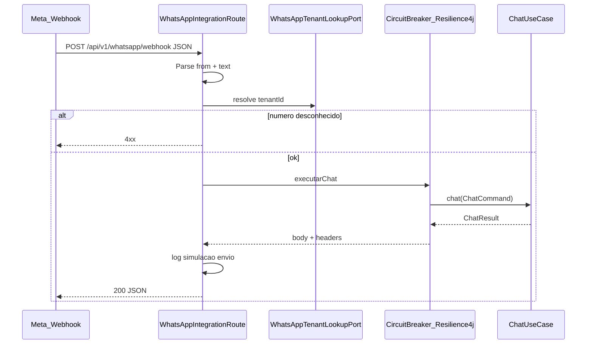

# Porta de entrada WhatsApp (Apache Camel)

## Contexto no repositório

- O servlet Camel está em [`bootstrap/src/main/resources/application.yml`](bootstrap/src/main/resources/application.yml) com `camel.servlet.mapping.context-path: /api/*`, portanto um `rest("/v1/whatsapp/webhook")` expõe **`POST /api/v1/whatsapp/webhook`** (o mesmo padrão de [`ChatRestRoute`](infrastructure/src/main/java/com/atendimento/cerebro/infrastructure/adapter/inbound/rest/camel/ChatRestRoute.java) que usa `/v1/chat` → `/api/v1/chat`).
- O padrão de resiliência desejado já existe em [`ChatRestRoute`](infrastructure/src/main/java/com/atendimento/cerebro/infrastructure/adapter/inbound/rest/camel/ChatRestRoute.java): `circuitBreaker()` + `resilience4jConfiguration().timeoutEnabled(true).timeoutDuration(chat.circuit.timeout-ms)` + `onFallback()` com [`ChatFallbackMessages`](infrastructure/src/main/java/com/atendimento/cerebro/infrastructure/adapter/inbound/rest/camel/ChatFallbackMessages.java). **Reutilizar a mesma propriedade** [`chat.circuit.timeout-ms`](bootstrap/src/main/resources/application.yml) para não duplicar política.
- [`ChatUseCase#chat`](application/src/main/java/com/atendimento/cerebro/application/port/in/ChatUseCase.java) recebe [`ChatCommand`](application/src/main/java/com/atendimento/cerebro/application/dto/ChatCommand.java) (`TenantId`, `ConversationId`, mensagem, etc.). Para WhatsApp, usar `ConversationId` estável por utilizador, por exemplo `wa-{numeroNormalizado}` (só dígitos / E.164 sem caracteres problemáticos), alinhado com o registo de contexto existente.

## Formato do JSON (entrada)

- **Formato alvo (Meta Cloud API):** extrair de `entry[].changes[].value.messages[]` o primeiro `messages[]` com `type == "text"` e usar `from` + `text.body`. Ignorar `statuses` e mensagens não texto (retornar 200 com corpo mínimo ou 400 conforme política — recomenda-se **200 sem processar** para evitar retries infinitos da Meta em payloads “vazios”).
- **Formato simples para testes locais/IT:** documentar um JSON mínimo alternativo, por exemplo `{"from":"5511999999999","text":"Olá"}` (ou nomes equivalentes), parseado no mesmo processor para não depender sempre do envelope Meta.

Implementação sugerida: um **único `Processor` ou bean `WhatsAppWebhookParser`** (infra) que devolve um DTO interno normalizado `{ from, text }` ou vazio; sem acoplar o domínio ao JSON da Meta.

## Mapeamento número → tenant

- Introduzir na camada **application** uma porta pequena, por exemplo `WhatsAppTenantLookupPort` com `Optional<TenantId> findTenantIdByWhatsAppNumber(String normalizedPhone)`.
- MVP: implementação na **infrastructure** com **`@ConfigurationProperties`** (ex.: prefixo `cerebro.whatsapp.tenants`) mapeando strings de número → `tenantId`, carregada em um `Map` normalizado (comparar só dígitos, ou E.164 consistente). Exemplo em YAML:

```yaml
cerebro:
  whatsapp:
    tenants:
      "5511999999999": "tenant-demo"
```

- Deixar a porta pronta para uma futura implementação JPA/Flyway sem mudar a rota Camel.

## Nova rota: `WhatsAppIntegrationRoute`

- **Classe:** [`infrastructure/.../camel/WhatsAppIntegrationRoute.java`](infrastructure/src/main/java/com/atendimento/cerebro/infrastructure/adapter/inbound/rest/camel/WhatsAppIntegrationRoute.java) — `@Component` + `extends RouteBuilder`, **sem** segundo `restConfiguration()` (já definido em `ChatRestRoute`; seguir o padrão de [`TenantSettingsRestRoute`](infrastructure/src/main/java/com/atendimento/cerebro/infrastructure/adapter/inbound/rest/camel/TenantSettingsRestRoute.java)).
- **REST:** `rest("/v1/whatsapp/webhook").post().consumes(JSON).to("direct:whatsappWebhook")` (ajustar `produces` se a resposta for um record simples).
- **Fluxo `from("direct:whatsappWebhook")`:**
  1. `process` — parse JSON → `(from, text)`; validar; se número sem tenant, `HTTP 404` ou `400` + corpo de erro JSON reutilizando o estilo de [`IngestErrorResponse`](infrastructure/src/main/java/com/atendimento/cerebro/infrastructure/adapter/inbound/rest/camel/IngestErrorResponse.java) se fizer sentido.
  2. `process` — montar `ChatCommand` com `new TenantId(...)`, `new ConversationId("wa-...")`, mensagem do utilizador (constructor de 3 args já fixa `GEMINI`).
  3. Mesmo bloco **`circuitBreaker()`** que em `ChatRestRoute` → `process(executarChat)` → `onFallback()` (pode delegar para métodos reutilizados ou copiar a lógica de [`respostaFallback`](infrastructure/src/main/java/com/atendimento/cerebro/infrastructure/adapter/inbound/rest/camel/ChatRestRoute.java), incluindo `isLikelyTimeout` e códigos HTTP 503/504).
  4. **`onCompletion()`** — log obrigatório em caso de sucesso:  
     `[Simulação WhatsApp para {numero}]: {resposta_da_ia}`  
     Em fallback, logar a mensagem amigável retornada (timeout/manutenção) com o mesmo prefixo para visibilidade.
- **Resposta HTTP:** JSON simples (ex. `{"status":"processed"}` / `{"status":"ignored"}`) com **200** na maior parte dos casos compatível com webhook; em erro de mapeamento, 4xx; em fallback do circuito, 503/504 como no chat (comportamento já alinhado com “não travar indefinidamente”).



## Testes

- Novo teste em [`bootstrap/src/test/...`](bootstrap/src/test/java/com/atendimento/cerebro/camel/) no estilo de [`ChatRestRouteIntegrationTest`](bootstrap/src/test/java/com/atendimento/cerebro/camel/ChatRestRouteIntegrationTest.java): `@MockitoBean ChatUseCase`, `TestRestTemplate`, perfil `test`, propriedades de mapeamento `cerebro.whatsapp.tenants` para um número fixo.
- Casos: sucesso (200 + log pode ser ignorado no assert; foco em status e mock chamado); número sem tenant (4xx); use case falha → 503 e mensagem de [`ChatFallbackMessages`](infrastructure/src/main/java/com/atendimento/cerebro/infrastructure/adapter/inbound/rest/camel/ChatFallbackMessages.java); opcional teste de timeout se já existir padrão em [`ChatRestRouteTimeoutIntegrationTest`](bootstrap/src/test/java/com/atendimento/cerebro/camel/ChatRestRouteTimeoutIntegrationTest.java).

## Escopo explícito fora deste plano

- **GET** `hub.mode` / `hub.verify_token` (verificação inicial do webhook Meta): não foi pedido; pode ser um incremento rápido depois.
- Envio real de mensagem para a API WhatsApp (Graph): apenas simulação por log, conforme pedido.

## Ficheiros principais a criar/alterar

| Área | Ficheiro |
|------|----------|
| Porta | `application/.../port/out/WhatsAppTenantLookupPort.java` (novo) |
| Config + impl | `infrastructure/.../whatsapp/WhatsAppTenantLookupProperties.java` + `.../WhatsAppTenantLookupAdapter.java` (novos) ou nomes equivalentes |
| Rota | `infrastructure/.../camel/WhatsAppIntegrationRoute.java` (novo) |
| YAML | [`bootstrap/src/main/resources/application.yml`](bootstrap/src/main/resources/application.yml) — secção `cerebro.whatsapp.tenants` de exemplo |
| Testes | `bootstrap/src/test/.../WhatsAppIntegrationRouteIntegrationTest.java` (novo) |
