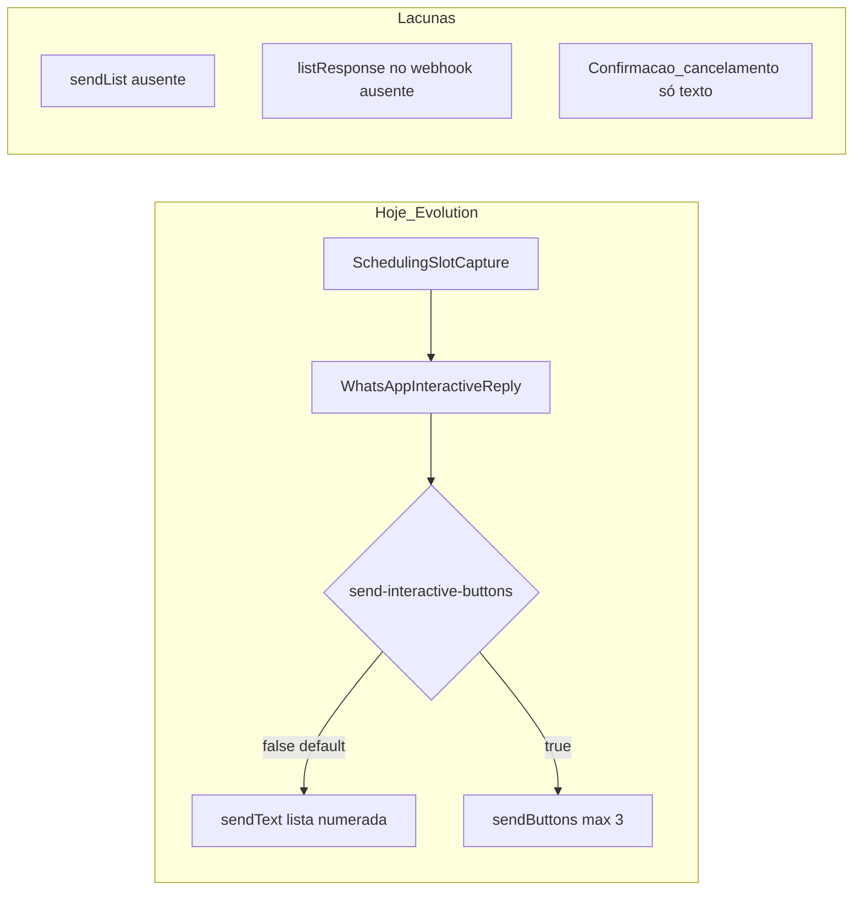

# Plano: listas interativas Evolution API no WhatsApp

## Diagnóstico (estado atual)

- **Outbound Evolution** está centralizado em [`WhatsAppOutboundRoutes.java`](d:/Documents/agenteAtendimento/infrastructure/src/main/java/com/atendimento/cerebro/infrastructure/adapter/inbound/rest/camel/WhatsAppOutboundRoutes.java): com `WhatsAppInteractiveReply` preenchido, ou envia só `sendText` com texto “premium” numerado (**padrão** `cerebro.whatsapp.evolution.send-interactive-buttons=false`), ou chama `/message/sendButtons/{instance}` (**máx. 3** horários como botões; comentários no código dizem que o cliente WhatsApp via Baileys muitas vezes **não** mostra botões de resposta reais).
- **Modelo de dados** [`WhatsAppInteractiveReply`](d:/Documents/agenteAtendimento/application/src/main/java/com/atendimento/cerebro/application/dto/WhatsAppInteractiveReply.java) está acoplado ao caso “título + descrição + `slotTimes`” pensado para `sendButtons`.
- **Origem dos horários interativos**: [`SchedulingSlotCapture.takeWhatsAppInteractive`](d:/Documents/agenteAtendimento/application/src/main/java/com/atendimento/cerebro/application/scheduling/SchedulingSlotCapture.java) (ThreadLocal preenchido pelas ferramentas Gemini em [`GeminiSchedulingTools`](d:/Documents/agenteAtendimento/infrastructure/src/main/java/com/atendimento/cerebro/infrastructure/adapter/out/ai/GeminiSchedulingTools.java) / adapter).
- **Inbound**: [`WhatsAppWebhookParser`](d:/Documents/agenteAtendimento/infrastructure/src/main/java/com/atendimento/cerebro/infrastructure/adapter/inbound/rest/camel/WhatsAppWebhookParser.java) trata `buttonsResponseMessage` e mapeia `slot_*` ids para `HH:mm` ([`labelFromSlotButtonId`](d:/Documents/agenteAtendimento/infrastructure/src/main/java/com/atendimento/cerebro/infrastructure/adapter/inbound/rest/camel/WhatsAppWebhookParser.java)); **não** há tratamento para resposta de **lista** (`listResponseMessage` / estruturas equivalentes do Baileys).
- **Confirmação / cancelamento**: fluxos como “Posso confirmar o agendamento?” e listas com [`CancelOptionMap`](d:/Documents/agenteAtendimento/application/src/main/java/com/atendimento/cerebro/application/scheduling/CancelOptionMap.java) são **100% texto** + apêndices internos (`[scheduling_draft:…]`, `[cancel_option_map:…]`); não passam pelo header `WHATSAPP_INTERACTIVE`.

## Direção técnica

1. **Introduzir modo de envio configurável** (substituir ou complementar o boolean atual), por exemplo: `cerebro.whatsapp.evolution.interactive-mode=text|buttons|list` com **default recomendado `list`** após validação em staging, mantendo **`text`** como fallback seguro. Documentar compatibilidade com a imagem/versão da Evolution em uso ([documentação oficial `sendList`](https://doc.evolution-api.com/v2/api-reference/message-controller/send-list)); há relatóveis de regressão por versão de imagem (avaliar no vosso deploy).
2. **Implementar `/message/sendList/{instance}`** no mesmo fluxo que hoje faz `sendButtons`/`sendText`: montar JSON com `number`, `title`, `description`, `buttonText`, `footerText` (opcional) e **`sections[].rows`** com **`rowId` estáveis** (ex.: mesmo prefixo `slot_09_00` já usado em botões — reutiliza [`labelFromSlotButtonId`](d:/Documents/agenteAtendimento/infrastructure/src/main/java/com/atendimento/cerebro/infrastructure/adapter/inbound/rest/camel/WhatsAppWebhookParser.java)).
3. **Respeitar limites do WhatsApp** para listas (ordem de grandeza típica: até **10 linhas por secção**; confirmar contra a doc Evolution/WhatsApp na vossa stack). Se houver mais horários: primeira mensagem `sendList` com até N linhas + **mensagem de texto complementar** com o restante (ou paginação “ver mais horários” num segundo turno).
4. **Webhook**: estender `extractEvolutionMessageText` para quando existir **`listResponseMessage`** (ou variante nomeada pela Evolution/Baileys), extrair **preferencialmente `selectedRowId`** e devolvê-lo como “texto” sintético (ex.: o próprio id ou já mapeado para `HH:mm` / token que o backend entende), alinhado ao que [`SchedulingUserReplyNormalizer`](d:/Documents/agenteAtendimento/application/src/main/java/com/atendimento/cerebro/application/scheduling/SchedulingUserReplyNormalizer.java) já espera para opções numeradas ou horários.
5. **Confirmação de agendamento**: quando existir `pendingConfirmationDraft` e o canal for Evolution, opcionalmente anexar um segundo payload interativo compacto (**2–3 linhas**: Confirmar / Ajustar horário / Cancelar fluxo — copy alinhado ao produto). Pode usar **lista curta** ou **botões** (3 encaixam no modelo de botões); decidir uma única UX para não misturar três APIs no mesmo turno. Recomendação: **lista** se quiser uniformizar com horários; **botões** só se empiricamente renderizarem melhor na vossa instância.
6. **Cancelamento / seleção de agendamento**: quando o assistente lista agendamentos com `cancel_option_map`, opcionalmente emitir **`sendList`** cujos `rowId` sejam `cancel_<appointmentId>` (ou índice + mapa igual ao atual) e reutilizar/estender **`CancelOptionMap`** ou um normalizador dedicado para mapear a escolha da lista ao `appointmentId` (sem depender de digitar “opção 2”).
7. **Fallback consistente**: se `sendList` falhar (HTTP 4xx/5xx) ou lista vazia após sanitização, cair para o comportamento atual (`sendText` premium), tal como já existe fallback para falha em `sendButtons`.

## Ficheiros principais a tocar

- [`WhatsAppOutboundRoutes.java`](d:/Documents/agenteAtendimento/infrastructure/src/main/java/com/atendimento/cerebro/infrastructure/adapter/inbound/rest/camel/WhatsAppOutboundRoutes.java): ramo Evolution + novo `buildEvolutionSendListJson`; possível extração para classe de montagem JSON (evitar método gigante).
- [`EvolutionOutboundHttp.java`](d:/Documents/agenteAtendimento/infrastructure/src/main/java/com/atendimento/cerebro/infrastructure/adapter/out/whatsapp/EvolutionOutboundHttp.java): tratamento/logging análogo a `sendButtons` para `sendList` se necessário.
- [`WhatsAppWebhookParser.java`](d:/Documents/agenteAtendimento/infrastructure/src/main/java/com/atendimento/cerebro/infrastructure/adapter/inbound/rest/camel/WhatsAppWebhookParser.java): parse de lista → texto/id.
- [`WhatsAppInteractiveReply`](d:/Documents/agenteAtendimento/application/src/main/java/com/atendimento/cerebro/application/dto/WhatsAppInteractiveReply.java) e/ou tipo novo (ex.: `WhatsAppOutboundInteractive` discriminado por `kind: SLOTS | CONFIRM | CANCEL_MENU`) para não sobrecarregar o record atual com campos só de lista (`buttonText`, `footerText`).
- [`ChatService.java`](d:/Documents/agenteAtendimento/application/src/main/java/com/atendimento/cerebro/application/service/ChatService.java) / [`CamelWhatsAppOutboundAdapter`](d:/Documents/agenteAtendimento/infrastructure/src/main/java/com/atendimento/cerebro/infrastructure/adapter/out/whatsapp/CamelWhatsAppOutboundAdapter.java): propagar novo tipo de interactive quando houver draft de confirmação ou mapa de cancelamento (somente onde o outbound já usa header `WHATSAPP_INTERACTIVE`).
- Config: [`bootstrap/src/main/resources/application.yml`](d:/Documents/agenteAtendimento/bootstrap/src/main/resources/application.yml) — novas keys + documentação dos trade-offs.
- Testes: testes unitários do builder JSON (`sendList`), testes do parser com payloads JSON de exemplo de webhooks Evolution; ajustes em testes existentes de outbound ([`WhatsAppOutboundRoutesEffectiveProviderTest`](d:/Documents/agenteAtendimento/infrastructure/src/test/java/com/atendimento/cerebro/infrastructure/adapter/inbound/rest/camel/WhatsAppOutboundRoutesEffectiveProviderTest.java) ou equivalente).

## Validação

- Testar em dispositivo real (Android/iOS) com a **mesma** instância Evolution de produção: lista abre, seleção chega ao webhook, escolha mapeada para `[slot_options]` / `SchedulingEnforcedChoice` / `cancel_option_map` sem regressão no fluxo de `create_appointment`.
- Comparar **`list` vs `text`** em taxa de erros de digitação e abandono (métrica operacional opcional).

## Riscos e mitigação

- **Compatibilidade Evolution/Baileys**: validar versão da API; ter **fallback texto** sempre ligado por defeito até validação.
- **Limites de tamanhos** (título/descrição/linhas): truncar como já é feito com `truncateForWhatsApp` em botões.
