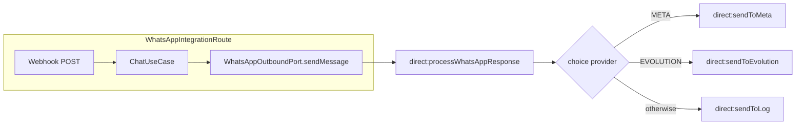

# Envio dinâmico WhatsApp (Camel + DB)

## Contexto atual

- A simulação de envio está em [`WhatsAppIntegrationRoute`](infrastructure/src/main/java/com/atendimento/cerebro/infrastructure/adapter/inbound/rest/camel/WhatsAppIntegrationRoute.java) (`onCompletion` → `logSimulacaoEnvio`) — **não existe** ainda `direct:sendToLog`.
- [`TenantConfiguration`](domain/src/main/java/com/atendimento/cerebro/domain/tenant/TenantConfiguration.java) e [`tenant_configuration`](bootstrap/src/main/resources/db/migration/V3__create_tenant_configuration.sql) só têm `system_prompt`.
- O módulo `infrastructure` usa Camel 4.x mas **não** inclui cliente HTTP para `POST` externo — será necessário adicionar `camel-http-starter` (BOM já em [`pom.xml`](pom.xml)) para `https://...` nas rotas Meta/Evolution.

## 1. Porta de saída (application)

- Criar [`application/.../port/out/WhatsAppOutboundPort.java`](application/src/main/java/com/atendimento/cerebro/application/port/out/WhatsAppOutboundPort.java):
  - `void sendMessage(TenantId tenantId, String to, String text);`
- Sem dependência de Camel na camada application (contrato puro).

## 2. Modelo de domínio e persistência

- Novo value object no **domain**, por exemplo `WhatsAppOutboundSettings` (ou nome equivalente ao estilo do projeto) com:
  - `provider` — enum alinhado aos headers Camel: `META`, `EVOLUTION` (e sem valor / `null` → comportamento “só log”).
  - `apiKey`, `instanceId` (Meta: *Phone Number ID* no path Graph; Evolution: nome da instância no path se necessário), `baseUrl` (Evolution: raiz da API, ex. `https://host`).
- Estender `TenantConfiguration` para incluir `Optional<WhatsAppOutboundSettings> whatsapp` (ou campos opcionais explícitos), mantendo validação coerente (ex.: se `provider == META`, exigir `apiKey` + `instanceId`).
- **Flyway** `V4__tenant_whatsapp_outbound.sql`: adicionar colunas nullable em `tenant_configuration`, por exemplo:
  - `whatsapp_provider VARCHAR(32)`, `whatsapp_api_key TEXT`, `whatsapp_instance_id VARCHAR(256)`, `whatsapp_base_url TEXT`
- Atualizar [`PostgresTenantConfigurationStore`](infrastructure/src/main/java/com/atendimento/cerebro/infrastructure/adapter/out/persistence/PostgresTenantConfigurationStore.java):
  - `SELECT` mapeando as novas colunas para o record.
  - Manter `upsert(tenantId, systemPrompt)` **compatível**: `INSERT` só `tenant_id` + `system_prompt` (novas colunas com DEFAULT NULL); `ON CONFLICT DO UPDATE SET system_prompt = ...` **sem** apagar credenciais WhatsApp já gravadas.

*(Gravação de credenciais via API pode ficar para iteração futura; para testes/manuais usar `UPDATE` SQL ou script.)*

## 3. Dependência Camel HTTP

- Em [`infrastructure/pom.xml`](infrastructure/pom.xml), adicionar `org.apache.camel.springboot:camel-http-starter` para produzir `POST` HTTPS com corpo JSON.

## 4. Rotas Camel (nova classe ou extensão)

Recomenda-se uma classe dedicada, por exemplo `WhatsAppOutboundRoutes` (`@Component` + `RouteBuilder`), para não inflar ainda mais [`WhatsAppIntegrationRoute`](infrastructure/src/main/java/com/atendimento/cerebro/infrastructure/adapter/inbound/rest/camel/WhatsAppIntegrationRoute.java):

| Endpoint | Comportamento |
|----------|-----------------|
| `direct:processWhatsAppResponse` | `process` injeta `TenantConfigurationStorePort`: lê config por `TenantId` (header ou property `tenantId`), define `header('provider')` a partir do tenant (ou ausência → tratar como log). Depois `.choice()`: `when(header('provider') == 'META')` → `direct:sendToMeta`; `when(... 'EVOLUTION')` → `direct:sendToEvolution`; `otherwise()` → `direct:sendToLog`. |
| `direct:sendToMeta` | Montar JSON Cloud API (ex.: `messaging_product`, `recipient_type`, `to`, `type`, `text.body`) e `POST` para `https://graph.facebook.com/v{versão}/{whatsappInstanceId}/messages` com `Authorization: Bearer {whatsappApiKey}`. Versão Graph configurável em [`application.yml`](bootstrap/src/main/resources/application.yml) (ex.: `cerebro.whatsapp.meta.api-version`). |
| `direct:sendToEvolution` | `POST` para `{whatsappBaseUrl}/message/sendText/{instance}` (ou o path exato da sua Evolution) com header `apikey: {whatsappApiKey}` e corpo JSON típico `number` + `text` (ajustar ao contrato real da instalação Evolution se diferir). |
| `direct:sendToLog` | Extrair a lógica atual de simulação: `LOG.info("[Simulação WhatsApp para {}]: {}", to, text)` (e opcionalmente nível debug para resposta HTTP bruta nas outras rotas). |

Contrato mínimo de entrada para `direct:processWhatsAppResponse` (definir constantes de header no mesmo pacote Camel):

- `tenantId` (string), `to` (destino), corpo da mensagem = `text` (ou tudo em properties — o importante é ser consistente entre o adapter e as rotas).

## 5. Adapter da porta + integração com o webhook

- Implementar `WhatsAppOutboundPort` na infrastructure (ex.: `CamelWhatsAppOutboundAdapter`) injetando `ProducerTemplate`: `sendBody`/`sendBodyAndHeaders` para `direct:processWhatsAppResponse`.
- Registar bean `ProducerTemplate` se ainda não existir (Camel Spring Boot costuma expor — confirmar no bootstrap).

**Alterar o fluxo do webhook** em `WhatsAppIntegrationRoute`:

- Guardar `tenantId` em exchange property quando o tenant for resolvido (ex.: após lookup em `analisarPedido` / `montarComando`).
- Após sucesso e fallback (`prepararRespostaSucesso`, `respostaFallback`), invocar `WhatsAppOutboundPort.sendMessage(tenantId, to, texto)` em vez de depender só do `onCompletion` para simular — ou manter `onCompletion` a delegar para `direct:processWhatsAppResponse` para um único ponto de saída. Objetivo: **uma** passagem pelo roteador dinâmico por resposta.

## 6. Testes

- Teste unitário do adapter com `ProducerTemplate` mockado ou `AdviceWith` em Camel (se já houver padrão no projeto).
- Ajustar/estender [`WhatsAppIntegrationRouteIntegrationTest`](bootstrap/src/test/java/com/atendimento/cerebro/camel/WhatsAppIntegrationRouteIntegrationTest.java): tenant em BD (ou dados de teste) com provider ausente → continua a verificar comportamento (log); opcionalmente um caso com provider `META` usando mock HTTP (WireMock) se quiserem validar o `POST` — pode ser fase 2.

## Diagrama (fluxo)

## Ficheiros principais

| Área | Ficheiros |
|------|-----------|
| Porta | [`application/.../WhatsAppOutboundPort.java`](application/src/main/java/com/atendimento/cerebro/application/port/out/WhatsAppOutboundPort.java) (novo) |
| Domain | record + enum provider; extensão de `TenantConfiguration` |
| DB | `bootstrap/src/main/resources/db/migration/V4__....sql` |
| Persistência | [`PostgresTenantConfigurationStore.java`](infrastructure/src/main/java/com/atendimento/cerebro/infrastructure/adapter/out/persistence/PostgresTenantConfigurationStore.java) |
| Camel | novo `WhatsAppOutboundRoutes.java`; ajustes em `WhatsAppIntegrationRoute.java` |
| Adapter | implementação de `WhatsAppOutboundPort` + config Spring se necessário |
| Maven | [`infrastructure/pom.xml`](infrastructure/pom.xml) |
