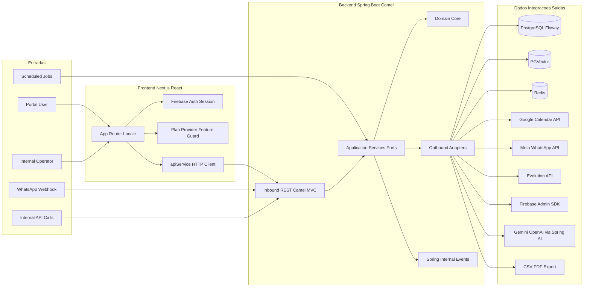

# Diagrama da Aplicacao Atual

Este documento apresenta a arquitetura atual da aplicacao, com foco em entradas, componentes internos, saidas e tecnologias envolvidas.

## Visao Geral

A solucao esta organizada em dois blocos principais:
- Frontend web em Next.js para operacao, monitoramento e configuracao.
- Backend Java (Spring Boot + Apache Camel) com arquitetura hexagonal (ports and adapters), responsavel pela orquestracao de chat, agendamentos, CRM, analytics e integracoes externas.

## Diagrama (Entradas, Processamento e Saidas)

## Componentes e Tecnologias

### Frontend
- Stack: Next.js 16, React 19, TypeScript, Tailwind CSS 4, next-intl.
- UI e experiencia: Radix UI, Lucide, Sonner, Recharts.
- Autenticacao: Firebase Auth com token Bearer para backend.
- Integracao: `apiService` centraliza chamadas HTTP para `/api/v1/*` e `/v1/*`.

### Backend
- Stack: Java 21, Spring Boot 3.4, Apache Camel, Spring Security, Spring Scheduling.
- Arquitetura: Domain + Application (ports) + Infrastructure (adapters) + Bootstrap.
- Resiliencia e operacao: Resilience4j, jobs `@Scheduled`, eventos internos Spring.
- Contrato API: OpenAPI servido em `/openapi.yaml`.

### Dados e Integracoes
- Persistencia principal: PostgreSQL com migracoes Flyway.
- RAG/embeddings: PGVector via Spring AI VectorStore.
- Cache/idempotencia: Redis.
- Integracoes externas: Google Calendar, Meta WhatsApp API, Evolution API, Firebase Admin.
- IA: Gemini (default) e OpenAI habilitavel via configuracao.

## Entradas e Saidas (Resumo Executivo)

### Entradas
- Acoes do usuario no portal web (dashboard, monitoramento, knowledge, settings).
- Webhooks de mensagens WhatsApp.
- Chamadas internas de operacao/admin.
- Jobs agendados de analytics, lembretes e classificacao.

### Saidas
- Escrita e leitura em PostgreSQL (dados transacionais e configuracoes).
- Consulta e escrita vetorial no PGVector para conhecimento.
- Controle de deduplicacao em Redis.
- Envio/recebimento em APIs externas (WhatsApp, Calendar, Firebase).
- Exportacao de resultados em CSV/PDF.

## Roteiro de Apresentacao (5 a 7 minutos)

1. Contexto e objetivo da plataforma  
   Plataforma multi-tenant para atendimento, automacao conversacional e operacao comercial.

2. Entradas da aplicacao  
   Portal web, webhook WhatsApp, APIs internas e jobs agendados.

3. Como o nucleo processa as requisicoes  
   Inbound REST/Camel recebe, Application Services orquestra, Domain aplica regras, Outbound integra.

4. Onde os dados sao persistidos e consumidos  
   PostgreSQL/Flyway, PGVector para conhecimento e Redis para controle operacional.

5. Integracoes externas e IA  
   Calendar, Meta/Evolution, Firebase e provedores LLM via Spring AI.

6. Estado atual  
   Arquitetura modular, com separacao de responsabilidades e base pronta para evolucao de escala e governanca.

## Fontes Tecnicas Utilizadas

- `bootstrap/src/main/resources/application.yml`
- `bootstrap/src/main/java/com/atendimento/cerebro/bootstrap/ApplicationConfiguration.java`
- `application/src/main/java/com/atendimento/cerebro/application/port/out/AIEnginePort.java`
- `infrastructure/src/main/java/com/atendimento/cerebro/infrastructure/adapter/out/ai/RoutingAIEnginePort.java`
- `infrastructure/src/main/java/com/atendimento/cerebro/infrastructure/adapter/inbound/rest/camel/ChatRestRoute.java`
- `infrastructure/src/main/java/com/atendimento/cerebro/infrastructure/adapter/inbound/rest/camel/WhatsAppIntegrationRoute.java`
- `atendimento-frontEnd/atendimento-frontend/package.json`
- `atendimento-frontEnd/atendimento-frontend/next.config.ts`
- `atendimento-frontEnd/atendimento-frontend/src/app/[locale]/layout.tsx`
- `atendimento-frontEnd/atendimento-frontend/src/services/apiService.ts`
