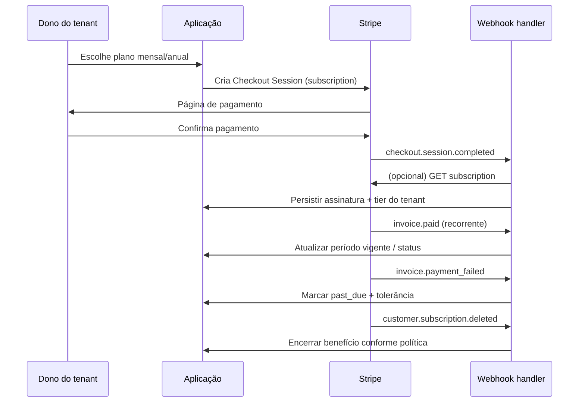

# Design: Cobrança Stripe por tenant (planos Basic / Pro / Ultra)

**Data:** 2026-05-08  
**Status:** proposta de design (aguardando revisão explícita antes de implementação)  
**Provedor:** Stripe (Billing / Subscriptions)  
**Premissa de negócio:** o **pagador é sempre o dono do tenant** (um “account owner” por tenant). O acesso do tenant aos perfis **Basic**, **Pro** e **Ultra** é **concedido ou revogado** com base no estado da assinatura no Stripe e no período vigente.

---

## 1. Objetivos

- Integrar o Stripe como fonte de verdade do **ciclo de vida de pagamento** (assinatura mensal ou anual).
- **Liberar** o tier correto após **comprovação de pagamento** confiável (via webhooks assinados e estado consistente de assinatura).
- **Encerrar ou rebaixar** o acesso quando o período pago terminar, houver falha de pagamento persistente ou cancelamento, conforme regras abaixo.
- Manter o sistema **multi-tenant**: todo estado de billing e toda decisão de entitlement deve ser **associável de forma inequívoca** a um `tenant_id` interno.

## 2. Contexto no repositório

O módulo **cerebro** (`com.atendimento.cerebro`) já propaga `TenantId` de forma explícita em fluxos de conversa e armazenamento de contexto. Esta spec descreve uma **capacidade transversal de billing** que o produto completo (portal, backoffice, API de tenants) deverá consumir. O desenho abaixo **não assume** que toda a UI de planos já exista neste monorepo; assume apenas que existe (ou existirá) um **identificador de tenant** e um **usuário dono do tenant** utilizável para checkout e correspondência com `Customer` no Stripe.

## 3. Escopo

**Dentro do escopo**

- Assinaturas **mensais** e **anuais** para três tiers (Basic, Pro, Ultra), modelados no Stripe como **Products/Prices** distintos ou metadados equivalentes.
- Fluxo de compra via **Stripe Checkout** (modo subscription) e, opcionalmente na mesma fase, **Customer Portal** para gestão de cartão e cancelamento.
- Endpoint(s) de **webhook** para processar eventos do Stripe com **verificação de assinatura** e **idempotência**.
- Modelo de dados mínimo para decisão de acesso (ver seção 7).
- Política clara de **corte de acesso** alinhada a estados Stripe.

**Fora do escopo desta spec (fases futuras)**

- Impostos complexos, faturamento B2B com nota fiscal integrada, múltiplas moedas com lógica custom, marketplace e split de pagamento.
- Disputas/chargebacks com fluxo jurídico detalhado além do rebaixamento automático quando o Stripe sinalizar perda de receita (pode ser tratado em spec futura).
- Implementação de código, migrações e configuração de deploy (próximo passo: plano de implementação via skill `writing-plans`).

## 4. Modelagem no Stripe

### 4.1 Objetos

| Objeto Stripe | Uso |
|---------------|-----|
| **Customer** | Um por tenant pagador: representa o dono do tenant no Stripe. Armazenar `customer_id` ↔ `tenant_id` no sistema. |
| **Product** | Opcionalmente um produto por linha comercial; pode-se usar **um Product “Assinatura”** com três Prices (Basic/Pro/Ultra) ou três Products — decisão operacional, não bloqueante. |
| **Price** | Duas variantes por tier quando houver mensal **e** anual: `price_basic_monthly`, `price_basic_yearly`, etc., **ou** metadado `billing_interval` no Price. |
| **Subscription** | Uma assinatura ativa por tenant (recomendado: **no máximo uma** assinatura “principal” que define o tier; upgrades trocam itens na mesma subscription). |
| **Checkout Session** | `mode=subscription`, `line_items` com o Price escolhido; `client_reference_id` ou `metadata` com `tenant_id` e `owner_user_id` para correlação. |
| **Customer Portal** | Autoatendimento: atualizar método de pagamento, cancelar ao fim do período, etc. |

### 4.2 Metadados recomendados

- No **Customer** ou na **Subscription**: `tenant_id` (string interna estável).
- Em cada **Price** (ou no **Product**): `tier` = `basic` | `pro` | `ultra` para mapeamento sem ambiguidade.

### 4.3 Checkout

- Criar sessão de checkout no **modo assinatura** com o Price selecionado (mensal ou anual).
- Após sucesso, o Stripe redireciona para URL de sucesso da aplicação; a **liberação efetiva** do tier não deve depender só da página de sucesso — deve depender dos **webhooks** (seção 5).

## 5. Fluxo de eventos (webhooks)

Todos os eventos chegam ao endpoint `POST /webhooks/stripe` (caminho ilustrativo). O corpo bruto deve ser validado com **Stripe-Signature** e o **secret** do endpoint.

### 5.1 Princípios de processamento

1. **Idempotência:** persistir `event.id` do Stripe; se já processado, retornar 2xx sem reexecutar efeitos colaterais.
2. **Ordem:** eventos podem chegar fora de ordem; o processador deve **reconciliar** pelo estado atual da `Subscription` via API Stripe quando necessário (ex.: após `checkout.session.completed`, buscar subscription por id).
3. **Fonte de tier:** derivar `tier` a partir do **Price** da linha ativa da assinatura (via metadado `tier` ou tabela interna price_id → tier).

### 5.2 Tabela de eventos → ações

| Evento Stripe | Quando ocorre | Ação no sistema |
|---------------|----------------|-----------------|
| `checkout.session.completed` | Checkout finalizado com sucesso | Se `mode=subscription`, extrair `subscription_id` e `customer_id`; vincular ao `tenant_id` (metadata/reference); registrar/atualizar registro de assinatura; **sincronizar** tier a partir dos itens da subscription. |
| `customer.subscription.created` | Nova assinatura criada | Garantir vínculo tenant ↔ customer/subscription; definir estado inicial; aplicar tier. |
| `customer.subscription.updated` | Mudança de plano, cancel_at_period_end, status, período | **Reconciliar** `status`, `current_period_start`, `current_period_end`, `cancel_at_period_end`, itens/price_ids; atualizar tier se mudou o price. |
| `customer.subscription.deleted` | Assinatura encerrada (imediato ou fim do período, conforme Stripe) | Marcar assinatura como encerrada; **aplicar política de acesso** (seção 6). |
| `invoice.paid` | Cobrança paga | Reforço de que o período está pago; se status da subscription estiver `active`, manter/atualizar `current_period_*` se vier na invoice; garantir tier ativo. |
| `invoice.payment_failed` | Cobrança falhou | Registrar falha e data; Stripe tende a passar subscription para `past_due`; **iniciar janela de tolerância** (se configurada); se permanecer `unpaid`/cancelada após política → cortar (seção 6). |
| `customer.updated` | Dados do customer mudaram | Atualização opcional de cache/email de cobrança; **não** alterar tier só por esse evento. |

Eventos adicionais podem ser habilitados depois (`invoice.finalized`, `charge.refunded`, etc.) sem mudar o núcleo, desde que a idempotência e o modelo de estado sejam respeitados.

### 5.3 Diagrama de fluxo (alto nível)

## 6. Estados, período de acesso e corte

### 6.1 Estados relevantes da Subscription (Stripe)

Interpretação simplificada para decisão de produto:

| Status Stripe | Comportamento sugerido de acesso |
|---------------|----------------------------------|
| `trialing` | Se o produto permitir trial: liberar tier do trial até fim do trial (opcional nesta versão). |
| `active` | **Liberar** tier mapeado do Price vigente durante `current_period_end` (usuário pode usar recursos pagos até lá, inclusive se `cancel_at_period_end=true` até o fim do período). |
| `past_due` | **Restringir gradualmente**: manter acesso pelo **grace period** interno (ex.: 7 dias configurável); após isso, rebaixar para Basic gratuito ou bloquear conforme política. |
| `unpaid` / `incomplete_expired` | **Cortar** benefícios pagos (tier efetivo = Basic livre ou bloqueio total). |
| `canceled` | Se cancelamento efetivo ocorreu: **sem** acesso pago; se cancelamento é ao fim do período mas ainda dentro do período pago com status `active`, manter até `current_period_end`. |

### 6.2 Regra de “comprovação de pagamento”

- **Critério aceito:** combinação de `checkout.session.completed` (ou subscription criada) **e** estado `active`/`trialing` com invoice paga inicial, e para renovações **invoice.paid** + subscription `active`.
- **Critério rejeitado:** apenas redirect de sucesso do Checkout sem webhook processado.

### 6.3 Verificação em tempo de requisição

Além dos webhooks, a API/backend deve poder decidir entitlement com base em dados locais atualizados (campos persistidos na seção 7). Opcionalmente, um job periódico **reconcile** pode consultar Stripe para tenants com estado `past_due` ou divergência.

## 7. Modelo de dados recomendado (conceitual)

Entidades/conceitos mínimos (nomes ilustrativos):

- **`stripe_customer`**: `tenant_id`, `stripe_customer_id`, `owner_user_id`, timestamps.
- **`tenant_subscription`**: `tenant_id`, `stripe_subscription_id`, `stripe_customer_id`, `status` (espelho), `tier` (`basic`|`pro`|`ultra`), `price_id`, `billing_interval` (`month`|`year`), `current_period_start`, `current_period_end`, `cancel_at_period_end`, `updated_at`.
- **`stripe_webhook_event`**: `event_id` (PK), `type`, payload hash ou snapshot opcional, `processed_at`, `processing_error` (nullable).

Índices: por `tenant_id`, por `stripe_subscription_id`, por `stripe_customer_id`.

**Nota:** o tier **comercial** “Basic” pode ser gratuito sem subscription Stripe; “Pro/Ultra” exigem subscription `active` (ou período válido até `current_period_end` quando aplicável).

## 8. Mapeamento de planos mensal / anual

- Para cada tier, existem **dois** Price IDs no Stripe (mensal e anual).
- Tabela interna ou metadados: `price_id` → `{ tier, interval }`.
- Upgrade/downgrade:
  - **Upgrade imediato** com **proration** é o padrão Stripe ao trocar item na mesma subscription (comportamento configurável no momento da troca).
  - **Downgrade** pode ser agendado para o próximo ciclo (`proration_behavior=none`) para evitar cobrança parcial reversa complexa para o usuário — decisão de produto a confirmar na implementação; esta spec só exige que o **tier efetivo** siga o Price coberto pelo período vigente.

## 9. Segurança e conformidade operacional

- Webhook: validar **assinatura** Stripe em **corpo bruto**; rejeitar se inválido.
- Segredos (`STRIPE_SECRET_KEY`, `STRIPE_WEBHOOK_SECRET`) apenas em armazenamento seguro (env/secret manager).
- Logs: **não** registrar PAN/dados completos de cartão; Stripe já tokeniza.
- LGPD: Customer no Stripe pode conter email/nome do dono; definir base legal e política de retenção alinhada ao DPO (fora do detalhamento técnico desta spec).

## 10. UX mínima

- Tela de planos: escolha Basic (gratuito, sem checkout) vs Pro/Ultra com botão “Assinar” → Checkout.
- Pós-pagamento: página de sucesso informando que a liberação pode levar segundos até processar webhook.
- Área “Faturamento”: link para **Customer Portal** (sessão criada no backend com `customer_id`).

## 11. Critérios de aceite

- Assinatura **mensal** e **anual** para cada tier gera entitlement correto após webhook.
- Falha de pagamento repetida ou subscription encerrada **remove** Pro/Ultra após política definida.
- Reprocessamento do mesmo `event.id` não duplica efeitos (idempotência).
- Tenant A nunca altera entitlement de Tenant B mesmo com payloads malformados se `tenant_id` não bater com o Customer mapeado.

## 12. Decisões de produto a fixar antes do código

1. **Grace period** exata em dias para `past_due` (sugestão inicial: 7 dias).
2. Comportamento pós-cancelamento dentro do período pago (seguir tabela da seção 6.1 — alinhado ao Stripe).
3. Tier “Basic”: é **gratuito ilimitado** ou **trial limitado** sem Stripe?

---

**Próximo passo (fora desta spec):** após sua revisão e aprovação explícita deste arquivo, invocar a skill **writing-plans** para gerar o plano de implementação incremental (API, persistência, testes de webhook, e integração com o fluxo de autorização por tenant).
